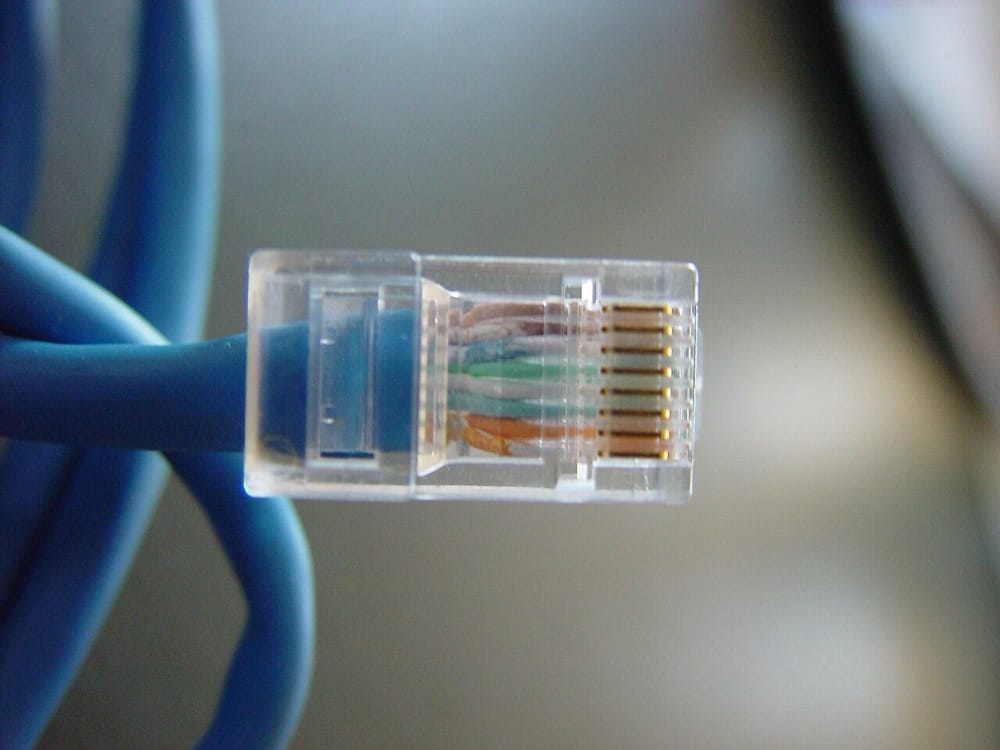

> **Before you read.** Two patch cables, same length, same colour, same
> connectors. One of them carries 10 gigabits between two switches and the other
> negotiates down to one, or does not come up at all.
>
> Nothing on the outside distinguishes them except some small print on the
> jacket.
>
> **What is different inside, and what would the small print have told you?**

This is the first topic in the track with nothing to capture. There is no
namespace that can be a bad cable, and pretending otherwise would produce a
transcript that proves nothing. What there is instead is a set of physical facts
with documents behind them, and one uncomfortable thing about those documents
that the last section comes back to.

### Some words you will need

<dl class="terms">
<dt>twisted pair</dt>
<dd>Two insulated wires twisted around each other, carrying one signal between them. Four pairs make one cable.</dd>
<dt>crosstalk</dt>
<dd>Signal from one pair leaking into another and arriving as noise.</dd>
<dt>attenuation</dt>
<dd>Signal getting weaker with distance. The reason there is a length limit at all.</dd>
<dt>bandwidth</dt>
<dd>Here, the range of frequencies a cable can carry, measured in megahertz. Not the same as a data rate.</dd>
<dt>channel</dt>
<dd>The whole path from one device to the other, patch cords included. What the 100 metre limit applies to.</dd>
<dt>plenum</dt>
<dd>A building space used to move air, usually above a suspended ceiling. A fire safety category, not a networking one.</dd>
</dl>

## What breaks without this

**You buy the wrong cable and find out at the far end of a building.** Pulling
cable through a ceiling is most of the cost of installing it, and the difference
between two categories is a few pence a metre. Getting it wrong means doing the
expensive part twice.

**A link that half works stays mysterious.** Copper faults rarely produce a dead
link. They produce a link that negotiated slower than it should have, or one that
drops under load, and none of that is visible from software.

**Somebody signs off an installation that is illegal.** The jacket rating is a
building code matter. A cable in the wrong space is a fire safety failure and it
is the sort of thing that surfaces during an inspection rather than during a
network problem.

## Why the pairs are twisted

A wire carrying a signal is also an antenna. It radiates into whatever is nearby
and it picks up whatever is nearby radiating into it, and at the frequencies
Ethernet uses, nearby includes the other three pairs inside the same jacket.

The fix is older than Ethernet and it is elegant. Send the signal down two wires
as a difference between them rather than as a voltage on one. Interference that
reaches the pair hits both wires almost equally, because they are in the same
place, so it appears on both as the same offset. The receiver subtracts one wire
from the other, the signal survives the subtraction and the interference cancels
out.

Twisting is what makes "almost equally" true. If the two wires ran straight and
parallel, one would always be marginally closer to whatever is interfering.
Twisting swaps their positions continuously, so over any reasonable length each
wire spends the same time on the inside and the outside, and the interference
they collect evens out.

<figure class="learn-figure photo">

<figcaption>Four pairs from one Category 6 cable. Look at how often each pair crosses over: the rates differ deliberately, for a reason the panel below explains. The grey plastic spine down the middle is the other thing Category 6 added, and it is there to hold the pairs a fixed distance apart rather than to stiffen the cable. Photo by Talifero, <a href="https://creativecommons.org/licenses/by-sa/3.0/">CC BY-SA 3.0</a>.</figcaption>
</figure>

That is the whole idea, and the entire category system is a set of increasingly
strict answers to the question of how well it has to work.

If you already work on networks: why the four pairs are twisted at different rates, and what a badly terminated end costs

Open a cable and the four pairs have visibly different twist rates. That is
deliberate and it is defending against a different problem from the one above.

Two pairs twisted at the same rate, lying next to each other, stay in the same
relative orientation along the whole run. Whatever coupling exists between them
at one point exists at every point, and it accumulates. Give them different rates
and their relative orientation keeps changing, so the coupling reverses sign
repeatedly and largely cancels over the length of the cable. The manufacturer
chooses rates that do not share convenient common multiples for exactly this
reason.

Which explains the single most common installation fault. Untwist the pairs at
the end to make them easier to punch down, and for that untwisted length you have
four parallel wire pairs with nothing defending them. The standards specify how
much untwisting is permitted at a termination and it is a small number, on the
order of half an inch. Anyone who has terminated a jack by fanning the pairs out
flat because it was easier has built a crosstalk generator into the end of an
otherwise good cable.

<figure class="learn-figure photo">

<figcaption>The last centimetre of every patch cable, through a transparent plug. The pairs are untwisted from the point they enter the body to the point they meet the gold contacts, because that is the only way they fit the eight slots. That short length is unprotected by design and the standards allow for it. What they do not allow for is the extra inch somebody strips back at a wall jack to make the punch down easier. Photo by Leon Brooks, public domain.</figcaption>
</figure>

The measurement that catches it is near-end crosstalk, NEXT, which a cable
tester reports per pair combination. A run that fails NEXT and passes everything
else is almost always a termination rather than the cable, which is good news
because one is a five minute fix and the other is a day.

There is a second kind that categories cannot fix by twisting harder, and it
governs the most confusing row in the table below. Alien crosstalk is coupling
between *different* cables lying against each other in a bundle. Nothing about
how one cable is built controls what its neighbour is doing, so the defence is
shielding, physical separation, or accepting a shorter run.

## The categories, and what a number promises

A category number is a bandwidth rating in megahertz. It is not a speed, and
treating it as one is the single most common misreading of this material.

| Category | Bandwidth | Commonly carries | Notes |
| --- | --- | --- | --- |
| Cat 5e | 100 MHz | 1 Gbps to 100 m | The floor for anything current |
| Cat 6 | 250 MHz | 1 Gbps to 100 m, 10 Gbps to less | The reduced distance is the interesting part |
| Cat 6A | 500 MHz | 10 Gbps to 100 m | What 10G was standardised around |
| Cat 7 | 600 MHz | 10 Gbps | ISO/IEC, never a TIA category. See the pitfalls |
| Cat 8 | 2000 MHz | 25 and 40 Gbps to about 30 m | Data centre only, by distance |

The relationship between the two middle columns is where the reasoning lives.
More bandwidth means the cable can carry higher frequencies without the signal
degrading past the point a receiver can recover it. Higher frequencies are what
let an encoding scheme push more bits per second down the same pairs. So
bandwidth enables speed and does not equal it, and the speed a given cable
achieves depends on which Ethernet standard is running over it.

**The 100 metre limit is a channel, not a cable.** It is 90 metres of fixed cable
in the walls plus up to 10 metres of patch cords at the two ends, and it comes
from TIA-568 rather than from physics. Exceed it and the link does not fail
cleanly; it becomes unreliable in ways that look like anything else.

<figure class="learn-figure">
<svg viewBox="0 0 720 236" role="img" aria-labelledby="channel-title" style="width:100%;height:auto;">
<title id="channel-title">Two scale drawings of the same link. The upper one spends its hundred metre budget as five metres of patch cord, ninety metres of fixed cable and five metres of patch cord. The lower one runs a hundred metres of fixed cable and then adds a three metre patch cord at each end, putting the channel six metres past the limit.</title>
<g fill="currentColor">
<text x="14" y="20" font-size="11">the hundred metres is the whole path. only ninety of it belongs to the cable in the wall</text>
<line x1="610" y1="44" x2="610" y2="206" stroke="currentColor" stroke-opacity="0.45" stroke-width="1.2" stroke-dasharray="4 4"/>
<text x="566" y="38" font-size="9.5" fill-opacity="0.75">100 m limit</text>
<text x="14" y="80" font-size="10">as specified</text>
<rect x="110" y="66" width="25" height="16" fill="currentColor" fill-opacity="0.35"/>
<rect x="135" y="66" width="450" height="16" fill="currentColor" fill-opacity="0.12" stroke="currentColor" stroke-opacity="0.5" stroke-width="1"/>
<rect x="585" y="66" width="25" height="16" fill="currentColor" fill-opacity="0.35"/>
<text x="112" y="100" font-size="9.5" fill-opacity="0.8">5 m</text>
<text x="272" y="100" font-size="10" fill-opacity="0.85">90 m of fixed cable in the wall</text>
<text x="586" y="100" font-size="9.5" fill-opacity="0.8">5 m</text>
<text x="112" y="116" font-size="9.5" fill-opacity="0.6">lead</text>
<text x="586" y="116" font-size="9.5" fill-opacity="0.6">lead</text>
<text x="14" y="170" font-size="10">as installed</text>
<rect x="110" y="156" width="15" height="16" fill="currentColor" fill-opacity="0.35"/>
<rect x="125" y="156" width="500" height="16" fill="currentColor" fill-opacity="0.12" stroke="currentColor" stroke-opacity="0.5" stroke-width="1"/>
<rect x="625" y="156" width="15" height="16" fill="var(--red)" fill-opacity="0.5"/>
<rect x="610" y="156" width="30" height="16" fill="none" stroke="var(--red)" stroke-width="1.4"/>
<text x="108" y="190" font-size="9.5" fill-opacity="0.8">3 m</text>
<text x="284" y="190" font-size="10" fill-opacity="0.85">100 m of fixed cable in the wall</text>
<text x="614" y="190" font-size="10" fill="var(--red)">106 m</text>
<text x="450" y="208" font-size="10" fill="var(--red)">six metres past the limit</text>
<text x="14" y="228" font-size="10" fill-opacity="0.85">nothing here is faulty and nothing reports an error. the link works, then stops working under load</text>
</g></svg>
<figcaption>The same hundred metres, budgeted two ways. The wall is the expensive part and the leads are the part somebody changes on a Tuesday, which is why the standard reserves ten metres for them and an installer who fills the wall to the limit has spent that reserve before anybody plugs anything in. Two ordinary three metre leads are then enough to put the channel over. What makes this worth drawing rather than stating is that the second row contains no fault: every component is compliant, the certifier signed off the ninety metre horizontal run, and the failure arrives months later as a link that works until it is busy.</figcaption>
</figure>

Category 6 running 10 Gigabit Ethernet is the row worth reading twice, because
the distance is not a single number. Published figures range from about 35 metres
to about 55 metres, and the disagreement is not sloppiness in the sources. It goes
back to the standards work itself: CommScope's account of the 10GBASE-T task
force records that "the exact maximum distance over minimally compliant Category
6 cabling was still uncertain" at the time, because the answer depends on the
installation rather than on the cable. How tightly the runs are bundled, how many
are carrying 10G at once, and how much alien crosstalk that produces all move it.

Category 6A exists to remove the variable. The same account records the task force
settling on 500 MHz as the required channel frequency, with tighter alien
crosstalk limits, so that the answer becomes 100 metres regardless of the
bundle.

If you already work on networks: what a category number is really certifying, and why the standards cost money

A category is not a promise about a cable. It is a promise about a whole channel,
tested against a list of electrical measurements, and the cable is one of four
things that have to comply.

The others are the connectors, the patch panel and the workmanship. A Category 6A
cable terminated into Category 5e jacks is a Category 5e channel, and the tester
will say so. This is why installers certify links with a tester that reports pass
or fail against the category rather than reading the jacket, and why the printed
category on the cable is the least authoritative thing in the room.

The measurements themselves are worth knowing by name because a test report lists
them: insertion loss, which is attenuation; near-end and far-end crosstalk;
return loss, which is signal reflected back by an impedance mismatch; and delay
skew, which is the difference in arrival time between pairs, and which matters
because the pairs have different twist rates and therefore different physical
lengths inside the same jacket.

Now the uncomfortable part, which almost no study material mentions. The document
that defines all of this, ANSI/TIA-568, is not free. Neither is IEEE 802.3.
Reading the actual definitions of the categories costs several hundred dollars,
which means every free cabling chart on the internet, including the table above,
is somebody's summary of a document they paid for or somebody's summary of
somebody else's summary.

That is worth knowing for two reasons. It explains why free sources disagree with
each other about specifics like the Category 6 distance: they are paraphrasing,
and paraphrases drift. And it is a reason to be more suspicious of confident
numbers in this part of the syllabus than in the protocol parts, where the RFCs
are free and you can go and read the sentence yourself.

## Shielded and unshielded

The twisting handles most interference. Shielding handles the rest, by wrapping
conductive foil or braid around the pairs, the whole bundle, or both, and
grounding it so that interference is carried away rather than reaching the
conductors.

The naming looks worse than it is once you know it is two letters and a slash.
The letter before the slash describes the overall shield and the letters after it
describe each pair.

| Written | Overall shield | Per-pair shield | Usually called |
| --- | --- | --- | --- |
| U/UTP | none | none | UTP, unshielded |
| F/UTP | foil | none | Foiled, or screened |
| S/FTP | braid | foil on each pair | Fully shielded |
| U/FTP | none | foil on each pair | Pair in metal |

Unshielded is the default nearly everywhere, and that is not a compromise. It is
cheaper, thinner, more flexible, easier to terminate, and it does not need
grounding, and in an ordinary office the twisting is enough.

Shielding earns its place where the environment is genuinely hostile: a factory
floor with motors on it, a lift shaft, a cable tray running alongside mains
power, or a dense bundle of cables all carrying 10G where alien crosstalk is the
limit.

If you already work on networks: when shielding makes things worse, which is more often than people expect

A shield is only a shield if it is grounded, at one end, properly. Get that wrong
and you have not built a neutral cable, you have built an antenna and connected
it to your equipment.

The failure everybody warns about is the ground loop. Ground the shield at both
ends of a run between two parts of a building whose electrical grounds sit at
slightly different potentials, and current flows along the shield to equalise
them. That current is now travelling the length of your cable, right next to the
pairs it is supposed to be protecting, injecting exactly the noise it was
installed to prevent. In the worst version it is a safety problem rather than a
performance one.

The second failure is quieter. A shield that is grounded at neither end, because
a patch panel was not bonded or a jack was terminated without connecting the
drain wire, does nothing at all. The installation cost more, the cable is
stiffer and harder to route, and electrically it is unshielded. Nothing reports
this. It passes a category test.

So the honest position on shielded cable is that it is a system rather than a
product. It needs shielded jacks, shielded patch panels, shielded patch cords and
a grounding design, and every one of those has to be right. In an environment
that needs it, that is worth doing carefully. In an environment that does not,
choosing it because it sounds more robust is a way of introducing a failure mode
you did not previously have.

Fibre, in the next topic, sidesteps the whole argument, because glass does not
conduct and cannot participate in a ground loop at all. That is a genuine reason
to choose it that has nothing to do with speed or distance.

## The copper that is not twisted pair

Two other copper media appear in the objectives and neither is structured
cabling.

**Direct attach copper**, usually written DAC, is a fixed assembly: a twinaxial
cable with a transceiver moulded onto each end, bought as one unit in a fixed
length. It plugs into the same cages an optical transceiver would, and it exists
because inside a rack, running fibre between a switch and a server a metre away
is expensive for no benefit. DAC is cheaper, uses less power because there is no
optical conversion at either end, and is limited to a few metres, which is
exactly the distance it is for.

Twinaxial itself is the cable type: two central conductors sharing a shield,
rather than the twisted pairs of structured cabling. The naming trips people
because a DAC is sold as a cable and behaves like a transceiver.

**Coaxial** is one central conductor inside an insulator inside a shield inside a
jacket, all sharing an axis, which is where the name comes from. It carried early
Ethernet and no longer does. Where you still meet it is the connection between a
building and a cable internet provider, and in some camera installations. The
common types are numbered with an RG prefix, and the connectors are the threaded
F-type on television and broadband equipment and the twist-locking BNC on video
and older network gear.

<figure class="learn-figure photo">

<figcaption>The name is the construction. Every layer shares one axis: copper conductor at the centre, then the clear plastic dielectric that sets the spacing, then foil and braid together as the shield, then the jacket. Twisted pair defends a signal by balancing it across two wires. Coaxial defends it by wrapping it in metal, which is why the shield is doing a job here that no amount of twisting can do. Photo by FDominec, <a href="https://creativecommons.org/licenses/by-sa/3.0/">CC BY-SA 3.0</a>.</figcaption>
</figure>

If you already work on networks: why direct attach exists at all, and where its length limit comes from

The interesting question about DAC is not what it is but why it is cheaper, and
the answer explains its limit.

An optical link converts electrical signals to light at one end and back at the
other. Those conversions cost money, cost power, and add a small amount of
latency. Over any distance where light's advantages matter, that is an obvious
trade. Over two metres between adjacent rack units, you are paying for two
conversions to solve a problem that did not exist.

DAC keeps the signal electrical the whole way, so both transceivers are mostly
empty shells that pass the electrical signal through. The saving is real: lower
cost per link, meaningfully lower power draw per port, and at data centre port
counts the power difference becomes a cooling difference.

The limit comes from the same place every copper limit comes from. The signal
attenuates and the frequencies involved are very high, so it degrades quickly.
Passive assemblies, which are genuinely just cable, run a small number of metres.
Active ones put signal conditioning in the ends and reach further, at the cost of
power and price, which starts eroding the reason to use DAC at all. Vendors
publish the supported lengths per speed and the numbers differ between them, so
this is a datasheet question rather than a memorised one.

The mechanical detail worth carrying: at high speeds a DAC assembly is thick and
does not bend tightly, and a rack full of them is genuinely difficult to route
and blocks airflow in a way fibre does not. That is a real design consideration
and the sort of thing that only shows up once the rack is built.

## The rating that has nothing to do with data

The last thing on the jacket is not about networking at all, and it is the one
that can stop a building being signed off.

A plenum is a space in a building used to move air, most often the gap above a
suspended ceiling that the air conditioning returns through. Anything in that
space is in the path of air that reaches the whole floor. A cable burning there
does not just burn, it feeds smoke into the air handling system.

So cable jackets are rated for where they may be installed, and the ratings run
in one direction.

| Rating | Marked | Where it may go |
| --- | --- | --- |
| Plenum | CMP | Air handling spaces, and anywhere below |
| Riser | CMR | Vertically between floors, and general spaces |
| General purpose | CM or CMG | Within a single floor, not risers or plenums |

Plenum cable uses a jacket compounded to produce less smoke and resist spreading
flame, which costs more and makes the cable stiffer. A higher rating may always
be used in place of a lower one, and the reverse is a code violation.

**This is a legal requirement rather than a best practice**, which is the part
worth carrying out of this topic. In the United States it comes from NFPA 70, the
National Electrical Code, and the equivalent exists in most countries. An
inspector who finds general purpose cable in a plenum can require it to be
removed, and removing cable from a ceiling costs what installing it cost.

The failure mode is mundane and common. Somebody runs a temporary link with the
cable that was on the shelf, it works, and temporary becomes permanent. Nothing
about the network ever complains.

If you already work on networks: how to tell what space you are actually in, and the abandoned cable problem

Whether a ceiling is a plenum is a question about the building's air handling
design, not about how the ceiling looks, and the person who knows is in
facilities rather than in IT.

The distinction is whether the space is used to return air to the handling
system. A suspended ceiling with ducted return, where the air travels inside
ductwork, is not a plenum: the ductwork is. A suspended ceiling where the void
itself is the return path is a plenum, and they are visually identical from
below. Guessing produces the expensive kind of wrong answer, and asking takes one
email.

The second thing worth knowing is what the code says about cable that is no
longer in use. Abandoned cable, meaning cable installed and left in place but no
longer connected to anything, has to be removed. The reasoning is straight
fire loading: decades of accumulated runs above a ceiling is a large quantity of
combustible material in the air path serving nothing.

That requirement is routinely ignored, and the ceilings of long-occupied
buildings are full of cable from three generations of network. It becomes a real
problem during refurbishment, when somebody has to work out which of four hundred
identical grey cables are live, and the answer is usually to remove all of them
and start again. Labelling both ends of every run when it is installed is the
cheap version of that problem, and it is a documentation habit rather than a
technical one.

## Prove it

This topic has no commands, so the evidence takes the third form: go and read a
named clause and answer a question only that clause answers.

Two of the three documents behind this page are not free, and pretending
otherwise would be dishonest. Here is what to do with each.

**NFPA 70, the National Electrical Code, Article 800.** Free read-only access is
available from NFPA after registration. Find the article covering communications
circuits and read the listing requirements for cable in plenums, then answer:
what marking would you look for on a jacket to know it may be installed in an air
handling space, and is a riser-rated cable acceptable there?

**IEEE 802.3.** The standard is published by the IEEE and the abstract and scope
are readable without purchase from the standards page. Read the scope statement
and answer a narrower question: does the standard define cable categories, or
does it define the Ethernet variants that run over cabling somebody else
defines? The answer tells you which document to reach for next time, and most
people get it wrong.

**ANSI/TIA-568.** This is where the categories, the channel model and the 100
metre limit actually come from, and it costs several hundred dollars. You are
unlikely to read it and you should know it exists, because it is the source every
free chart is paraphrasing.

Then do the thing that costs nothing. Find a patch cable, anywhere, and read the
printing on the jacket. It will tell you the category, usually the shielding
construction, and the fire rating, in that order and in small type. Most people
in this industry have never once read it.

## What trips people up

### 1. Reading a category as a speed

Category 6 is 250 MHz, not "1 gigabit". The bandwidth is what the cable is rated
for; the speed depends on which Ethernet standard runs over it. This is why the
same Cat 6 cable carries 1 Gbps to 100 metres and 10 Gbps to considerably less.

### 2. Treating Cat 7 as the next step after Cat 6A

Category 7 comes from ISO/IEC and was never recognised as a TIA category, so it
sits outside the sequence most people assume it is in. It also specified
connectors that did not become common. In practice the progression that matters
runs 5e, 6, 6A, then 8, and Cat 7 cable sold for ordinary office use is usually
solving a problem the buyer did not have.

### 3. Measuring the cable instead of the channel

The 100 metre limit is 90 metres of fixed cable plus 10 metres of patch cords at
the ends. Running exactly 100 metres in the wall and then adding two three metre
patch leads puts the channel at 106 metres, and the fault that produces is
intermittent rather than obvious.

### 4. Believing the printing on the jacket certifies the link

A Category 6A cable terminated into Category 5e jacks gives a Category 5e
channel. The category applies to the whole path including connectors and
workmanship, which is why installations are certified with a tester rather than
by reading labels.

<figure class="learn-figure photo">

<figcaption>The tester most people mean when they say tester, and worth knowing what it does not do. Those four lights are the four pairs, and they answer one question: is each pair connected end to end, in the right order. That catches a miswired jack and a broken conductor, which is most of what goes wrong. It says nothing at all about crosstalk, insertion loss or return loss, so it cannot tell you whether a channel meets Category 6A. The instrument that answers that is a certifier, it costs thousands rather than tens, and it is what an installer signs off a building with. Photograph by Reise Reise, <a href="https://creativecommons.org/licenses/by-sa/4.0/">CC BY-SA 4.0</a>.</figcaption>
</figure>

### 5. Fitting shielded cable and not grounding it

An ungrounded shield does nothing, and a shield grounded at both ends between
areas at different potentials can carry current along the length of the cable and
inject noise. Shielded cabling is a system that includes the jacks, the panels
and the bonding, and half of it is worse than none.

### 6. Assuming any ceiling void is a plenum, or that none of them are

It depends on whether the building returns air through that space, which is a
facilities question. Both directions of guessing are expensive: the wrong cable
in a plenum is a code violation, and plenum cable everywhere is money spent on
stiffness you did not need.

## Work it through

A small office is being fitted out on one floor. The longest run from the comms
room to a desk is 78 metres of cable path once it has gone up, across and back
down. The ceiling void is the air conditioning return. The building has a
machine room at one end with several large motors in it, and two of the desk
positions are in that room.

Take the length first, because it decides whether anything else matters. Seventy
eight metres sits comfortably inside the 90 metres the model allows for fixed
cable, and it leaves the ten metre patch cord allowance untouched. It does not buy
you twenty two metres of leads: the horizontal limit and the cord limit are two
separate numbers, and a short run does not lend its slack to the other one. Had
the figure been 95 metres, the conversation would have been about moving the comms
room or putting a switch closer, and it is much cheaper to have that conversation
now.

Category next, and the question is not what the desks need today. Pulling the
cable is most of the cost and it will be in that ceiling for fifteen years, so
the category is a guess about what will be plugged into it in ten. Cat 6A carries
10G to 100 metres and costs a little more per metre than Cat 6, and the
difference is small against the labour. That is the defensible choice, and the
argument for Cat 6 is only that it is what somebody has in stock.

The ceiling is the constraint with legal force. It is the air return, so it is a
plenum, so the cable must be plenum rated regardless of anything else on this
list. Not a preference and not negotiable.

The machine room is the only place shielding is worth discussing. Two runs
passing near large motors is a real interference case, and the answer is either
shielded cable for those two runs with the grounding done properly, or fibre if
the equipment at the desk end can take it. What is not sensible is shielding the
whole floor because part of it is noisy: the other runs gain nothing and every
one of them acquires a shield that has to be terminated correctly.

So: plenum rated Cat 6A throughout, shielded for the two machine room runs with
the bonding specified in writing, and a note in the documentation saying which
runs are shielded and why. That last part is the one that gets skipped and the
one that saves an argument in five years.

## Try it

**Read a jacket.** Find any patch cable and read the printing along it. Category,
construction and fire rating are all there. If it says CM and you are about to
run it above a ceiling, you have just learned something useful about that cable.

**Look up one clause.** Pick the NFPA or IEEE exercise from **Prove it** and
actually open the document. Knowing which standard defines what, rather than
having a general sense that standards exist, is the difference this section is
for.

**Ask what your ceiling is.** If you have access to a building with a suspended
ceiling and somebody in facilities, ask whether the void is used as an air
return. It is a one line question and the answer determines what cable is legal
above your head right now.

## Check yourself

Why is Category 6 rated for 10 Gbps at a shorter distance than Category 6A, and why do published figures for that distance disagree?

Because the limiting factor is alien crosstalk, which is interference between
different cables lying against each other rather than between pairs inside one
cable.

Nothing about how a single Category 6 cable is built controls what its neighbours
in the bundle are doing. So the usable distance depends on the installation: how
tightly cables are bundled, how many are carrying 10G at once, and how much
coupling that produces. Published figures range from about 35 to about 55 metres
because they are describing different assumptions.

Category 6A was specified to remove the variable, with tighter alien crosstalk
requirements so the answer is 100 metres regardless of the bundle.

A run measures 97 metres of cable in the wall and the link is unreliable. Both ends use 4 metre patch cords. What is wrong?

The channel is 105 metres, and the limit is 100.

The 100 metre figure covers the whole path: up to 90 metres of fixed cable plus
up to 10 metres of patch cords at the two ends combined. Ninety seven metres in
the wall already exceeds the fixed portion before any patch cords are added.

The symptom fits. Exceeding the limit does not produce a dead link, it produces
one that negotiates lower, errors under load, or drops intermittently, which is
why this gets diagnosed as a switch or a NIC for a long time first.

Somebody proposes shielded cable throughout a new office "to be safe". What would you say?

That shielding is a system rather than an upgrade, and fitting it everywhere buys
a failure mode instead of removing one.

A shield only works if it is grounded correctly, which means shielded jacks,
shielded panels, shielded patch cords and a bonding design. Ungrounded, it does
nothing at all and the installation simply cost more. Grounded at both ends
between areas at different potentials, it can carry current along the cable and
inject the noise it was supposed to prevent.

In an ordinary office the twisting is sufficient. Shielding is worth it where the
environment is genuinely hostile, and the right answer there is usually to shield
those specific runs rather than the building.

What does CMP mean, where is it required, and what happens if the wrong rating is used?

CMP is the plenum rating. It is required in spaces the building uses to move air,
most commonly a ceiling void the air conditioning returns through.

The jacket is compounded to produce less smoke and resist spreading flame,
because a fire in that space feeds smoke into air that reaches the whole floor.

Using a lower rating there is a building code violation rather than a performance
problem. The network will work perfectly. An inspector can require the cable to be
removed, and removing cable from a ceiling costs what installing it cost. A higher
rating may always be used in a lower rated space.

Why does a direct attach copper assembly cost less and use less power than an optical link over the same distance?

Because it never converts the signal to light.

An optical link converts electrical to optical at one end and back at the other,
and those conversions cost money and power. A DAC keeps the signal electrical the
whole way, so the transceivers on each end mostly pass it through.

The trade is distance. Copper at those frequencies attenuates quickly, so DAC
runs a few metres, which is exactly the in-rack case it exists for. At data
centre port counts the power saving becomes a cooling saving, which is often the
real argument.

Why should you be more sceptical of a cabling chart on the internet than of a protocol summary?

Because the underlying documents are not free.

The definitions of the categories, the channel model and the 100 metre limit come
from ANSI/TIA-568, which costs several hundred dollars, and IEEE 802.3 is also
paid. So every free cabling chart is somebody's paraphrase, and often a paraphrase
of a paraphrase, which is why they disagree on specifics like the Category 6 10G
distance.

Protocol material does not have this problem. The RFCs are free, so a claim about
TCP or DNS can be checked against the sentence that defines it in about a minute.
Knowing which parts of this syllabus you can verify cheaply and which you cannot
is worth as much as any individual fact.

## References

- [IEEE 802.3 Standard for Ethernet](https://standards.ieee.org/ieee/802.3/10422/) - IEEE Standards Association. The scope is readable without purchase; the standard itself is not. Accessed 2026-08-10.
- [NFPA 70, National Electrical Code](https://www.nfpa.org/codes-and-standards/nfpa-70-standard-development/70) - National Fire Protection Association, on cable listings for plenums and risers. Free read-only access after registration. Accessed 2026-08-10.
- [Cat 6A: the fact file](https://www.commscope.com/insights/the-enterprise-source/cat6a-the-fact-file/) - CommScope, on alien crosstalk, the 500 MHz decision, and why the Category 6 distance was left uncertain. Accessed 2026-08-10.
- [Category 8 cabling fact sheet](https://www.flukenetworks.com/knowledge-base/applicationstandards-articles-copper/category-8-cabling-fact-sheet) - Fluke Networks, on Category 8 bandwidth and channel length. Accessed 2026-08-10.

**Pictures.** The photographs on this page are freely licensed files from
Wikimedia Commons, downloaded and served from this site rather than linked
across to somebody else's server. Each is resized and otherwise unaltered.

- [UTP Cat 6](https://commons.wikimedia.org/wiki/File:UTP_Cat_6.jpg) by Talifero, [CC BY-SA 3.0](https://creativecommons.org/licenses/by-sa/3.0/).
- [Network utp unshielded twisted pair cable](https://commons.wikimedia.org/wiki/File:Network_utp_unshielded_twisted_pair_cable.jpg) by Leon Brooks, public domain.
- [Coaxial cable cut](https://commons.wikimedia.org/wiki/File:Coaxial_cable_cut.jpg) by FDominec, [CC BY-SA 3.0](https://creativecommons.org/licenses/by-sa/3.0/).
- [Network Cable Tester](https://commons.wikimedia.org/wiki/File:Network_Cable_Tester_(1).jpg) by Reise Reise, [CC BY-SA 4.0](https://creativecommons.org/licenses/by-sa/4.0/).

**Where the numbers came from.** Nothing on this page is captured, because there
is no way to make a namespace be a cable and no honest way to present a hand
written block as a transcript. The bandwidth figures, distances and jacket
ratings are sourced from the documents above, and three of the five are
manufacturer publications rather than standards. That is a step down in evidence
from the rest of this track and it is deliberate: the standards that actually
define this material are paid documents, the manufacturers publishing summaries
of them are the ones who make the cable, and saying so is better than implying a
tier of sourcing this topic does not have.

**If you also work on Linux.** Nothing here has a Linux counterpart. Physical
media are the same whatever is running on top of them, and no operating system
can tell you what is printed on a jacket.
