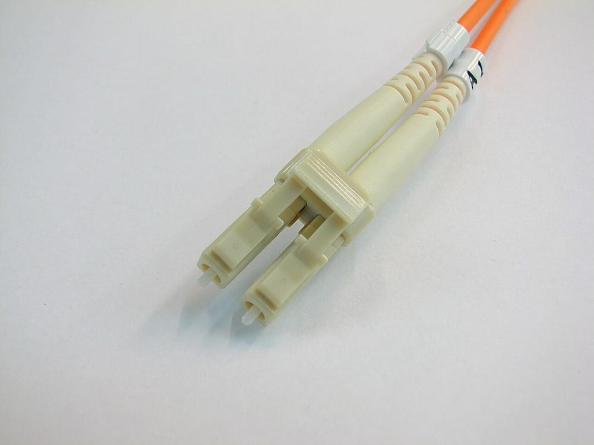
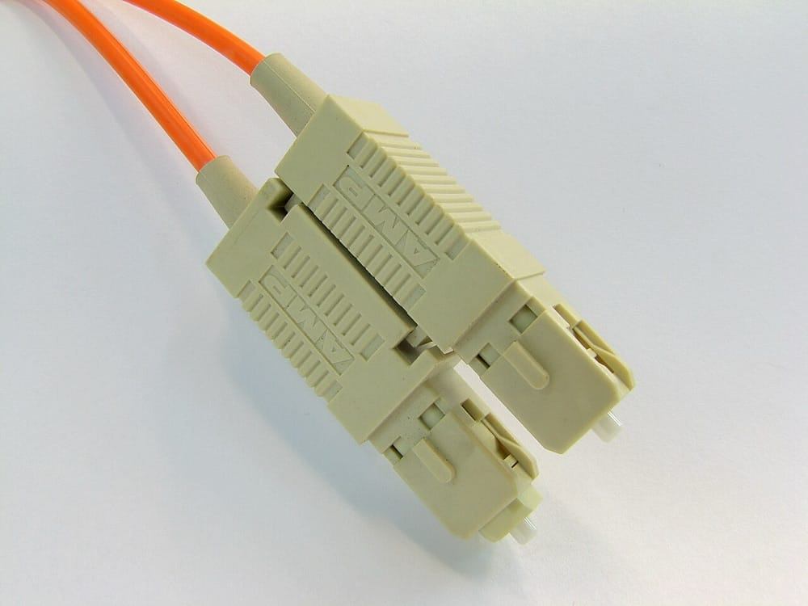

> **Before you read.** Two fibre patch leads, both yellow, both with the same
> connectors, both apparently identical. Between two switches in the same room
> either of them works.
>
> Move one of those switches to a building 300 metres away and one lead would
> carry the traffic and the other would not, and no amount of testing in the room
> would have told you which.
>
> **What is different inside the glass, and what would have told you?**

Copper had one variable that mattered and a category number that summarised it.
Fibre has four things that have to agree, they are chosen independently, and
getting one of them wrong produces a link that comes up. That last part is what
makes this topic worth more than its share of the exam.

### Some words you will need

<dl class="terms">
<dt>core</dt>
<dd>The centre of the fibre, where the light travels. Its diameter is the whole distinction below.</dd>
<dt>cladding</dt>
<dd>The glass around the core, with a lower refractive index, which keeps light in the core.</dd>
<dt>mode</dt>
<dd>One possible path light can take down the fibre. A wider core allows more of them.</dd>
<dt>dispersion</dt>
<dd>A pulse of light spreading out as it travels, until it overlaps the pulse behind it.</dd>
<dt>wavelength</dt>
<dd>The colour of the light, measured in nanometres. The transceiver picks it and the fibre is designed for it.</dd>
<dt>transceiver</dt>
<dd>The removable module that converts between electrical signals and light. Transmitter and receiver in one.</dd>
</dl>

## What breaks without this

**A link comes up and the circuit is still wrong.** Copper mostly fails honestly.
A fibre mismatch frequently gives you a link light and an interface that says up,
with errors accumulating underneath, which is the hardest kind of fault to be
handed.

**You order the wrong part and lose a week.** A transceiver is specific to a
fibre type, a wavelength, a distance and a speed. Ordering by the shape of the
socket gets you something that fits perfectly and does not work.

**Somebody cleans a connector with their shirt.** Contamination is the most
common fibre fault in the field by a wide margin, and the instinct to wipe
something on your sleeve makes it permanently worse.

## Two kinds of glass

The difference between the two fibre types is the diameter of the core, and
everything else follows from it.

**Multimode** has a wide core, either 50 or 62.5 micrometres. Wide enough that
light entering at slightly different angles takes visibly different paths down
the fibre, bouncing off the cladding boundary at different rates. Each of those
paths is a mode, hence the name.

**Single mode** has a core of roughly 9 micrometres. That is narrow enough that
only one path is possible, so the light travels straight down the middle.

The consequence is what matters. In multimode, light that took a longer bouncing
path arrives later than light that went more directly, so a pulse that left as a
sharp spike arrives smeared out in time. That is modal dispersion, and it puts a
ceiling on distance: send pulses faster and they start to overlap the smeared
tail of the one before, until the receiver cannot tell them apart. Higher speed
therefore means shorter distance, on the same fibre.

Single mode has no modal dispersion because there is only one mode. It goes
tens of kilometres, and in long haul use considerably further.

So why does multimode exist at all? Because a wide core is far more forgiving.
Alignment tolerances are looser, connectors are cheaper, and the light sources
that work with it are cheaper than the ones single mode needs. Inside a building,
where nothing is more than a few hundred metres from anything else, multimode is
the cheaper answer to a problem single mode would over-solve.

If you already work on networks: the wavelengths, and the second kind of dispersion

Modal dispersion is the one that explains the core diameters. There is another,
and it explains the wavelengths.

Multimode systems run at 850 nanometres, and sometimes at 1300. Single mode runs
at 1310 and 1550. Those are not arbitrary and they are not interchangeable, and
the reasoning is different in each case.

The multimode choice is economic. At 850 nm you can use a vertical cavity surface
emitting laser, which is cheap to make and cheap to drive, and the fibre is
designed to perform well there. Most of the cost advantage of multimode is
actually the cost advantage of that light source.

The single mode choice comes from the glass. ITU-T G.652, which is the
recommendation that defines ordinary single mode fibre, describes fibre designed
around a zero-dispersion wavelength near 1310 nm and usable in both the 1310 and
1550 regions. Zero dispersion here means chromatic dispersion, which is the
second kind: a light source does not emit one perfect colour but a narrow band of
them, and different colours travel at slightly different speeds through glass, so
the pulse spreads. Near 1310 nm those effects largely cancel in standard fibre.

At 1550 nm chromatic dispersion is worse, and 1550 is used anyway, because
attenuation is lower there than anywhere else. That is the trade for very long
distances: accept dispersion you can compensate for, and lose less signal
per kilometre.

Two practical consequences. The wavelength is a property of the transceiver, not
of the fibre, so a fibre run does not have a wavelength until you plug something
into it, and two transceivers at opposite ends have to have chosen the same one.
And this is why single mode transceivers come in a confusing spread of variants
with different reaches: they are different lasers at different wavelengths with
different power budgets, all fitting the same socket.

ITU-T also publishes G.657 for bending-loss insensitive single mode, which is the
same fibre made tolerant of tight bends for use inside buildings, where somebody
is eventually going to route it round a corner it was not designed for.

## Naming the glass

The category system for fibre is two letters and a number, and it splits the two
types cleanly.

**OM numbers are multimode.** They run OM1 through OM5 and each one is a bandwidth
grade rather than a distance, in the same way a copper category was a bandwidth
rather than a speed. Higher numbers carry a given speed further.

**OS numbers are single mode**, OS1 and OS2, and they differ by attenuation and
by how the cable is constructed rather than by anything about the core.

| Grade | Type | Core | Typically |
| --- | --- | --- | --- |
| OM1 | Multimode | 62.5 µm | Legacy. Orange jacket |
| OM2 | Multimode | 50 µm | Legacy. Orange jacket |
| OM3 | Multimode | 50 µm | 10G to 300 m. Aqua jacket |
| OM4 | Multimode | 50 µm | 10G further than OM3. Aqua or violet |
| OM5 | Multimode | 50 µm | Adds short wavelength multiplexing. Lime green |
| OS1 | Single mode | 9 µm | Indoor, tight buffered. Yellow |
| OS2 | Single mode | 9 µm | Outdoor and long haul, loose tube. Yellow |

**Do not mix OM1 with anything.** The 62.5 µm core against 50 µm is a physical
mismatch, and joining them loses a substantial fraction of the light in one
direction. Buildings cabled in the 1990s are full of OM1, and connecting a new
OM3 run to an existing OM1 backbone is a fault that measures as unexplained loss.

If you already work on networks: the jacket colours are a convention, and they have drifted

The colour table above is how it is taught and how it usually is, and it is worth
knowing exactly how much weight it will bear.

Aqua for OM3 and OM4 is close to universal, and it is genuinely useful: an aqua
jacket in a rack is almost certainly multimode rated for 10G. Yellow for single
mode is similarly reliable. Those two are safe reflexes.

The rest has drifted. OM4 appears in both aqua and violet depending on the
manufacturer and the year, and violet was introduced precisely because aqua could
not distinguish OM3 from OM4. Lime green for OM5 is the intended convention and
OM5 is uncommon enough that you may never see one. Orange covers both OM1 and
OM2, which is exactly the pair you most need to tell apart, because one is 62.5
µm and the other is 50.

And none of it is guaranteed. Jacket colour is a manufacturing convention rather
than a requirement, and a cable made to a customer specification can be any
colour at all. Data centres with a colour scheme for purpose rather than for
fibre type are common, and in one of those the colour tells you which system a
link belongs to and nothing about the glass.

So the reliable answer is printed on the jacket alongside everything else, in the
same small type as the copper markings from the previous topic. It gives the
type, the core and cladding diameters as a pair such as 50/125, and the OM or OS
grade. Reading it takes ten seconds and it is the difference between knowing and
assuming, which on an OM1 backbone is a whole afternoon.

## The connectors

Four connector types come up, and they are best remembered by how they attach
rather than by their initials.

| Connector | How it attaches | Where you meet it |
| --- | --- | --- |
| LC | Small latch, like a phone plug. Usually a duplex pair | Almost everything current. The default |
| SC | Square, push and pull | Older equipment, some providers, patch panels |
| ST | Bayonet, twist to lock, round | Legacy multimode installations |
| MPO | Multi-fibre ribbon, one connector carrying 12 or more | 40G and 100G, and structured trunks |

LC is what you will handle most. It is small, which is the point: two of them fit
where one SC would, so a switch port takes a duplex LC and gets transmit and
receive in the space a single older connector needed.

<figure class="learn-figure photo pair">

<figcaption>LC on the left, SC on the right, both duplex and both on the orange jacket that used to mean multimode. The two photographs are cropped differently, so read the shapes rather than the sizes. What separates them is the latch. LC has a slim lever you pinch, like the clip on a telephone plug, and SC has no lever at all: it pushes straight in and pulls straight out against a square shroud. That is how you tell them apart by feel, at the back of a rack, without a torch. Photos by Adamantios, <a href="https://creativecommons.org/licenses/by-sa/3.0/">CC BY-SA 3.0</a>.</figcaption>
</figure>

MPO is the odd one because it is not a single link. It carries a ribbon of fibres
in one body, and speeds such as 40G were originally built by running four lanes
in parallel over four pairs of fibres inside one MPO. That makes polarity a real
concern: the fibres have to arrive in an order the far end expects, and MPO
trunks come in several polarity types that are not interchangeable.

Two more things on the end face. Connectors are polished either flat, called PC
or UPC, or at a slight angle, called APC. Angled connectors are green and flat
ones are blue, and the angle exists to send reflected light into the cladding
rather than straight back down the fibre. **Never mate an angled connector to a
flat one.** They do not sit together correctly, the loss is high, and on some
combinations you can damage the end faces.

If you already work on networks: contamination, which is the fault you will actually meet

Ask anyone who works with fibre what breaks and they will say dirt, and they will
say it before you have finished the question.

The scale explains it. A single mode core is 9 micrometres across. A typical dust
particle is comparable in size, and a fingerprint is enormous. One particle
sitting on the end face can block a meaningful fraction of the light, and because
the two end faces are pressed together under spring pressure, it does not simply
sit there: it gets ground into the glass, which turns a cleanable problem into a
scratched ferrule and a connector that has to be replaced.

Three habits follow from that, and they are the whole practice.

Caps stay on until the moment of connection, on both the connector and the port.
The dust cap is not packaging.

Clean before every connection, with a proper cleaner: a cassette tool, or
lint-free wipes with the right solvent. Not a shirt, not a tissue, not
compressed air from a can, all three of which either deposit more contamination
or drive it further in.

And inspect if you can. A fibre inspection scope shows the end face magnified,
and once you have seen a contaminated one next to a clean one you stop treating
this as fussiness. It is the reason a link that measured fine last month is now
losing 3 dB.

The diagnostic pattern worth carrying: a fibre link that has degraded over time,
with no change to the equipment and no physical damage to the run, is
contamination until proven otherwise, and it is usually the last connector
somebody touched.

## The transceiver, and what a form factor is

The module that plugs into the switch is where most of the confusion lives, and
one distinction clears most of it up.

**A form factor is a shape and an electrical interface.** It says what fits in
the cage and how fast the lane runs. It says nothing about the light.

**The optic is what is inside.** Which wavelength, which fibre type, how much
power out, how sensitive the receiver, and therefore how far it reaches.

| Form factor | Typical speed |
| --- | --- |
| SFP | 1 Gbps |
| SFP+ | 10 Gbps |
| SFP28 | 25 Gbps |
| QSFP+ | 40 Gbps, four lanes of 10 |
| QSFP28 | 100 Gbps, four lanes of 25 |

The Q is for quad, and it is the reason the numbers work: a QSFP is four lanes in
one module, which is why 40G was four times 10 and 100G was four times 25. That
also explains why a QSFP can often be broken out into four separate links with the
right cable, which is a genuinely useful thing to know exists.

Two modules of the same form factor can be completely different optics. An SFP+
might be 10GBASE-SR at 850 nm for multimode over a few hundred metres, or
10GBASE-LR at 1310 nm for single mode over ten kilometres. Same shape, same
socket, same switch, and they will not talk to each other.

<figure class="learn-figure photo">

<figcaption>One SFP+ module, with the whole argument printed on the side of it. Along the top of the label: 10G, 850&nbsp;nm, MM, 300M. Speed, wavelength, fibre type, reach. A 10GBASE-LR module is the same metal shell, seats in the same cage, and reads 1310&nbsp;nm, SM, 10KM instead. Nothing on the outside distinguishes them except that line of small print, which is the reason this label is worth photographing before the module goes into a switch. Photo by Dmitry Nosachev, <a href="https://creativecommons.org/licenses/by-sa/4.0/">CC BY-SA 4.0</a>.</figcaption>
</figure>

The same cages carry protocols other than Ethernet. **Fibre Channel** is a
separate storage networking protocol with its own speeds and its own transceivers
in the same form factors, which is why a box of SFPs pulled from a storage
environment may look right and be built for a different protocol entirely.

If you already work on networks: why a mismatch gives you a link that comes up, and then does not work

The unhelpful thing about optical mismatches is that link status is a poor test of
them. The interface goes up, the light is present, and the problem shows up as
errors or as a link that fails at a distance nobody has tested at.

**A single mode transceiver on multimode fibre** is the classic. The narrow beam
enters a wide core, launches into multiple modes, and over a short distance
enough of it arrives to establish a link. Over a real run the modal dispersion it
just created smears the signal and the link degrades or drops. So it works on the
bench and fails in the building, which is the worst possible failure schedule.

**Too much light** is the mistake nobody expects, because more signal sounds
safe. A long-reach single mode transceiver is built to put out enough power to
survive forty kilometres. Plug two of those into a three metre patch lead and the
receiver is saturated: it is being shouted at, and it cannot resolve the pulses.
The link comes up and errors constantly. The fix is an inline attenuator, which is
a component whose entire purpose is throwing signal away, and which sounds absurd
until you have met this fault.

**Wavelength mismatch** between the two ends produces either nothing or a poor
link, depending on how far apart they are. Two ends both need the same colour.

The diagnostic that settles all of these is the transceiver's own reporting.
Modules support digital diagnostics, and a switch will show transmit power,
receive power, temperature and bias current per port. Receive power against the
optic's specified range answers the question directly: too low means loss,
contamination or the wrong optic, and too high means saturation. That single
number resolves more fibre arguments than any amount of swapping parts, and it is
the first thing to look at rather than the last.

## Making the two ends agree

Four things have to match, and they are ordered here by how often each one is the
problem.

**The fibre type.** Single mode transceivers on single mode fibre, multimode on
multimode. This is the one at the top of the page, and it is why the two yellow
patch leads were not interchangeable.

**The wavelength.** Both transceivers, the same colour of light.

**The connector and polish.** Physically compatible, and angled to angled or flat
to flat, never mixed.

**The protocol and speed.** Ethernet to Ethernet, and the same speed at both
ends, since unlike copper there is generally no auto-negotiation to rescue a
mismatch.

The reason this is a list rather than a single decision is that the four are
bought separately, often by different people at different times. The fibre was
installed by a contractor five years ago, the transceivers came with a purchase
order last month, and the patch leads came out of a drawer.

Which suggests the habit worth building: write down what a link is made of. Fibre
type and grade, transceiver part number at each end, wavelength, connector type.
It takes a line in the documentation and it turns a future fault from an
investigation into a comparison.

If you already work on networks: where the transceiver specifications actually live, and why vendor locking exists

The form factors are not defined by any of the standards this page cites. They
come from the SFF committee, whose specifications are published through SNIA and
are free to read, and which define the mechanical shape, the electrical
interface, and the management interface a module presents.

That management interface is why a switch can tell you a module's manufacturer,
part number, serial number, and its live optical power readings. The module
carries a small amount of memory describing itself, and the switch reads it on
insertion.

Which is also where vendor locking comes from. Some switch vendors check the
manufacturer field and refuse to enable a port with a module that is not theirs,
sold at several times the price of an identical optic from a third party. The
practice is contested, the third party market exists and codes its modules to
match, and most vendors provide a command to permit unsupported optics while
declining to support the result.

Two things worth carrying into a purchasing conversation. The optic itself is
frequently manufactured by the same handful of companies whatever name is on it,
so the technical argument for the premium is weaker than it is presented as. And
the support argument is not nothing: if a link misbehaves and the optics are third
party, the first response you get will be to replace them with the vendor's own,
and you will have to do it before anyone looks further.

## Prove it

No commands here either, so the evidence is again a document and a question only
that document answers.

**ITU-T G.652.** ITU-T recommendations are free to download, which makes this the
one primary source in these two topics you can actually read. Open it and find
what it says about the wavelength regions the fibre is intended for, then answer:
does the recommendation define a single wavelength for single mode fibre, or a
fibre that works across more than one, and which one is it designed around?

**The SFF specifications, published through SNIA.** Find the specification for a
form factor named on this page. Answer a narrower question: does it specify the
optical characteristics of the module, or the mechanical and electrical interface
it presents? The answer tells you why two modules of the same form factor can be
entirely different optics, which is the confusion this topic exists to remove.

Then, if you have any access to network equipment with fibre in it, read the
transceiver diagnostics on a working port. Every managed switch exposes transmit
and receive power per module. Comparing a working link's receive power against
the optic's specified range is the single most useful fibre skill there is, and it
is easiest to learn on a link that is behaving.

## What trips people up

### 1. Assuming a link light means the optics match

A single mode transceiver on multimode fibre will frequently bring a link up over
a short patch lead and fail over a real distance. Fibre mismatches are not
excluded by link status, which is why the transceiver's power readings matter more
than the interface state.

### 2. Thinking more light is safer

A long-reach transceiver on a short link saturates the far receiver and produces
constant errors. The fix is an attenuator, deliberately throwing signal away. More
power is not a margin, it is a specification with a lower bound and an upper one.

### 3. Reading a form factor as a specification

SFP+ is a shape and a speed. It says nothing about wavelength, fibre type or
distance. Two SFP+ modules can be incompatible with each other and both perfectly
correct.

### 4. Mixing 62.5 and 50 micrometre multimode

OM1 has a 62.5 µm core and everything since has 50. Joining them loses a
substantial amount of light in one direction, and it presents as unexplained loss
on a run where every component is individually fine.

### 5. Mating an angled connector to a flat one

Green is angled, blue is flat. They do not seat correctly together, the loss is
severe, and the end faces can be damaged. This is a five second visual check that
people skip because both ends fit.

### 6. Cleaning a connector with whatever is to hand

A core is 9 micrometres across and a fingerprint is enormous by comparison.
Wiping an end face on clothing or with a tissue drives contamination in and
scratches the ferrule when it is mated under spring pressure. Cleaning tools are
cheap and the alternative is replacing connectors.

## Work it through

A campus has two buildings 400 metres apart. The existing link between them is
1 Gbps over multimode fibre installed in 2003, and it needs to become 10 Gbps.
Somebody has priced 10G transceivers and the plan is to swap them at both ends.

Take the distance and the fibre together, because they decide everything. Four
hundred metres is comfortably beyond what multimode carries at 10G. OM3 manages
10G to around 300 metres and OM4 further, but the fibre was installed in 2003,
which almost certainly makes it OM1 or OM2, and neither carries 10G anywhere near
400 metres. So swapping the transceivers gives you a link that comes up on the
bench and does not work between the buildings.

Establish what is actually in the ground before pricing anything else. The jacket
markings at either end give the type and the core diameter, and the installation
records may exist. That one check decides between three very different projects.

If it is OM1 or OM2, which is likely, there are two honest options. Pull new
fibre, and if you are pulling anyway then pull single mode, because the cost
difference is in the labour rather than the glass and single mode removes the
distance question permanently. Or, if there are spare strands and the run is
short enough for a different technology, look at what else the existing fibre
supports at lower speed.

The option to be suspicious of is anything promising 10G over old multimode at
400 metres. It exists, at a price, using specialised optics, and it is a way of
paying transceiver money to avoid a cable project while inheriting the constraint
permanently.

The thing to write down at the end, whichever way it goes: the fibre type, the
grade, the transceiver part numbers, and the measured receive power at both ends
on the day it was commissioned. That last number is what a future fault gets
compared against, and nobody ever regrets having recorded it.

## Try it

**Read a fibre jacket.** If you can find a fibre patch lead anywhere, read the
printing. It gives the type, the core and cladding as a pair such as 50/125, and
the OM or OS grade. Compare what it says to the jacket colour and see whether the
convention held.

**Open G.652.** It is free, it is the only primary source in these two topics you
can read without paying, and the exercise in **Prove it** is a ten minute read.
Knowing what a fibre recommendation actually contains is worth more than the
specific answer.

**Look at transceiver diagnostics.** On any managed switch with fibre, find the
command that shows optical power per module. Compare the receive power to the
optic's datasheet range. If you have no equipment, read a transceiver datasheet
instead and find the receiver sensitivity and the maximum input power, which are
the two numbers the panels above are about.

## Check yourself

What physically differs between single mode and multimode fibre, and what follows from it?

The core diameter. Single mode is about 9 micrometres, multimode is 50 or 62.5.

A wide core allows light to travel by several different paths, each of which is a
mode. Light taking a longer bouncing path arrives later, so a pulse spreads out
as it travels. That is modal dispersion and it limits distance, more severely as
speed goes up. A 9 micrometre core allows only one path, so there is no modal
dispersion and the fibre carries signals tens of kilometres.

Multimode exists because the wide core is more forgiving. Alignment is looser,
connectors are cheaper, and the light sources are cheaper, which makes it the
economical choice inside a building.

A 10G link between two switches works on a 2 metre patch lead in the lab and fails when installed over 250 metres of existing fibre. What is likely?

Most likely a fibre type mismatch, and specifically a single mode transceiver on
multimode fibre, or 10G optics on multimode that is too old a grade for the
distance.

A narrow beam entering a wide core launches multiple modes, and over two metres
enough of the signal arrives that the link comes up. Over 250 metres the
dispersion that creates is enough to break it.

The check is the jacket marking on the installed fibre and the transceiver part
numbers, and then the receive power reading at each end. Link status will not
tell you, because it already said the link was up.

Why would anyone deliberately install an attenuator on a fibre link?

To stop the receiver being saturated.

A long-reach transceiver is built to put out enough power to survive tens of
kilometres. Over a short link that power arrives almost undiminished and the far
receiver cannot resolve the pulses, so the link comes up and errors continuously.

An attenuator throws away a specified amount of signal to bring the received power
back inside the optic's working range. Optical receivers have a maximum input
power as well as a minimum sensitivity, and only the minimum is intuitive.

Two SFP+ modules both fit the same switch port. Does that mean they will work together?

No. A form factor is a shape and an electrical interface, and it says nothing
about the light.

One SFP+ could be an 850 nm multimode optic for a few hundred metres and the
other a 1310 nm single mode optic for ten kilometres. Both fit, both are correct,
and they cannot talk to each other.

The same cages also carry protocols other than Ethernet, so a module pulled from a
Fibre Channel environment will fit and is built for something else entirely.

A fibre link that has worked for two years is now losing signal. Nothing has been reconfigured and the run has not been damaged. What is the first thing to check?

Contamination on the connector end faces, and specifically the last one somebody
touched.

A single mode core is 9 micrometres across, so a dust particle or a fingerprint
blocks a meaningful fraction of the light. Because the faces are mated under
spring pressure, contamination gets ground in, which can turn a cleanable problem
into a scratched ferrule.

Check it by reading receive power at both ends and comparing against the optic's
range, then clean the connectors with a proper cleaning tool rather than anything
to hand. Gradual degradation with no configuration change is contamination until
proven otherwise.

What is the difference between an OM number and an OS number, and why must OM1 not be mixed with the rest?

OM grades are multimode and OS grades are single mode. The OM number is a
bandwidth grade, so a higher number carries a given speed further, in the same way
a copper category rates bandwidth rather than speed.

OM1 has a 62.5 micrometre core and OM2 onward have 50. Joining them means light
crossing from a wide core into a narrow one, which loses a substantial fraction of
it in that direction.

The practical version: buildings cabled in the 1990s are full of OM1, and
connecting new OM3 to an existing OM1 backbone produces unexplained loss on a run
where every individual component tests fine.

## References

- [Recommendation ITU-T G.652](https://www.itu.int/rec/T-REC-G.652/en) - ITU-T, characteristics of a single-mode optical fibre and cable, including the wavelength regions it is designed around. Free to download. Accessed 2026-08-10.
- [Recommendation ITU-T G.651.1](https://www.itu.int/rec/T-REC-G.651.1/en) - ITU-T, multimode fibre for the optical access network. Accessed 2026-08-10.
- [Recommendation ITU-T G.657](https://www.itu.int/rec/T-REC-G.657/en) - ITU-T, bending-loss insensitive single mode fibre. Accessed 2026-08-10.
- [SFF specifications](https://www.snia.org/technology-communities/sff/specifications) - SNIA, the transceiver form factor specifications. Free to read. Accessed 2026-08-10.
- [IEEE 802.3 Standard for Ethernet](https://standards.ieee.org/ieee/802.3/10422/) - IEEE Standards Association, which defines the Ethernet variants rather than the fibre. Accessed 2026-08-10.

**Pictures.** Freely licensed files from Wikimedia Commons, downloaded and served
from this site rather than linked across to somebody else's server. Each is
resized and otherwise unaltered.

- [LC optical fiber connector](https://commons.wikimedia.org/wiki/File:LC-optical-fiber-connector-hdr-0a.jpg) by Adamantios, [CC BY-SA 3.0](https://creativecommons.org/licenses/by-sa/3.0/).
- [SC optical fiber connector](https://commons.wikimedia.org/wiki/File:SC-optical-fiber-connector-hdr-0a.jpg) by Adamantios, [CC BY-SA 3.0](https://creativecommons.org/licenses/by-sa/3.0/).
- [LR-Link 10GBASE-SR SFP+ transceiver](https://commons.wikimedia.org/wiki/File:LR-Link_10GBASE-SR_SFP%2B_transceiver.jpg) by Dmitry Nosachev, [CC BY-SA 4.0](https://creativecommons.org/licenses/by-sa/4.0/).

**Where the numbers came from.** Nothing on this page is captured, for the same
reason as the previous topic. The wavelength and fibre characteristics are from
the ITU-T recommendations, which unlike the copper standards are free to
download, so this topic rests on better evidence than the one before it. The
distances given for the OM grades are industry conventions drawn from the
IEEE Ethernet variants that specify them, and the jacket colours are a
manufacturing convention rather than a requirement, which the panel about them
says explicitly.

**If you also work on Linux.** Nothing here has a Linux counterpart. An operating
system sees a link that is up or down and has no visibility of the glass, and
transceiver diagnostics are read from the switch rather than from the host.
