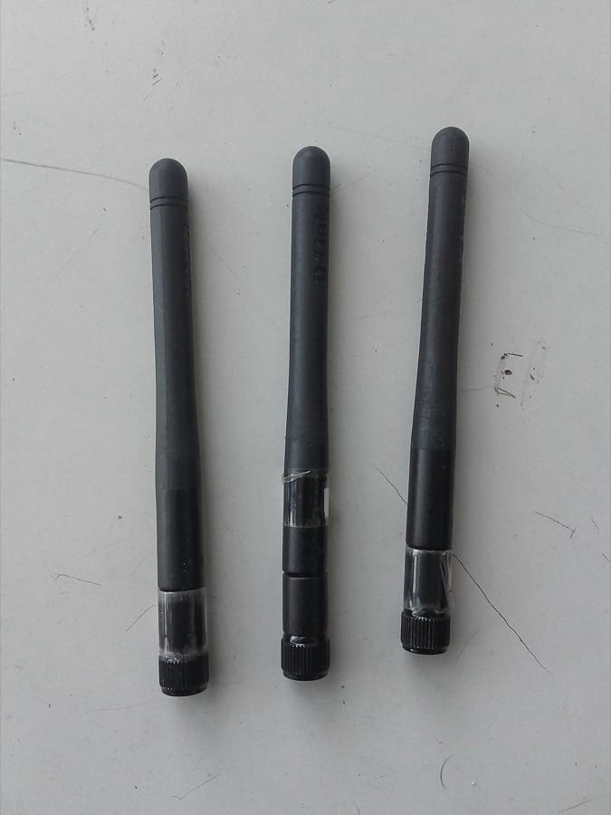
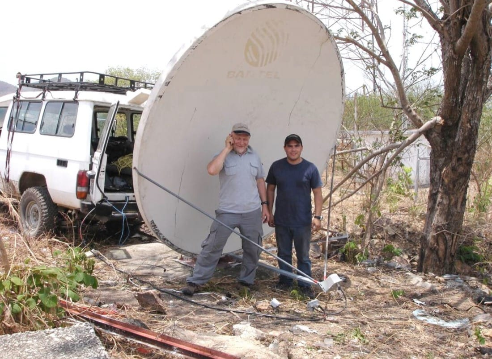

> **Before you read.** A laptop shows four bars and the word connected. Pages do
> not load, a file copy runs at a fraction of what it should, and moving two
> metres makes it better or worse for no reason anybody can see.
>
> Nothing is broken. The access point is healthy, the cable behind it is fine,
> and the wired machine next to it is perfectly happy.
>
> **What is different about a link with no cable?**

Everything in this track so far has assumed a wire. Two ends, one medium each,
and a frame that either arrives or does not. Wireless breaks three of the
assumptions that made the earlier topics simple, and almost every confusing thing
about it traces back to one of those three.

### Some words you will need

<dl class="terms">
<dt>802.11</dt>
<dd>The IEEE family of wireless LAN standards. A family, not one document, and the exam treats it as a category.</dd>
<dt>shared medium</dt>
<dd>One channel that every device in range takes turns using. The air is always one.</dd>
<dt>half duplex</dt>
<dd>Only one end may transmit at a time. Not a configuration on wireless, a property of it.</dd>
<dt>CSMA/CA</dt>
<dd>Carrier sense multiple access with collision avoidance. Listen first, and try to avoid collisions rather than detect them.</dd>
<dt>attenuation</dt>
<dd>Signal weakening with distance, and through anything it passes through.</dd>
<dt>signal to noise ratio</dt>
<dd>How far the signal stands above the background. The number that actually predicts whether a link works.</dd>
</dl>

## What breaks without this

**Every wireless fault gets diagnosed as the wrong thing.** Connected and working
are different states, and a client that reports a strong signal can be unable to
pass traffic for reasons no client-side indicator shows.

**Capacity gets promised that the air cannot deliver.** A rated speed is what one
device might achieve alone, and dividing it by the number of clients is closer to
the truth than any datasheet.

**Cellular and satellite get treated as slower wireless.** They have different
properties, particularly in latency, and one of them has a floor no engineering
can move.

## What a radio link actually shares

A cable gives each link its own medium. Two machines on two cables into a switch
never contend for anything, which is why topic 18 could talk about full duplex as
the normal case and half duplex as a fault.

The air gives that up. Every device using the same channel within range of each
other shares one medium, and the rules for sharing it are the first thing that
makes wireless different.

**So the air is half duplex, always.** Not because somebody configured it, and
not as a fallback. A radio that is transmitting cannot usefully listen on the
same frequency at the same time, so an access point and a client take turns, and
so does every other client. That single fact is behind more wireless behaviour
than anything else on this page.

The second consequence is that collisions cannot be detected the way Ethernet
detected them. A transmitting station cannot hear another station transmitting,
because its own signal drowns everything else out. Wired Ethernet used CSMA/CD,
where the D is detection. Wireless uses **CSMA/CA**, where the A is avoidance: a
station listens before transmitting, waits a random interval, and where necessary
asks permission first. Avoidance is more expensive than detection, and the
overhead is why the number on the box was never achievable.

If you already work on networks: the hidden node, and why two clients that cannot hear each other are the worst case

Carrier sense assumes that a station which listens before transmitting can hear
everything it might collide with. On a wire that holds. In the air it frequently
does not, and the failure has a name.

Picture an access point with a client on either side of it, far enough apart that
neither can hear the other, though both hear the access point clearly. Client A
listens, hears nothing, and transmits. Client B listens, also hears nothing,
because A is out of range, and transmits too. Both frames arrive at the access
point at once and both are destroyed. Neither client has any way of knowing why,
so both retry, and under load the pair can spend more time colliding than
communicating.

That is the hidden node problem, and its distinctive quality is that each client
sees an excellent signal and terrible throughput. Every client-side diagnostic
says the link is fine.

The mechanism 802.11 provides for it is request to send and clear to send.
A station asks the access point for the medium, the access point answers with a
grant that every station in its range can hear, and the stations that cannot hear
each other both hear the grant and stay quiet. It works, and it costs two extra
frames per transmission, which is why it is usually left off and enabled only
where the problem has been diagnosed.

RFC 3819 is worth knowing about here. It is advice to people designing subnetwork
layers beneath IP, it is free, and its sections on link characteristics explain
why a link that loses packets for reasons unrelated to congestion is difficult
for TCP specifically. Topic 09 established that TCP reads loss as congestion and
collapses its window. On a wire, loss usually is congestion. In the air it
usually is not, and the two disagreeing is a large part of why wireless
throughput is so uneven.

## One conversation at a time

Because the medium is shared and half duplex, the capacity of a channel is
divided among everyone using it, and the division is worse than a straight split.

Each transmission carries overhead: the listening interval before it, the
acknowledgement after it, and the retries when something goes wrong. Add clients
and the overhead grows faster than the data does, so twenty clients on one access
point do not each get a twentieth. They get rather less.

There is a second effect that surprises people, and it is the one worth carrying
into a design conversation. **A slow client slows everybody.** A device at the
edge of the coverage area transmits at a low data rate, because a weak signal
forces a more robust and slower encoding. While it is transmitting, it holds the
medium, and a frame that would take one unit of time at full rate takes many at
the low one. Everybody else waits.

So one laptop in a far corner can measurably reduce throughput for a room full of
people sitting next to the access point, and nothing on any of their screens will
explain why.

## Signal strength is not throughput

Now the question at the top of this page. The client shows four bars, which is a
measure of received signal strength, and it says nothing about whether the link
works.

**What matters is the signal to noise ratio**, meaning how far the signal stands
above whatever else is on that frequency. A strong signal in a noisy environment
performs worse than a moderate signal in a quiet one, and the bars measure only
the first half of that fraction.

The sources of noise are the reason the next topic exists. Other access points on
the same channel. Neighbouring networks bleeding across channels. Microwave ovens,
which occupy part of the 2.4 GHz band and are not being rude, they are operating
in a band deliberately set aside for equipment that is not communications. Bluetooth
devices hopping across the same band.

And moving two metres changes it because radio does not travel in a straight line
only. Signals reflect off walls and metal, and the reflections arrive fractionally
later than the direct path, sometimes reinforcing it and sometimes cancelling it
out. A null in the pattern can be smaller than a person, which is genuinely why
standing up sometimes fixes it.

**So connected and working are separate states**, and every client indicator
reports the first one.

<figure class="learn-figure photo pair">

<figcaption>The same protocol at both ends of its range. The rods radiate roughly evenly in every horizontal direction, which is what you want on a ceiling in an office: coverage in a doughnut around the access point, and nobody has to aim anything. The dish does the opposite. It takes the same power and concentrates it into a narrow beam, which buys enormous distance and costs you everything outside the beam, so both ends have to be aimed at each other and stay aimed. Same standard, same band, and one of them serves a desk while the other crosses a valley. Photographs by EEIM, <a href="https://creativecommons.org/licenses/by-sa/4.0/">CC BY-SA 4.0</a>, and Wireless Networking in the Developing World, <a href="https://creativecommons.org/licenses/by-sa/3.0/">CC BY-SA 3.0</a>.</figcaption>
</figure>

## 802.11 as a family

The exam names 802.11 and stops there, and the research for this track found that
deliberate: no letter standards appear anywhere in the objectives, and neither do
the Wi-Fi generation numbers.

That is unusual enough to be worth stating plainly rather than assuming it is an
oversight. Most material for this subject is organised around the letters, and
memorising them for this exam is effort spent on something it does not ask about.
What it asks about is the band, the channel and the security, which are the next
three topics.

What is worth knowing is the shape of the family. IEEE 802.11 is a base standard
with amendments, each adding capability, and the letters are amendment
identifiers rather than product names. The Wi-Fi Alliance's generation numbers are
a marketing layer on top of that, applied afterwards, which is why they do not map
cleanly onto the letters in every case.

## Cellular and satellite

Two more media the objective names, and both are worth a paragraph rather than a
chapter, because at this level what matters is where each one belongs.

**Cellular** covers the mobile network generations, and its distinguishing
property for a network engineer is not speed. It is that coverage and capacity
are somebody else's, sold to you, and shared with everyone else in the cell. As a
primary link it suits sites where running a cable is impractical. As a backup
link it is genuinely good, because its failure modes are unrelated to those of a
wired circuit: a digger through a duct does not affect it.

**Satellite** has one property that dominates every other. Distance imposes
latency that no engineering can remove, because the signal travels at the speed
of light and a geostationary orbit is roughly 36,000 kilometres up. Up and back is
already a large fraction of a second before anything else happens, and that
budget cannot be optimised away.

The consequence is not slowness in the sense of throughput, which can be
respectable. It is that anything requiring many round trips feels terrible. Topic
09 established that TCP needs a handshake before data moves, and every one of
those round trips now costs half a second. Low earth orbit constellations change the
arithmetic by being far closer, which reduces the latency substantially, and the
principle stands: with satellite you are buying a link whose delay is set by
geometry.

If you already work on networks: why the number on the box was never achievable

Every wireless product is sold with a data rate, and the gap between that number
and observed throughput is larger than in any other medium. Three things account
for it, and none is dishonesty exactly.

The rated figure is a physical layer signalling rate. It describes how fast bits
are put on the air under ideal conditions, and it counts everything: preambles,
headers, acknowledgements, interframe spaces. Useful throughput is what is left,
and roughly half is a reasonable expectation rather than a pessimistic one.

The figure assumes the best encoding, which assumes an excellent signal. Rate
adaptation moves a client down to slower and more robust encodings as conditions
worsen, and it does so continuously and invisibly. A client's actual rate changes
several times a minute while sitting still.

And the figure is per channel, not per client. The whole channel is shared, so
the number describes the ceiling for everybody together.

The habit worth building is to divide. Take the advertised figure, halve it for
overhead, then divide by the number of active clients, and treat the result as an
optimistic estimate. That arithmetic done in a design meeting prevents the
conversation that otherwise happens after installation.

## Prove it

There is nothing to capture here. The lab in this track is Linux network
namespaces, veth pairs have no radios, and simulating a radio link would produce
a transcript that proves nothing about radio.

What there is instead is a document and an instrument.

**IEEE 802.11.** The standard is published by the IEEE and the scope statement is
readable without purchase. Read it and answer one question: does 802.11 define a
medium access method as well as a physical layer, and what does that tell you
about why the wired and wireless access methods have different names?

**Then use the instrument you are holding.** Every phone can list the networks it
can see, and most operating systems will report the signal strength of the one
you are on. Stand somewhere with a good signal and watch the number while you
walk. Note where it drops, note what you were walking past, and note whether
throughput follows the number or not. That last part is the point of this topic
and it takes ten minutes to observe directly.

## What trips people up

### 1. Reading signal bars as a prediction of throughput

Bars measure received signal strength. What determines whether a link works is
how far that signal stands above the noise, and the noise is not measured by
anything the client shows you.

### 2. Expecting full duplex on wireless

The air is half duplex and cannot be otherwise. A radio transmitting on a
frequency cannot usefully receive on it at the same time, which is a physical
constraint rather than a setting.

### 3. Dividing the rated speed by the number of clients and expecting that

The division is real but the answer is optimistic, because overhead grows with
the number of stations and because slow clients hold the medium for longer than
fast ones.

### 4. Assuming a strong signal means a fast client

A client at the edge negotiates a slower encoding, and while it transmits it
occupies the channel. One distant device measurably slows a room of nearby ones.

### 5. Learning the 802.11 letter standards for this exam

They do not appear in the objectives, and neither do the generation numbers. The
band, the channel plan and the security are what is tested.

### 6. Treating satellite as simply slow

Its throughput can be good. Its latency is set by how far the signal has to
travel, and no product can improve on the speed of light.

## Work it through

The scenario at the top, taken apart in the order a fault should be.

Start by separating the two states. The client says connected, which means it
associated with an access point and holds an address. That is a layer 2 and layer
3 statement and says nothing about whether frames are getting through. So the
first useful question is not why is it slow, it is whether anything is arriving
at all.

Then the signal number, and what it does not tell you. Four bars is received
strength. If throughput is poor with a strong signal, the likely cause is on the
other side of the fraction: something else is occupying the channel. That is not
diagnosable from the client, which is why the next topic is about the channel
plan and why a survey exists as a job.

Then the room, because two metres mattering is a clue rather than noise. Signals
reflect, and reflections arriving slightly out of step with the direct path can
cancel it. A null a metre across is entirely ordinary indoors, and it is why
coverage is measured by walking rather than calculated from a floor plan.

Then the other clients. If the problem correlates with how many people are in the
room, the medium is being shared and the answer is capacity rather than coverage:
more access points on different channels, not more power on this one. Turning the
power up is the intuitive fix and it usually makes things worse, because it
enlarges the area over which everybody contends.

And the honest last step, which is that all of this is inference from a client.
The instrument that answers it directly is a survey tool listening to the air
itself, which is what the next topic's picture shows.

## Try it

**Watch your own signal number change while you walk.** Note where it drops and
what you walked past. Walls with metal in them, lift shafts, and mirrors are the
usual culprits and the effect is larger than people expect.

**Count the networks your phone can see.** In a flat in a city the answer is
frequently more than twenty, and every one of them is sharing the same small
number of channels with you. That is the single best motivation for the next
topic.

**Do the division.** Take the rated speed of your access point, halve it, and
divide by the number of devices in your home. Compare that to what you actually
get. The estimate is usually closer than the box is.

## Check yourself

Why is a wireless link always half duplex, and what did that force the access method to change?

Because a radio transmitting on a frequency cannot usefully receive on the same
frequency at the same time. Its own signal overwhelms anything arriving.

That broke collision detection. Wired Ethernet used CSMA/CD, listening for
collisions while transmitting, which is only possible if you can hear the medium
while using it. Wireless uses CSMA/CA instead: listen before transmitting, wait a
random interval, and where necessary reserve the medium first.

Avoidance costs more than detection, which is part of why observed throughput
sits so far below the rated figure.

A client shows a strong signal and poor throughput. What does the signal indicator not tell you?

How much else is on the channel. Bars report received signal strength, and what
determines whether a link performs is the signal to noise ratio, meaning how far
the signal stands above the background.

A strong signal in a busy channel performs worse than a moderate signal in a
quiet one. Nothing on the client measures the other half of that fraction, which
is why this fault needs an instrument that listens to the air rather than a
screenshot of a laptop.

How does one distant laptop reduce throughput for people sitting next to the access point?

By holding the medium for longer. A weak signal forces a slower, more robust
encoding, so the same amount of data takes considerably more airtime.

The channel is shared and half duplex, so while that client transmits nobody else
can. A frame that would take one unit of time at full rate takes many at the low
one, and everybody waits through all of it.

This is why adding power to reach a distant client is often the wrong fix. It
keeps the slow client associated rather than letting it move to a nearer access
point.

Why does satellite latency resist engineering in a way that throughput does not?

Because it is set by distance and the speed of light. A geostationary satellite is
roughly 36,000 kilometres up, so a round trip is already a large fraction of a
second before any equipment does anything.

Throughput can be engineered: more spectrum, better encoding, more capacity.
Delay imposed by geometry cannot. The practical consequence is that anything
needing many round trips feels bad even when the link is fast, which includes
TCP's own handshake before a single byte of data moves.

Constellations in low earth orbit reduce the distance substantially, which is a
different geometry rather than a different physics.

Why is learning the 802.11 letter standards not worth your time for this exam?

Because they are not in the objectives. The research for this track found that
802.11 appears as a family and no letter amendment appears anywhere, and neither
do the Wi-Fi generation numbers.

What the objectives do test is the band, the channel plan, the regulatory limits
and the security, which are the next three topics. The letters are worth
recognising as amendment identifiers so a datasheet is readable, and worth no
memorisation beyond that.

## Across platforms

The signal number is available on every desktop operating system, and the command
differs on each.

| | Command | Reports |
| --- | --- | --- |
| Linux | `iw dev wlan0 link` | Signal in dBm, current bitrate, the associated network |
| Windows | `netsh wlan show interfaces` | Signal as a percentage, receive and transmit rate, channel |
| macOS | `wdutil info` | RSSI and noise in dBm, channel, transmit rate |

The one worth noting is macOS, which reports noise alongside signal, so the ratio
this topic is about can be worked out directly rather than inferred. On the
others you get the top half of the fraction and have to reason about the rest.

Signal is conventionally reported in dBm, which is a negative number where closer
to zero is stronger. Around -50 is excellent, around -70 is usable, and -80 is
close to unusable, which is a scale worth internalising because the percentages
Windows shows are a vendor's mapping of that number rather than a measurement in
their own right.

## References

- [IEEE 802.11](https://standards.ieee.org/ieee/802.11/7028/) - IEEE Standards Association, the wireless LAN standard covering both the medium access method and the physical layer. Scope readable without purchase. Accessed 2026-08-11.
- [RFC 3819](https://www.rfc-editor.org/rfc/rfc3819) - IETF, advice for subnetwork designers, and the free source on why links that lose packets without congestion are hard for TCP. Accessed 2026-08-11.
- [IEEE 802.3](https://standards.ieee.org/ieee/802.3/10422/) - IEEE Standards Association, for the wired access method this one is contrasted against. Accessed 2026-08-11.

**Pictures.** Freely licensed files from Wikimedia Commons, downloaded and served
from this site rather than linked across to somebody else's server. Each is
resized and otherwise unaltered.

- [Antenas adaptador wifi](https://commons.wikimedia.org/wiki/File:Antenas_adaptador_wifi.jpg) by EEIM, [CC BY-SA 4.0](https://creativecommons.org/licenses/by-sa/4.0/).
- [Long Distance 802.11 Wi-Fi, dish, Venezuela](https://commons.wikimedia.org/wiki/File:Long_Distance_802.11_Wi-Fi_-_dish,_Venezuela.jpg) by Wireless Networking in the Developing World, [CC BY-SA 3.0](https://creativecommons.org/licenses/by-sa/3.0/).

**Where the numbers came from.** Nothing on this page is captured, because the lab
behind this track is Linux network namespaces and a veth pair has no radio.
Simulating one would produce a transcript that proves nothing about radio, which
is the same reason the cabling topics have no captures. The dBm scale in the
platforms table is a widely used rule of thumb rather than a figure from a
standard, and the halving rule for rated against useful throughput is an
expectation rather than a specification, which is why both are described as such.

**If you also work on Linux.** `iw` is the current tool and `iwconfig` is the one
most search results still show; the second is deprecated and reports less. `iw dev
wlan0 scan` lists what the radio can hear, which is the closest a host gets to the
survey instrument the next topic describes.
