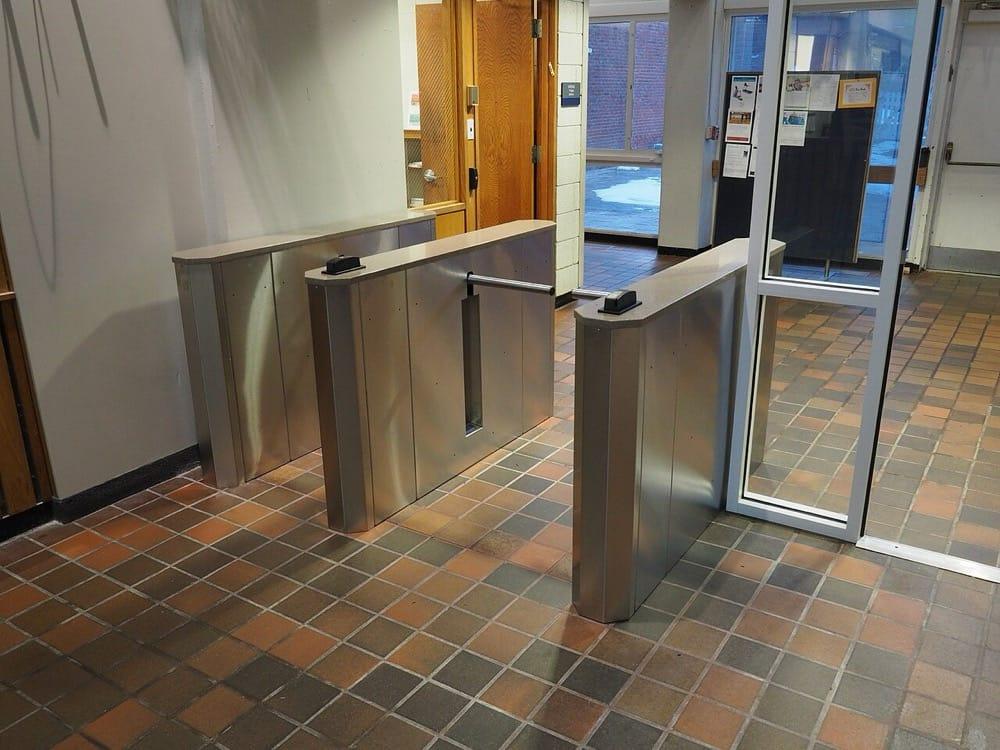
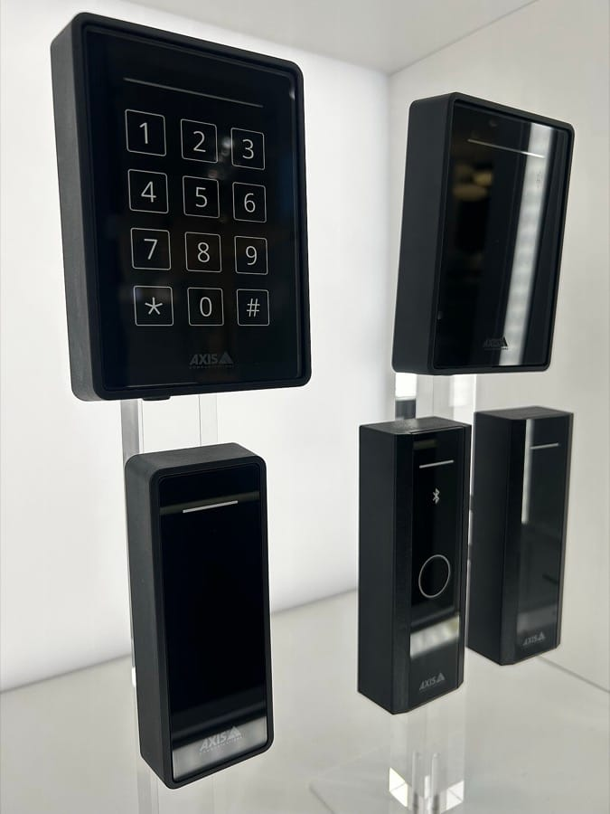

> **Before you read.** A company has multifactor authentication everywhere, a
> firewall estate somebody is proud of, and a patching record that survives an
> audit.
>
> A person in a high visibility jacket, holding a clipboard, walks in behind an
> employee at nine in the morning, spends forty minutes in the comms room, and
> leaves.
>
> **Which of those controls helped, and what would have?**

None of them helped, and the reason is worth stating before the list of
equipment. Every control in the rest of this block assumes the attacker is on the
other end of a wire. Physical access removes that assumption, and once it is
removed most of the controls do not degrade gracefully, they stop applying.

### Some words you will need

<dl class="terms">
<dt>tailgating</dt>
<dd>Following an authorised person through a door they opened. Also called piggybacking when they hold it for you.</dd>
<dt>access control vestibule</dt>
<dd>Two doors with a space between them, where the second will not open until the first has closed. Often called a mantrap.</dd>
<dt>bollard</dt>
<dd>A post stopping a vehicle reaching a building. A control against a specific attack rather than a general one.</dd>
<dt>honeypot</dt>
<dd>A system that exists to be attacked, holding nothing real, so that anything touching it is worth knowing about.</dd>
<dt>honeynet</dt>
<dd>A whole network of them, made convincing enough to hold somebody's attention for a while.</dd>
<dt>detective control</dt>
<dd>One that tells you something happened. A camera is one. It stops nothing.</dd>
</dl>

## What breaks without this

**Every other control is conditional on this one.** Encryption at rest protects a
disk from being read elsewhere. It does not protect a running machine from
somebody who can reach its console.

**The controls get bought in the wrong order.** Cameras are the popular purchase
and they prevent nothing, which is fine as long as everybody knows that is what
they bought.

**An alert nobody can interpret is the same as no alert.** The value of a signal
depends on how much noise it arrives in, and that is the whole argument for the
second half of this topic.

## Why the physical layer is different

Every attack in the topics ahead has to work through a network stack that
somebody designed to resist it. A person standing in the room does not.

Consider what a comms room gives up to somebody with forty minutes in it. Console
access to switches, which on a great many networks means a password prompt that
accepts a default. A port to plug into, on the inside of every filter. The cables
themselves, which can be tapped or simply moved. And on many devices a physical
reset that returns the thing to factory configuration, which is a documented
feature rather than an attack.

**So the honest way to hold this is that physical access is not one more layer.
It is underneath all of them**, and the controls that matter are the ones that
decide who gets into the room.

<figure class="learn-figure photo pair">

<figcaption>The gate and the reader, which are two different controls that get discussed as one. The reader answers who you are, and the models here span the whole authentication argument on their own: the plain panels want a card, which is something you have, and the one with a keypad wants a code as well, which is something you know. The gate answers how many people go through per authentication, and that is the question the reader cannot answer at all. A reader with no barrier behind it authenticates the first person and counts nobody. Photographs by Fabtron, <a href="https://creativecommons.org/licenses/by-sa/4.0/">CC BY-SA 4.0</a>, and Lindiloue, <a href="https://creativecommons.org/publicdomain/zero/1.0/">CC0</a>.</figcaption>
</figure>

If you already secure buildings: what a stolen device gives away after it has left

The forty minutes in the room is the obvious risk. The device carried out of it is the
one that keeps giving.

A switch or a firewall taken from a rack holds its configuration, and a configuration is
a map: the addressing, the VLANs, the routing, the names of the other devices, and
frequently the management addresses of everything else. It also holds credentials. Even
where passwords are stored hashed, shared secrets for authentication servers and
monitoring communities are often recoverable, and those work against the rest of the
estate from anywhere.

So a theft is a configuration disclosure and a credential disclosure, and it stays that
way until somebody does something about it. The response that matters is not replacing
the hardware, which is an insurance question, but rotating every secret that device held
and reviewing what its configuration revealed. That is a list somebody has to be able to
produce, which means knowing what was on the device, which is the inventory problem from
topic 36 again.

The same reasoning applies to equipment leaving deliberately. A device sent for repair or
disposal with its configuration intact has been handed to a stranger, which is why
decommissioning includes wiping rather than only recording. Topic 37 covers the process;
this is why the wipe step is in it.

## The controls, and what each one actually stops

The exam lists these, and the useful way to learn them is by what they do rather
than by what they are.

**Locks** stop entry without a key, and the interesting question is what counts as
a key. A physical key can be copied and cannot be revoked. A badge can be revoked
in a second and leaves a record. A code cannot be revoked from one person without
changing it for everybody, which is the same argument the wireless topic made
about a shared passphrase, arriving in a corridor.

**Badge readers** authenticate a person and produce a log, and the log is
frequently the more valuable half. Knowing who entered the comms room, and when,
turns an incident into an investigation.

**Cameras** are detective. They record. A camera has never stopped anybody,
though a visible one deters people who are deciding whether to try, and the
recording is what makes an investigation possible afterwards. Buying cameras and
believing you have bought prevention is the common mistake.

**An access control vestibule** stops tailgating, and it is the only control on
this list that does. Two doors, the second not opening until the first has closed,
one person at a time. It is expensive and unpopular and there is no substitute for
it.

**Bollards** stop a vehicle. That is a narrow control against a specific attack,
and it appears on this list because for some sites that attack is the one that
matters.

**Guards** are the only control that exercises judgement, which is both the
argument for them and the reason they can be talked past.

If you already specify these: which controls prevent and which only tell you afterwards

The list divides cleanly once you ask whether a control stops something or merely records
it, and mixing the two is how a site ends up feeling protected while being observed.

Locks, barriers, bollards and mantraps prevent. They physically stop somebody who has not
been admitted, and they work whether or not anybody is watching. Cameras and logs do not
prevent anything at all: they produce a record, which deters some people and helps after
the fact, and a camera pointed at a door that anybody can walk through has changed nothing
about who gets in.

That distinction decides where money goes. A site with excellent camera coverage and a
door that is propped open every morning has bought a recording of its own compromise. The
detective controls are worth having and they are worth having second, after the preventive
ones do their job.

The category that spans both is the one worth knowing for the exam and for practice: a
control that prevents casual access and records determined access is where most real
designs land, because absolute prevention is expensive and rarely necessary. A badge
reader on a comms room prevents the person who wandered in and records the person who
borrowed a badge, and knowing which of those two you have prevented is the honest way to
describe it.

## The attack that needs no exploit

Now the person with the clipboard.

Tailgating works because the control is delegated to a human being who has been
asked to be rude to a stranger carrying something heavy, in a building where they
do not know everybody, on behalf of a policy they did not write. Nearly everyone
holds the door. The high visibility jacket and the clipboard are not a disguise so
much as a reason for you not to ask.

**What defeats it is not a better lock**, because the lock worked. Somebody
authenticated and the door opened correctly. What defeats it is a control that
counts people rather than authentications, which is the vestibule, or a person
whose job is specifically to challenge, which is a guard.

Everything else on the list is unaffected by this attack. The badge reader logged
one entry and it was a legitimate one. The camera recorded somebody who will be
identified after the fact if anybody watches the recording. The bollards were
irrelevant. That is the point of the scenario at the top of this page: the
controls were not bypassed, they were simply answering a different question.

If you already work on networks: why the console port survives everything, and what to do about it

The specific reason forty minutes in a comms room is so expensive is a piece of
hardware nobody thinks about, which is the console port.

A switch or router's console is a serial connection that predates every network
control on the device. It does not care about the firewall, the management VLAN,
the access lists or the authentication server, because it exists precisely to work
when all of those are broken or unreachable. That is a good design decision. It is
also the reason physical access is total access.

Three things follow that are worth checking on any network you inherit.

Console access usually authenticates against the local database rather than
against the central server, because the whole point is that it works when the
central server does not. So the local account on every device is a real
credential, and on a surprising number of networks it is the same one everywhere
and was set during installation.

Password recovery is a documented procedure on essentially every managed device,
performed at the console, and it works by design. Some platforms allow it to be
disabled, which trades recoverability for security and is a decision worth making
deliberately rather than by default.

And the configuration can be read as well as changed. A device that has never
been touched will still hand over the wireless pre-shared key, the RADIUS shared
secret, and any credentials stored in its configuration.

None of that is a vulnerability. It is a set of features behaving correctly, and
the only control that addresses any of it is the door.

## Deception, and what it is actually for

A **honeypot** is a system that exists to be attacked. It holds nothing real,
serves no users, and is made just interesting enough to be worth somebody's time.
A **honeynet** is several of them arranged as a network, which is what you build
when you want an intruder to spend a while believing they are making progress.

The usual explanation is that they catch attackers, and that is the least useful
thing about them.

<figure class="learn-figure">
<svg viewBox="0 0 720 254" role="img" aria-labelledby="hp-title" style="width:100%;height:auto;">
<title id="hp-title">A production segment carrying constant legitimate traffic next to a honeypot segment carrying none, where a single connection is unambiguous</title>
<g fill="currentColor">
<text x="14" y="20" font-size="11">the same alert, raised on two segments, meaning two completely different things</text>
<rect x="14" y="40" width="330" height="120" rx="4" fill="currentColor" fill-opacity="0.05" stroke="currentColor" stroke-opacity="0.5"/>
<text x="28" y="62" font-size="11.5">a production segment</text>
<text x="28" y="80" font-size="10" fill-opacity="0.75">real users, real applications, all day</text>
<line x1="30" y1="96" x2="38" y2="96" stroke="currentColor" stroke-opacity="0.45" stroke-width="3"/>
<line x1="43" y1="96" x2="51" y2="96" stroke="currentColor" stroke-opacity="0.45" stroke-width="3"/>
<line x1="56" y1="96" x2="64" y2="96" stroke="currentColor" stroke-opacity="0.45" stroke-width="3"/>
<line x1="69" y1="96" x2="77" y2="96" stroke="currentColor" stroke-opacity="0.45" stroke-width="3"/>
<line x1="82" y1="96" x2="90" y2="96" stroke="currentColor" stroke-opacity="0.45" stroke-width="3"/>
<line x1="95" y1="96" x2="103" y2="96" stroke="currentColor" stroke-opacity="0.45" stroke-width="3"/>
<line x1="108" y1="96" x2="116" y2="96" stroke="currentColor" stroke-opacity="0.45" stroke-width="3"/>
<line x1="121" y1="96" x2="129" y2="96" stroke="currentColor" stroke-opacity="0.45" stroke-width="3"/>
<line x1="134" y1="96" x2="142" y2="96" stroke="currentColor" stroke-opacity="0.45" stroke-width="3"/>
<line x1="147" y1="96" x2="155" y2="96" stroke="currentColor" stroke-opacity="0.45" stroke-width="3"/>
<line x1="160" y1="96" x2="168" y2="96" stroke="currentColor" stroke-opacity="0.45" stroke-width="3"/>
<line x1="173" y1="96" x2="181" y2="96" stroke="currentColor" stroke-opacity="0.45" stroke-width="3"/>
<line x1="186" y1="96" x2="194" y2="96" stroke="currentColor" stroke-opacity="0.45" stroke-width="3"/>
<line x1="199" y1="96" x2="207" y2="96" stroke="currentColor" stroke-opacity="0.45" stroke-width="3"/>
<line x1="212" y1="96" x2="220" y2="96" stroke="currentColor" stroke-opacity="0.45" stroke-width="3"/>
<line x1="225" y1="96" x2="233" y2="96" stroke="currentColor" stroke-opacity="0.45" stroke-width="3"/>
<line x1="238" y1="96" x2="246" y2="96" stroke="currentColor" stroke-opacity="0.45" stroke-width="3"/>
<line x1="251" y1="96" x2="259" y2="96" stroke="currentColor" stroke-opacity="0.45" stroke-width="3"/>
<line x1="264" y1="96" x2="272" y2="96" stroke="currentColor" stroke-opacity="0.45" stroke-width="3"/>
<line x1="277" y1="96" x2="285" y2="96" stroke="currentColor" stroke-opacity="0.45" stroke-width="3"/>
<line x1="290" y1="96" x2="298" y2="96" stroke="currentColor" stroke-opacity="0.45" stroke-width="3"/>
<line x1="303" y1="96" x2="311" y2="96" stroke="currentColor" stroke-opacity="0.45" stroke-width="3"/>
<line x1="316" y1="96" x2="324" y2="96" stroke="currentColor" stroke-opacity="0.45" stroke-width="3"/>
<line x1="30" y1="112" x2="38" y2="112" stroke="currentColor" stroke-opacity="0.45" stroke-width="3"/>
<line x1="43" y1="112" x2="51" y2="112" stroke="currentColor" stroke-opacity="0.45" stroke-width="3"/>
<line x1="56" y1="112" x2="64" y2="112" stroke="currentColor" stroke-opacity="0.45" stroke-width="3"/>
<line x1="69" y1="112" x2="77" y2="112" stroke="currentColor" stroke-opacity="0.45" stroke-width="3"/>
<line x1="82" y1="112" x2="90" y2="112" stroke="currentColor" stroke-opacity="0.45" stroke-width="3"/>
<line x1="95" y1="112" x2="103" y2="112" stroke="currentColor" stroke-opacity="0.45" stroke-width="3"/>
<line x1="108" y1="112" x2="116" y2="112" stroke="currentColor" stroke-opacity="0.45" stroke-width="3"/>
<line x1="121" y1="112" x2="129" y2="112" stroke="currentColor" stroke-opacity="0.45" stroke-width="3"/>
<line x1="134" y1="112" x2="142" y2="112" stroke="currentColor" stroke-opacity="0.45" stroke-width="3"/>
<line x1="147" y1="112" x2="155" y2="112" stroke="currentColor" stroke-opacity="0.45" stroke-width="3"/>
<line x1="160" y1="112" x2="168" y2="112" stroke="currentColor" stroke-opacity="0.45" stroke-width="3"/>
<line x1="173" y1="112" x2="181" y2="112" stroke="currentColor" stroke-opacity="0.45" stroke-width="3"/>
<line x1="186" y1="112" x2="194" y2="112" stroke="currentColor" stroke-opacity="0.45" stroke-width="3"/>
<line x1="199" y1="112" x2="207" y2="112" stroke="currentColor" stroke-opacity="0.45" stroke-width="3"/>
<line x1="212" y1="112" x2="220" y2="112" stroke="currentColor" stroke-opacity="0.45" stroke-width="3"/>
<line x1="225" y1="112" x2="233" y2="112" stroke="currentColor" stroke-opacity="0.45" stroke-width="3"/>
<line x1="238" y1="112" x2="246" y2="112" stroke="currentColor" stroke-opacity="0.45" stroke-width="3"/>
<line x1="251" y1="112" x2="259" y2="112" stroke="currentColor" stroke-opacity="0.45" stroke-width="3"/>
<line x1="264" y1="112" x2="272" y2="112" stroke="currentColor" stroke-opacity="0.45" stroke-width="3"/>
<line x1="277" y1="112" x2="285" y2="112" stroke="currentColor" stroke-opacity="0.45" stroke-width="3"/>
<line x1="290" y1="112" x2="298" y2="112" stroke="currentColor" stroke-opacity="0.45" stroke-width="3"/>
<line x1="303" y1="112" x2="311" y2="112" stroke="currentColor" stroke-opacity="0.45" stroke-width="3"/>
<line x1="316" y1="112" x2="324" y2="112" stroke="currentColor" stroke-opacity="0.45" stroke-width="3"/>
<line x1="30" y1="128" x2="38" y2="128" stroke="var(--red)" stroke-width="3"/>
<text x="28" y="150" font-size="10.5" fill="var(--red)">one of these is an intruder</text>
<rect x="376" y="40" width="330" height="120" rx="4" fill="currentColor" fill-opacity="0.05" stroke="currentColor" stroke-opacity="0.5"/>
<text x="390" y="62" font-size="11.5">a honeypot segment</text>
<text x="390" y="80" font-size="10" fill-opacity="0.75">no users, no applications, nothing scheduled</text>
<line x1="392" y1="112" x2="400" y2="112" stroke="var(--red)" stroke-width="3"/>
<text x="390" y="150" font-size="10.5" fill="var(--red)">and so is this one</text>
<text x="14" y="196" font-size="10.5">on the left the alert has to be separated from everything legitimate, which is most of the work</text>
<text x="14" y="212" font-size="10.5" fill-opacity="0.85">and where the false positives live. on the right there is nothing to separate it from.</text>
<text x="14" y="236" font-size="10.5">a honeypot is not a better sensor. it is the same sensor somewhere with no noise.</text>
</g></svg>
<figcaption>The same connection, in two places, and the difference is not the sensor. On a production segment an alert has to be separated from everything legitimate happening around it, and that separation is most of the work in security monitoring and the source of nearly all its false positives. On a segment with no users, no applications and nothing scheduled, there is nothing to separate it from. That is the whole value of a honeypot, and it is a property of where it sits rather than of what it runs.</figcaption>
</figure>

**The value is the signal-to-noise ratio**, and that phrase is doing the same work
here as it did in the wireless topics. A honeypot has no legitimate users, so it
generates no legitimate traffic, so any interaction with it is worth looking at.
There is no tuning, no baselining, and no argument about whether this particular
connection is normal for this host, because nothing is normal for that host.

That is a genuinely rare property in security monitoring, where most of the effort
goes into deciding which alerts to ignore.

Two other things they buy, and one risk.

They buy time, in that an intruder spending an hour on a convincing fake is an
hour not spent on anything real, and they buy information about what somebody is
actually trying, which is more concrete than a threat report.

The risk is that a honeypot is a real system on your network with deliberately
weak defences. If it is not isolated properly it becomes a foothold rather than a
sensor, which is why the segmentation topic ahead matters more here than anywhere
else in this block.

## Prove it

Nothing on this page is captured, and the reason is different from the cabling
topics. There is no technical obstacle to standing up a honeypot in a namespace.
The obstacle is that a transcript of a system nobody attacked would demonstrate
nothing, and attacking somebody else's to produce one is not something this track
is going to do.

So the evidence is a document and a walk.

**NIST SP 800-53.** Free, and it is the catalogue most of this vocabulary comes
from. Find the Physical and Environmental Protection family and read the control
on physical access control. Then answer one question: does the catalogue treat
monitoring physical access as the same control as controlling it, or as a separate
one? The answer tells you why a camera and a lock are not substitutes.

**RFC 4949.** The internet security glossary, free, and unusually readable. Look
up the entries for the words this page uses. It is worth doing once for the habit
rather than for any single definition, because a great deal of security writing
uses these terms loosely and this document does not.

**Then walk your own building.** Enter the way you always do and count the points
at which somebody would have had to decide to challenge you. In most buildings the
answer is zero after the front door, and noticing that is worth more than reading
about it.

## What trips people up

### 1. Treating physical access as one more layer

It is underneath the others rather than beside them. Console access, cable access
and a documented password recovery procedure are all available to somebody in the
room, and none of them is a vulnerability.

### 2. Buying cameras as prevention

A camera is detective. It records what happened so somebody can find out
afterwards. A visible one deters some people from trying, and that is a different
and weaker claim than stopping them.

### 3. Thinking a better lock stops tailgating

The lock worked. Somebody authenticated and the door opened correctly, and a
second person walked through the same opening. Only a control that counts people
rather than authentications addresses this.

### 4. Believing a honeypot is for catching people

Its value is that it has no legitimate traffic, so any interaction is unambiguous.
That is a monitoring property rather than a trap, and it is why the placement
matters more than what the honeypot runs.

### 5. Deploying a honeypot without isolating it

It is a real system with deliberately weak defences. Badly placed, it is a
foothold on your network rather than a sensor watching it.

### 6. Reading a badge log as a headcount

It records authentications. Two people through one opening is one log entry, which
is exactly the gap the clipboard walked through.

## Work it through

The morning in the scenario, control by control, asking of each one what question
it was answering.

The front door lock was answering whether the person who presented a badge is
allowed in. It answered correctly. An employee badged in, and the door opened for
an authorised person.

The badge reader was answering who that person was and recording it. It also
answered correctly, and its log will show one entry at a plausible time, belonging
to somebody with a good reason to be there. Nothing in that log is anomalous
because nothing anomalous happened at the reader.

The camera was answering what happened, for later. It has the footage. Whether
anybody watches it depends on whether anybody has reason to, and on the morning
itself nobody did, because no control reported a problem.

The comms room door is the one worth pausing on, because it is where the design
usually fails. If the same badge opens the front door and the comms room, then
being inside the building is the same thing as being inside the comms room, and
the second door is decoration. Separate credentials for the room, with a separate
log, is the change that costs least here.

Then the forty minutes. What was available in that time is the panel above:
console access to switches authenticating against a local account, a live port on
the inside of every filter, and the configurations of anything reachable. The
useful question after the fact is not what did they do, it is what did they have
access to, and the answer is set by what is in the room rather than by what they
were seen doing.

So what would have helped, in order of cost. A separate credential on the comms
room door, which is cheap and mostly a policy decision. Someone whose job is to
challenge people they do not recognise, which is expensive and effective. And a
vestibule, which is expensive, unpopular, and the only thing on the list that
stops the attack itself rather than recording it.

## Try it

**Count the challenge points on your own way in.** From the pavement to your desk,
how many times could a human being have decided to ask who you are.

**Find out whether one credential opens both the building and the comms room.**
This is a one question answer and it is frequently yes.

**Look up two of this page's words in RFC 4949.** The definitions are tighter than
the ones in circulation, and the habit of checking is the point.

## Check yourself

Why is physical access described as being underneath the other controls rather than alongside them?

Because the controls above it assume the attacker is at the other end of a wire,
and physical access removes that assumption rather than weakening it.

Somebody in the room has console access, which authenticates locally by design so
that it works when the network does not. They have a live port inside every
filter. They have the cables. And on nearly every managed device they have a
documented password recovery procedure performed at the console.

None of those is a flaw. They are features working correctly, and the only control
that addresses any of them is the door.

A badge reader, a camera and a lock are all working correctly and somebody unauthorised spent the morning in the comms room. How?

Tailgating. An authorised person badged in, the lock opened correctly for them,
and a second person walked through the same opening.

Every control answered its own question correctly. The reader answered who
presented a badge. The lock answered whether to open. The camera answered what
happened, for later. None of them answers how many people went through one
opening, and that is the question the attack exploits.

The control that does answer it is an access control vestibule, or a person whose
job is to challenge.

What is the actual value of a honeypot, and why is placement more important than what it runs?

That it has no legitimate users, so it produces no legitimate traffic, so anything
touching it is worth investigating without any tuning or baselining.

On a production segment the same alert has to be separated from everything normal
happening around it, and that separation is where the effort and the false
positives live. On a honeypot there is nothing to separate it from.

So the value is a property of where it sits rather than of what software it runs,
and a badly isolated honeypot is a weakly defended real machine on your network
rather than a sensor.

Why is a shared door code a worse credential than a badge, in the same way a shared wireless passphrase is worse than an account?

Because it can only be revoked collectively.

A badge belongs to one person, can be disabled in seconds, and leaves a record
naming them. A code is known by everyone who has ever been told it, cannot be
withdrawn from one person without changing it for everybody, and the log, if there
is one, records that the correct code was entered rather than who entered it.

It is the argument from the wireless topic in a corridor, and it fails the same
way: the change that should happen when somebody leaves is expensive enough that
it does not happen.

Which control on the exam's list is preventive, which is detective, and why does the distinction matter for buying?

A lock, a vestibule and a bollard are preventive: they stop something happening. A
camera is detective: it records that it did. A badge reader is both, since it
decides whether to open and writes a log.

It matters because cameras are the popular purchase and prevent nothing. That is
perfectly acceptable if it is what somebody meant to buy, and a serious problem if
they believe they have bought prevention.

## References

- [NIST SP 800-53 Rev. 5](https://csrc.nist.gov/pubs/sp/800/53/r5/upd1/final) - NIST, the control catalogue most of this vocabulary comes from, including the Physical and Environmental Protection family. Free. Accessed 2026-08-11.
- [RFC 4949](https://www.rfc-editor.org/rfc/rfc4949) - IETF, the internet security glossary, which defines these terms more tightly than general usage does. Free. Accessed 2026-08-11.
- [NFPA 75](https://www.nfpa.org/codes-and-standards/nfpa-75-standard-development/75) - National Fire Protection Association, for the room requirements topic 13 introduced and this one depends on. Free read-only access after registration. Accessed 2026-08-11.

**Pictures.** Freely licensed files from Wikimedia Commons, downloaded and served
from this site rather than linked across to somebody else's server. Each is
resized and otherwise unaltered.

- [Q-Lane Turnstiles](https://commons.wikimedia.org/wiki/File:Q-Lane_Turnstiles.jpg) by Fabtron, [CC BY-SA 4.0](https://creativecommons.org/licenses/by-sa/4.0/).
- [Access control solutions from Axis Communications](https://commons.wikimedia.org/wiki/File:Access_control_solutions_from_Axis_Communications.jpg) by Lindiloue, [CC0](https://creativecommons.org/publicdomain/zero/1.0/).

**Where the numbers came from.** There are no numbers on this page, which is
itself worth saying: this is the one topic in the track that is entirely about
judgement and none of it is measurable. The control vocabulary is from NIST SP
800-53 and RFC 4949 rather than from any figure. Nothing is captured, and the
reason is not that it could not be: a honeypot in a namespace is easy to build,
and a transcript of one nobody attacked would prove nothing.

**If you also work on Linux.** The console equivalent on a server is the serial
console or the out of band management interface, and both are worth auditing for
the same reason: they authenticate independently of everything else so that they
work when everything else is down, which is exactly what makes them valuable to
somebody in the room.
