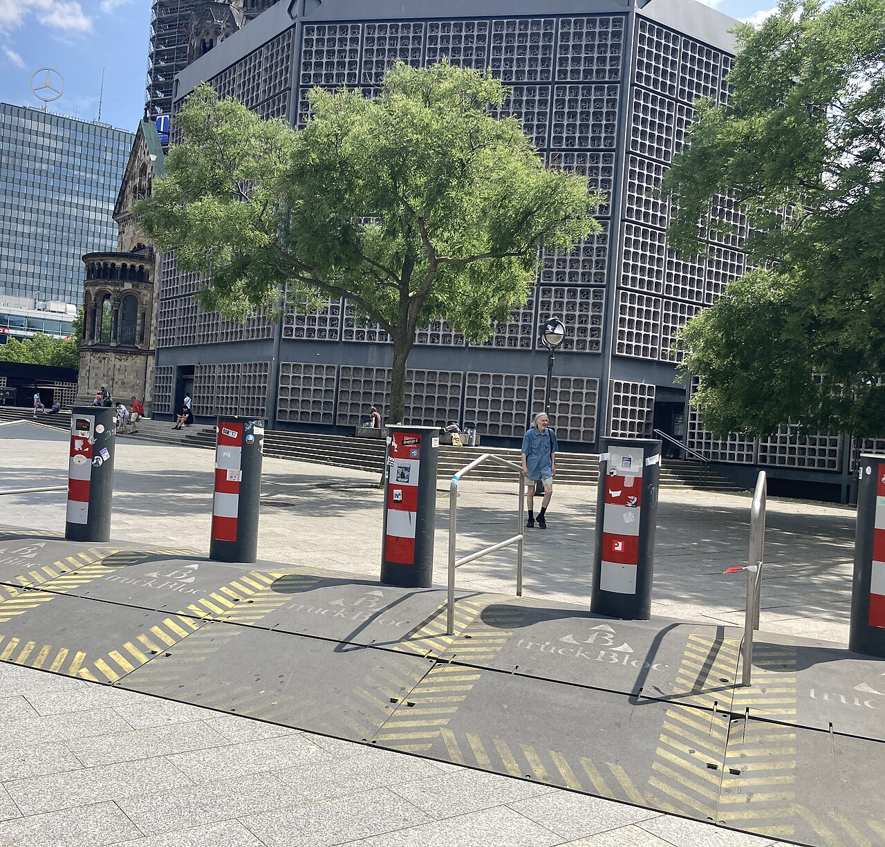
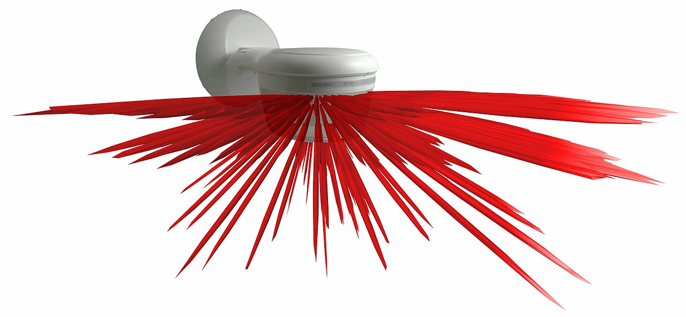

> **Before you read.** A building has a card reader on the front door, a camera
> in reception, and a policy about visitors. It also has a fire exit at the side
> that people prop open in summer because the corridor gets hot.
>
> **Which door is the building's actual entrance, and what is the card reader
> measuring?**

Physical security is the part of this exam that people skim because it has no
commands in it. It is also the part where a control failing is easiest to see,
which makes it the best place to learn what a control is for.

### Some words you will need

<dl class="terms">
<dt>bollard</dt>
<dd>A post designed to stop a vehicle. Nothing to do with people.</dd>
<dt>access control vestibule</dt>
<dd>Two doors with a space between them, where the second will not open until the first has closed. Older material calls it a mantrap.</dd>
<dt>tailgating</dt>
<dd>Following an authorised person through a door they opened.</dd>
<dt>access badge</dt>
<dd>A credential presented to a reader. Something you have.</dd>
<dt>video surveillance</dt>
<dd>Cameras. Detective, and deterrent only when somebody knows about them.</dd>
<dt>security guard</dt>
<dd>The only control on the list that can exercise judgement.</dd>
<dt>sensor</dt>
<dd>A device that detects a physical change. Four kinds are named, and they detect four different things.</dd>
</dl>

## What breaks without this

**The controls are bought for the wrong threat.** Bollards get installed to stop
intruders, and they stop vehicles. Cameras get installed to prevent theft, and
they record it.

**One authentication admits several people.** A reader counts credentials
presented. It does not count people who walked through, and the difference is
the most common physical breach there is.

**The strongest door is not the one people use.** Every building has a route
somebody found convenient, and it is usually the one with no control on it at
all.

**A sensor alarms constantly and gets ignored.** Choosing one whose blind spots
match the room is the difference between a detective control and a nuisance
somebody has unplugged.

## Each control, and what it actually stops

The exam names these together and they answer completely different questions.

**Bollards stop vehicles.** That is the whole of it, and it is worth being blunt
because bollards get discussed as though they were general-purpose security.

<figure class="learn-figure photo">

<figcaption>Bollards installed in front of the Kaiser Wilhelm Memorial Church in Berlin after the 2016 attack there. The spacing is the design: wide enough that people walk through without noticing, narrow enough that nothing on wheels does. A control that stops one specific thing completely and everything else not at all is easy to undervalue, and this is what one looks like. Photograph by PhoenixXxXxXxX, <a href="https://creativecommons.org/licenses/by/4.0">CC BY 4.0</a>.</figcaption>
</figure>

**Fencing marks a boundary and slows a determined person down.** Its real job is
usually making crossing the line unambiguous, so that somebody inside it has
visibly chosen to be there.

**Lighting makes other controls work.** It detects nothing on its own. A camera
in the dark records darkness, and a guard cannot see what is not lit, so lighting
is the control that multiplies the others.

**Video surveillance records.** It is detective. It becomes deterrent when
somebody knows it is there, which is the sign's job rather than the camera's, and
that distinction is the same one topic 02 makes about type being a statement of
purpose.

**Access badges answer who.** They are something you have, which means they work
exactly as well as the assumption that the person holding one is the person it was
issued to.

**Security guards are the only control on the list that can think.** Everything
else applies a rule. A guard notices that somebody is behaving oddly, that a
delivery is expected on Thursdays and this is Tuesday, and that the man with the
ladder does not have the right kind of confidence. That is expensive and it is
the only answer to anything the rules did not anticipate.

If you specify these: why the badge is the weakest thing in the building

A badge is something you have, and the entire physical access control industry has
spent thirty years discovering what that means.

The oldest card types transmit a fixed number and nothing else. Anybody who can
get within reading distance can capture that number and write it to a blank card
with equipment that costs less than a meal out. There is no cryptography involved
because there was none in the design: the card says a number and the reader
believes it.

Newer credentials do challenge and response with a key on the card, which fixes
copying and introduces key management to a building, which is a conversation most
facilities teams have never had. NIST SP 800-116 exists for exactly this and is
the readable treatment of what a credential has to do at a door.

Two practical things follow. The generation of a card system is a security
property and is usually undocumented, so "we have card access" says nothing until
somebody reads what the readers actually are. And the failure is silent: a cloned
card works perfectly, the log shows a legitimate badge, and there is nothing in
the record that distinguishes it from the real one.

That last point is why the interesting control is not the badge at all. It is
whatever makes one badge admit exactly one person, which is the next section.

## The only control that answers tailgating

Somebody badges in. Somebody else walks through behind them, carrying a box, and
the first person holds the door because that is what people do.

Of everything on the objectives list, bollards, fencing, lighting, cameras, guards, badges, sensors, how many actually reduce the chance of somebody walking in behind an authorised person?

**One, and it is not any of those.** It is the access control vestibule, which
the list prints alongside the others as though it were another item of the same
kind rather than the only answer to a specific failure.

The reason is worth predicting before reading the section. A badge reader
authenticates. Tailgating is not an authentication failure: the reader worked
correctly, the right person presented the right credential, and the door then did
what doors do, which is stay open for as long as it takes several people to pass
through. Nothing in a credential system counts bodies.

Take the rest in turn and the same thing happens each time. A guard can watch for
it and looks away. A camera records it and does so afterwards. A turnstile
narrows the opening and can be climbed or jumped. A policy asks an employee to
challenge a stranger carrying a box, which is a real control and a weak one
because of what it asks of people.

**No amount of authentication fixes that.** The reader worked. The right person
presented the right credential and was correctly admitted. The problem is that a
door, once open, admits any number of people, and nothing in the credential
system counts them.

An **access control vestibule** is the control that answers it, and it works by
being architecture rather than by being clever: two doors with a space between,
and the second will not unlock until the first is shut. One authentication, one
enclosed space, and whoever is in it has to be admitted individually.

Everything else on the list addresses this partially at best. A guard can watch
for it and is not always looking. A camera records it, afterwards. A turnstile
narrows the opening and is climbable. A policy tells people not to hold the door
and asks them to be rude to a stranger holding a box, which is a lot to ask.

The trade is cost and flow. Vestibules are slow, they are unpleasant in a crowd,
and they are why you meet them at data centre entrances and not at the front of an
office. That is a legitimate decision and the useful version of it is stated
rather than assumed: we accept tailgating at the front door and we do not accept
it at the room with the servers in it.

If you have run this argument: what a vestibule is really counting, and the fire problem

The property a vestibule provides has a name worth knowing, which is that it
enforces one-to-one correspondence between authentications and entries. Anti
passback is the related control in the same family: the system refuses a badge
that enters twice without leaving, which catches the case where a badge is passed
back through a window.

Both of those are about counting rather than about identity, and noticing that is
what makes the category clear. The reader answers who. The vestibule answers how
many. Those are different questions and a building that has answered only the
first has not answered the second at all.

The constraint that shapes every real installation is fire. Egress cannot be
prevented, in any jurisdiction, ever, so every one of these controls has to fail
open on the way out while failing closed on the way in. That is why the exit side
is usually a push bar and no credential, and it is why the interesting attack on a
vestibule is not the vestibule at all.

It is the fire exit, which brings this back to the top of the page. A door that
must open from the inside without a credential, in a corridor nobody watches, is
the least controlled route into most buildings, and the control that covers it is
an alarm on the door rather than a lock in it.

## Four sensors, four different physical facts

The objectives name infrared, pressure, microwave and ultrasonic in one list,
which makes them look like four brands of the same thing.

An intruder alarm keeps triggering on nothing, so somebody turns the sensitivity down. What has that done to the two failure rates, and what would move both the right way at once?

**Turning it down trades one failure for the other, one for one.** Sensitivity is
a single dial and the two rates sit at opposite ends of it. Fewer false alarms,
more missed intrusions, and nothing has improved except how often the alarm is
annoying.

The thing that moves both at once is a second sensor working on a different
physical principle, wired so the alarm needs both to agree. It works because the
two technologies do not produce false alarms for the same reasons. A draught
across a room sets off an ultrasonic sensor and means nothing to an infrared one.
A radiator warming up does the reverse. Requiring agreement cancels most of the
false alarms without lowering either sensor's ability to see an actual person,
which is why infrared paired with microwave is the common installation.

If you guessed that a better sensor was the answer, that is the intuition worth
correcting. A more sensitive device moves further along the same dial. A
different kind of device changes what the dial is measuring.

<figure class="learn-figure">
<svg viewBox="0 0 720 324" role="img" aria-labelledby="sens-title" style="width:100%;height:auto;">
<title id="sens-title">The four sensor types the objectives name, each shown by what physical thing it detects and the situation each one is blind to</title>
<g fill="currentColor">
<text x="14" y="20" font-size="11">four sensors, four different physical facts, four different blind spots</text>
<text x="150" y="46" font-size="9.5" fill-opacity="0.85">what it actually detects</text>
<text x="452" y="46" font-size="9.5" fill-opacity="0.85">what it does not see</text>
<text x="14" y="76" font-size="9.5">infrared</text>
<rect x="140" y="60" width="290" height="24" rx="3" fill="currentColor" fill-opacity="0.07" stroke="currentColor" stroke-opacity="0.6" stroke-width="1.2"/>
<text x="152" y="76" font-size="8.5">a moving warm body against a cooler background</text>
<rect x="446" y="60" width="260" height="24" rx="3" fill="var(--red)" fill-opacity="0.12" stroke="var(--red)" stroke-opacity="0.7" stroke-width="1.2"/>
<text x="458" y="76" font-size="8.5">something at room temperature, or very slow</text>
<text x="14" y="124" font-size="9.5">pressure</text>
<rect x="140" y="108" width="290" height="24" rx="3" fill="currentColor" fill-opacity="0.07" stroke="currentColor" stroke-opacity="0.6" stroke-width="1.2"/>
<text x="152" y="124" font-size="8.5">weight on a mat, a floor, or a hinge</text>
<rect x="446" y="108" width="260" height="24" rx="3" fill="var(--red)" fill-opacity="0.12" stroke="var(--red)" stroke-opacity="0.7" stroke-width="1.2"/>
<text x="458" y="124" font-size="8.5">anybody who steps over or around it</text>
<text x="14" y="172" font-size="9.5">microwave</text>
<rect x="140" y="156" width="290" height="24" rx="3" fill="currentColor" fill-opacity="0.07" stroke="currentColor" stroke-opacity="0.6" stroke-width="1.2"/>
<text x="152" y="172" font-size="8.5">a radio reflection whose frequency has shifted</text>
<rect x="446" y="156" width="260" height="24" rx="3" fill="var(--red)" fill-opacity="0.12" stroke="var(--red)" stroke-opacity="0.7" stroke-width="1.2"/>
<text x="458" y="172" font-size="8.5">nothing much, including through a wall</text>
<text x="14" y="220" font-size="9.5">ultrasonic</text>
<rect x="140" y="204" width="290" height="24" rx="3" fill="currentColor" fill-opacity="0.07" stroke="currentColor" stroke-opacity="0.6" stroke-width="1.2"/>
<text x="152" y="220" font-size="8.5">a sound reflection whose frequency has shifted</text>
<rect x="446" y="204" width="260" height="24" rx="3" fill="var(--red)" fill-opacity="0.12" stroke="var(--red)" stroke-opacity="0.7" stroke-width="1.2"/>
<text x="458" y="220" font-size="8.5">anything behind soft furnishings or a draught</text>
<text x="14" y="264" font-size="10" fill-opacity="0.85">the bottom two work the same way and differ only in what they send out</text>
<text x="14" y="286" font-size="10" fill-opacity="0.85">a microwave sensor seeing through a wall is a feature and a false alarm generator</text>
<text x="14" y="308" font-size="10" fill-opacity="0.85">so the pairing you meet in real installations is infrared and microwave, both required</text>
</g></svg>
<figcaption>The objectives print these four as a list, which makes them look like four brands of the same product. They detect four different physical facts and that is what decides where each one belongs. Infrared is passive and waits for a moving heat difference, so it fails on anything at room temperature and on somebody moving slowly enough. Pressure detects weight and is defeated by not putting weight there. Microwave and ultrasonic are the same idea twice, sending a wave out and measuring the frequency of what comes back, and they differ in what the wave will pass through: radio goes through plasterboard and sound does not. That is why the common installation pairs infrared with microwave and alarms only when both agree. Each one covers the other's blind spot, and requiring both is what makes the false alarm rate low enough that somebody still responds to it at three in the morning.</figcaption>
</figure>

They detect four different physical facts, and what each one is blind to is what
decides where it belongs.

<figure class="learn-figure photo">

<figcaption>A motion detector with its beam pattern superimposed, and the length of each beam is its sensitivity in that direction. This is the fact a bullet-pointed list of sensor types cannot carry: a passive infrared sensor does not watch a room, it watches a set of wedges, and it triggers when a warm object crosses from one wedge into the next. That is why moving slowly and directly towards one is the classic way past it, and why coverage is a question about where the gaps between the beams fall rather than about whether the device points at the door. Photograph by AndreasCT, <a href="https://creativecommons.org/licenses/by-sa/4.0">CC BY-SA 4.0</a>.</figcaption>
</figure>

**Infrared is passive.** It emits nothing and waits for a moving heat difference,
which is why it is cheap and why it fails on anything close to room temperature.

**Pressure detects weight**, on a mat, a floor or a hinge, and is defeated by not
putting weight there.

**Microwave and ultrasonic are the same idea twice.** Both send a wave out and
measure the frequency of what comes back, and both differ only in what the wave
passes through. Radio goes through plasterboard and sound does not.

That last difference is why microwave sensors generate false alarms: seeing
through the wall is a genuine capability and it means the sensor reacts to the
corridor, the car park and the weather.

**Which is why real installations pair two technologies and alarm only when both
agree.** Infrared and microwave is the common pairing, because each covers the
other's blind spot, and requiring both is what gets the false alarm rate low
enough that somebody still gets out of bed for it.

If you tune these: the two ways a sensor is wrong, and which one you are choosing

Every detector has one dial on it, whatever the marketing says, and turning it
trades one kind of mistake for the other.

A **false positive** alarms when nothing happened. It costs a response, and its
real cost is compounding: a sensor that cries wolf weekly is a sensor whose
alarms get acknowledged without being investigated, and eventually unplugged. The
control is still installed, still on the inventory, and no longer a control.

A **false negative** is the intrusion it did not report. It costs nothing at all
until the one time it matters, which is what makes it so much easier to live with
and so much worse.

You cannot minimise both by adjusting sensitivity, because they are the same dial
in opposite directions. What does move both at once is a second sensor on a
different physical principle, which is the pairing above, and it works because the
two technologies do not produce false positives for the same reasons. A draught
sets off an ultrasonic sensor and not an infrared one; a warm pipe does the
reverse.

The same trade runs through the whole exam and it is worth meeting it here, on a
device you can hold, before it turns up again as an intrusion detection tuning
question and as an alert fatigue question. The physical version is the easiest one
to reason about, because the failure is visible: somebody has taped over the
sensor.

## Prove it

**Work it out.** Walk the building you are in, or the last one you worked in, and
find the route in with the fewest controls on it. Loading bay, smoking area, fire
exit, car park barrier that is up during the day. That route is the building's
real security posture, and the front door is a statement of intent.

**Work it out again.** Take the four sensor types and place each one in a room you
know: a server room with no windows, a warehouse with a roller shutter, an office
with a suspended ceiling. For each, name what it would miss and what would set it
off falsely. The answers are different in each room, which is the point.

**Look it up.** NIST SP 800-116 Rev. 1 covers using credentials at a door. Read
what it says about authentication mechanisms at different security levels and
answer one question: at the higher levels, is presenting the card sufficient on
its own, and if not what is added? The answer is why the card reader in the
scenario is measuring less than people assume.

## What trips people up

### 1. Treating bollards as general security

They stop vehicles. That is all they do, and they do it completely. A control with
one job is not a weak control.

### 2. Expecting a card reader to stop tailgating

It counts credentials, not people. The door admits everybody who walks through
while it is open, and no improvement to the reader changes that.

### 3. Calling a camera preventive

It records. It becomes a deterrent when somebody knows it is there, which is
usually a sign doing that work rather than the camera.

### 4. Believing lighting is not a control

It detects nothing and makes the cameras and the guards work. Removing it degrades
every other control in the same area.

### 5. Treating the four sensors as interchangeable

They detect heat, weight, radio reflection and sound reflection. Choosing on price
rather than on which physical fact is available in that room is how you get an
alarm somebody has unplugged.

### 6. Forgetting the exit

Egress cannot be blocked, so every entry control has a matching door that opens
freely from inside. The alarm on that door is the control, and it is the one
nobody tests.

## Work it through

Back to the building with the propped fire exit.

**First, name what the card reader is actually measuring.** It records that a
credential was presented at the front door. It is not measuring how many people
entered, and it is not measuring the side of the building at all.

**Then rank the routes rather than the controls.** The front door has a reader and
a camera. The fire exit has a bar and a wedge. An attacker chooses the route, so
the building's posture is the weakest route rather than the average of them, and
listing controls per door is what makes that visible.

**Then reject the fixes that do not survive summer.** Locking the fire exit is
illegal and would not survive an inspection. A policy telling people not to prop
it has been tried and produced the wedge. A camera on it records the wedge going
in every June.

**Then find one that addresses the reason.** The door is propped because the
corridor is hot, so the durable fix is ventilation, which is not a security
control and is the actual answer. Alongside it, an alarm on the door held open for
more than thirty seconds converts an invisible condition into a noticeable one,
and it fails safe: the door still opens, the alarm still sounds, and nobody is
trapped.

**Then say what is still uncovered.** Anybody who opens the fire exit briefly,
from inside, for somebody waiting outside, defeats all of it. That is a person
problem and the controls for it are the awareness ones in topic 76, not the
physical ones here.

The decision, written the way it should be written down: fix the ventilation, add
a held-open alarm to the fire exit, and leave the front door as it is, because a
vestibule there is not justified for the value inside. The rejected option is a
lock on the fire exit, and the cost of rejecting it is nothing, because it was
never available. The residual is deliberate collusion, which no door hardware
addresses.

## Try it

**Count the controls on your own way in this morning.** Which are preventive,
which detective, which deterrent, and how many people went through per
authentication. That last number is usually not one.

**Find the propped door.** Every building has one. Look for the wedge, the bin,
the fire extinguisher used as a doorstop. Then work out what it is compensating
for, because it is almost always a real problem somebody solved the only way they
could.

**Look up at the ceiling.** Find the motion sensors and work out which type they
are and which way they face. Then find the part of the room they cannot see, which
the beam pattern photograph above should tell you how to look for.

## Check yourself

An organisation installs bollards after a break-in. What did they buy?

Protection against a vehicle being driven into the building, which is what a
bollard does and the only thing it does.

If the break-in was somebody forcing a door on foot, the bollards address none of
it. That is not an argument against bollards, which stop vehicle attacks
completely, but it is why naming the threat before choosing a control matters more
here than anywhere else on the exam.

A card reader is working correctly and unauthorised people are entering the building. How?

Tailgating. The reader counts credentials presented and the door admits everybody
who walks through while it is open, so one valid authentication can admit any
number of people.

Nothing about improving the credential fixes it, because nothing went wrong with
the credential. The control that answers it is an access control vestibule, which
uses two interlocked doors to enforce one entry per authentication. A guard, a
camera and a policy each address it partially and none of them enforces it.

Why do serious installations pair an infrared sensor with a microwave one?

Because each covers the other's blind spot, and requiring both to agree brings the
false alarm rate down.

Infrared is passive and needs a moving heat difference, so it misses anything near
room temperature. Microwave sends out radio and measures the reflection, which
passes through plasterboard, so it detects reliably and also reacts to the
corridor and the car park. Alone, one under-detects and the other over-alarms, and
an alarm nobody believes is not a detective control.

What is lighting doing, given that it detects nothing?

Making the other controls work. A camera in the dark records darkness and a guard
cannot see what is not lit, so lighting multiplies the effectiveness of everything
detective in the same area.

It is also deterrent in its own right, on the same terms as any deterrent: it
works on somebody weighing whether to try and does nothing to somebody who has
decided.

Why can a fire exit not simply be locked, and what covers it instead?

Because egress cannot be prevented. Every entry control has a matching door that
opens freely from the inside, and no jurisdiction permits otherwise.

What covers it is detection rather than prevention: an alarm when the door is held
open, which turns an invisible condition into a noticeable one while leaving the
door working. And often the real fix is not a security control at all. A door
propped every summer is usually a ventilation problem, and addressing the reason
outlasts addressing the symptom.

## References

- [NIST SP 800-53 Rev. 5](https://csrc.nist.gov/pubs/sp/800/53/r5/upd1/final) - NIST, the control catalogue, whose physical and environmental protection family covers everything on this page. Free. Accessed 2026-08-25.
- [NIST SP 800-116 Rev. 1](https://csrc.nist.gov/pubs/sp/800/116/r1/final) - NIST, using credentials in facility access, and the readable treatment of what a badge has to do at a door and what presenting one proves. Free. Accessed 2026-08-25.
- [NIST SP 800-12 Rev. 1](https://csrc.nist.gov/pubs/sp/800/12/r1/final) - NIST, an introduction to information security, for physical controls in the context of the rest of a programme. Free. Accessed 2026-08-25.
- Bollards photograph by PhoenixXxXxXxX, [CC BY 4.0](https://creativecommons.org/licenses/by/4.0), from [Wikimedia Commons](https://commons.wikimedia.org/wiki/File:Kaiser_Wilhelm_Memorial_Church_truck_barrier.jpg).
- Motion detector photograph by AndreasCT, [CC BY-SA 4.0](https://creativecommons.org/licenses/by-sa/4.0), from [Wikimedia Commons](https://commons.wikimedia.org/wiki/File:Motion_Detector_with_Beam_Pattern.jpg).

**Where the content came from.** Nothing on this page is captured, because a
bollard does not have a command line. The two photographs are freely licensed
files from Wikimedia Commons, downloaded and committed to this repository rather
than linked, and credited above in the form their licences require. The sensor
figure is built from the four types the objectives name, with the physical
principle and the blind spot for each; the pairing of infrared with microwave is
the standard arrangement in commercial installations rather than a recommendation
from any of the documents cited.

**If you also work on networks.** The Network+ track's
[physical security and deception](/learn/network-plus/physical-security-and-deception)
topic covers the same controls from the point of view of protecting network
equipment, and
[physical installations](/learn/network-plus/physical-installations) covers the
room those controls are protecting.
