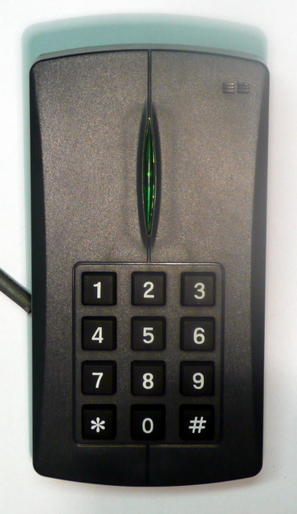

> **Before you read.** A door reader logs a valid entry at 09:14. The badge belongs
> to somebody who is demonstrably in another country that morning, and the badge is
> in their pocket.
>
> **What happened, and which part of the system failed?**

Nothing failed. The reader accepted a credential it was designed to accept and the
credential was presented by somebody else, because the older kind of badge answers
the same way to anybody who asks. This topic is about attacks on the physical layer
and on the network, which share a property: both work against systems doing exactly
what they were built to do.

### Some words you will need

<dl class="terms">
<dt>brute force, physical</dt>
<dd>Applying force to a barrier. The oldest attack and still relevant to a door.</dd>
<dt>RFID cloning</dt>
<dd>Copying a badge's identifier so a duplicate answers the same way.</dd>
<dt>environmental attack</dt>
<dd>Changing the conditions a system depends on: power, cooling, water.</dd>
<dt>denial of service</dt>
<dd>Making something unavailable. Distributed when the traffic comes from many sources.</dd>
<dt>reflection</dt>
<dd>Sending a request with somebody else's address on it, so the answer goes to them.</dd>
<dt>amplification</dt>
<dd>Choosing a request whose answer is much larger than itself.</dd>
<dt>on-path</dt>
<dd>Positioned where traffic passes, able to observe and to modify.</dd>
<dt>credential replay</dt>
<dd>Capturing something that proved identity and presenting it again.</dd>
</dl>

## What breaks without this

**A cloned badge is treated as a system failure.** The reader worked and the
credential was valid, and the defect is that the credential was copyable.

**Amplification is blamed on the responding service.** The resolver answered a
question, correctly, and the fix is somewhere else entirely.

**An on-path position is assumed to reveal everything.** It reveals a great deal
and, against encrypted traffic, not the contents.

**Encryption is assumed to stop replay.** It stops reading, and a captured proof of
identity presented again is not being read.

## The physical half

<figure class="learn-figure photo">



<figcaption>A 125 kHz proximity reader with a keypad. The two halves are worth reading as a security design rather than as a product: the card is something you have and the keypad is something you know, and a reader with both is asking for two factors where a reader without the keypad asks for one. The frequency matters more than it looks. Devices at this frequency typically transmit a fixed identifier when energised, with no challenge and no cryptography, which means anything that can listen at close range obtains everything needed to reproduce it. Photograph by Andriusval, public domain.</figcaption>
</figure>

**RFID cloning works because the older badges answer unconditionally.** The reader
energises the card, the card transmits its identifier, and the reader compares that
identifier against a list. There is no challenge, nothing proves the card is
present rather than a recording of it, and the identifier is not a secret in any
meaningful sense.

<figure class="learn-figure photo">


<figcaption>Tags at 13.56 MHz, in the two form factors people carry. This is the frequency where the newer schemes live, and the important difference is not the number: it is that devices at this frequency can support a challenge and a cryptographic response, so the reader asks something the card has to compute rather than recite. Whether a particular deployment uses that capability is a separate question, and plenty of installations run cards that could authenticate in a mode that simply transmits an identifier, which is the older behaviour wearing newer hardware. Photograph by Anonymous Agent, CC BY-SA 4.0.</figcaption>
</figure>

**Brute force belongs in this objective because doors are physical.** A reader
controls a lock, and a lock is a mechanical device with a mechanical failure mode.
It is worth naming because access control reviews concentrate on the credential and
the frame, the hinges and the glass beside the door are part of the control.

**Environmental attacks target what the system needs rather than the system.**
Power, cooling and water. A data hall whose cooling fails is unavailable without
anybody touching a computer, and those dependencies are frequently outside the
security team's model entirely.

<details class="deeper">
<summary>If you own the badge system: what to check, and the migration nobody schedules</summary>

An access control estate accumulates the same way everything else in this track
does, and three checks find most of what matters.

**Which credential technology is actually in use.** Not what was purchased, what is
deployed, because estates run mixed populations: a newer reader will frequently
accept older credentials for compatibility, which means the newest reader in the
building is as strong as the oldest badge it will accept. That backwards
compatibility is a setting and it is usually on.

**Whether the identifier is all that is checked.** A system comparing a number
against a list is doing something different from one that challenges the card. The
question to ask the integrator is direct: does the reader authenticate the card, or
read it.

**What the reader is wired to.** A reader on the outside of a door is in the
attacker's hands, and if the wire from it to the controller carries the decision
rather than a request, cutting into it is easier than defeating anything else. The
protocols in older installations were designed when the wire was assumed to be
inside.

The migration nobody schedules is the credential one. Replacing readers is visible
capital work with a project. Replacing every badge held by every employee,
contractor and visitor is logistics, and it is the half that determines whether the
new readers are doing anything, because until the old credentials stop being
accepted they are still the weakest thing in the building.

The practical intermediate step, where a full migration is not affordable, is to
stop accepting the old technology at the doors that matter, which is a per-door
setting and is a much smaller conversation than an estate-wide replacement.

</details>
<details class="predict">
<summary>A badge is used at 09:14 in one building while its owner is provably elsewhere. Predict what the access log alone can establish.</summary>

**That a credential matching that identifier was presented. Nothing about who
presented it.**

That is the whole of what the record contains, and it is worth being precise
because the natural reading of an access log is that a person went through a door.
The reader compared a number against a list and opened a lock, which is what it was
built to do, and it has no mechanism for knowing whether the number came from the
issued card, a copy of it, or a device transmitting the same sequence.

So the log establishes presence of a credential and the investigation has to supply
the rest. The camera covering that door, if there is one and if it is retained. The
network authentication of the same person at the same moment, which places them
somewhere. Whether the badge was used anywhere else that day and how far apart
those readings are, which is the impossible travel indicator from the next topic
arriving in a physical form.

The uncomfortable half is what the finding implies about every other entry in the
log. If one identifier could be reproduced, the log is evidence of credentials
rather than of people generally, and any prior investigation that treated it
otherwise rested on an assumption nobody stated.

Which is why the remediation for a cloning finding is not usually about the one
badge. It is about whether the technology in use authenticates the card or reads
it, because that decides what every future log entry means.

</details>


## What makes amplification work

The network half of this objective contains one mechanism worth measuring rather
than describing.

<details class="predict">
<summary>A small DNS question is sent to a public resolver. Predict how much larger the answer is.</summary>

```bash
# AlmaLinux 10.2, x86_64
$ answer-ratio
resolver: 1.1.1.1, EDNS0 buffer 4096
question                      sent  received  ratio
A example.com                   40        72    1.8x
TXT google.com                  39      1103   28.3x
DNSKEY cloudflare.com           43       203    4.7x
```

**Twenty-eight times, for the largest of the three, and the sizes are the point.**
Thirty-nine bytes of question produced one thousand one hundred and three bytes of
answer.

The other two rows matter as much. An ordinary address lookup returned less than
twice what it was asked, which is nothing useful to anybody. So amplification is
not a property of the protocol; it is a property of the particular question, and
the attacker's work is choosing one whose answer is large.

That reframes what a defender is looking for. The question is not whether you run a
service that answers queries. It is whether you run one that will answer a small
question with a large answer, to anybody, without a relationship.

Two things combine to make this an attack rather than a curiosity.

**Reflection supplies the target.** The protocol is over a connectionless
transport, so the sender writes whatever source address it likes and the answer is
delivered there. The attacker never touches the victim.

**Amplification supplies the volume.** Each byte the attacker sends arrives at the
victim as twenty-eight, which turns a modest sending capacity into a large arriving
one.

Neither works without the other. Reflection alone moves the same volume and hides
the origin. Amplification without reflection sends a large answer back to the
attacker, which is not useful to them.

</details>

<figure class="learn-figure">
<svg viewBox="0 0 720 268" role="img" aria-labelledby="amp-title" style="width:100%;height:auto;">
<title id="amp-title">One measured DNS question and the answer it produced, drawn to the same scale, with the ratio between them</title>
<g fill="currentColor">
<text x="14" y="20" font-size="11">one real question and one real answer, drawn to the same scale</text>
<text x="14" y="78" font-size="9">the question</text>
<rect x="190" y="60" width="16" height="26" rx="2" fill="var(--accent)" fill-opacity="0.35" stroke="var(--accent)" stroke-width="1.4"/>
<text x="216" y="78" font-size="9">39 bytes</text>
<text x="14" y="148" font-size="9">the answer</text>
<rect x="190" y="130" width="460" height="26" rx="2" fill="var(--red)" fill-opacity="0.30" stroke="var(--red)" stroke-width="1.4"/>
<text x="660" y="148" font-size="9">1103 bytes</text>
<path d="M 190 92 V 124" stroke="currentColor" stroke-opacity="0.35" stroke-width="1"/>
<text x="200" y="114" font-size="10" fill="var(--red)" fill-opacity="0.95">28.3x</text>
<text x="14" y="196" font-size="10" fill-opacity="0.85">the sender chooses where the answer is delivered, by writing an address on the question</text>
<text x="14" y="216" font-size="10" fill-opacity="0.85">so a small effort produces a large arrival somewhere the sender never touched</text>
<text x="14" y="244" font-size="9" fill-opacity="0.7">which is why the fix is at the network that lets a forged source address leave, not at the resolver</text>
</g></svg>
<figcaption>The measured pair drawn to one scale. The upper bar is barely visible, which is the shape of the problem: an attacker with a modest connection produces an arriving volume nearly thirty times larger, at a victim they never contacted. What the drawing also explains is where the remedy belongs. The resolver answered a question correctly and has no way to know the source address was forged, so asking every resolver operator to behave differently is asking them to solve somebody else's problem. The address could only be forged because a network somewhere let a packet leave carrying a source address that did not belong to it, and that is the network the fix belongs to.</figcaption>
</figure>

**Reflection and amplification are separate ideas** and exam items separate them.
Reflection is about who receives the answer. Amplification is about how big it is.
A reflected attack with a ratio near one is possible and pointless; an amplified
answer sent back to the attacker is possible and pointless. The combination is what
gets used.

**And the fix is ingress filtering**, which is a network operator's control rather
than a service operator's. A network that refuses to forward a packet whose source
address does not belong to it makes the forgery impossible at the point of
departure. That has been documented practice for decades and remains incompletely
deployed, which is why the technique still works.
<details class="deeper">
<summary>If you are asked to prepare for denial of service: what you can do in advance, and what you cannot</summary>

Denial of service is the class where preparation matters most and where the useful
preparation is least technical, so it is worth separating what is yours from what
is not.

**What you cannot do** is absorb a volumetric attack at your own edge. If more
traffic arrives than your link carries, the link is full before any equipment you
own sees a packet, and no configuration changes that. Every control you operate
sits behind the constraint.

**What you can do in advance** is four things, none of them exciting.

Know who to call and have called them before. Whatever upstream filtering exists is
provided by a network operator or a mitigation service, and the difference between a
relationship established in advance and one negotiated during an outage is measured
in hours.

Know what your normal looks like. A mitigation service asked to filter needs to
distinguish attack traffic from customers, and that is much easier if somebody can
say what the ordinary volume, geography and protocol mix are. That baseline is free
to collect and impossible to collect during the event.

Reduce what you expose. Anything not required to be reachable from the internet is
a service that cannot be targeted, which is the attack surface topic arriving here.

And separate what must survive. If the public website and the customer service
platform share a link, an attack on the first takes the second, and dividing them is
an architecture decision made calmly beforehand.

**The application-layer case is different** and worth distinguishing. An attack that
sends few requests but expensive ones is not saturating anything, so upstream
volume filtering does not see a problem. That one is yours, and the defences are
rate limiting, cost control on expensive operations, and knowing which of your
endpoints is disproportionately expensive to serve, which is a thing most teams
have never measured.

</details>


## On-path, and what it does not give

An on-path position means traffic passes through you, and its value is frequently
overstated in one direction and understated in another.

**What it gives you is complete.** Every packet, in both directions, with the
ability to delay, drop or modify. Against unencrypted traffic that is total control:
read anything, change anything, inject anything.

**Against encrypted traffic it gives you metadata and nothing else.** The
destination, because the name is negotiated before the encryption applies or
resolved beforehand. The certificate, because it is presented in the clear. The
sizes and timings of everything that follows. What it does not give you is the
contents, which is what the encryption is for.

That is more than people assume and less than the phrase suggests. Knowing that a
device contacted a particular service at a particular moment, and roughly how much
was exchanged, answers many questions without a single decrypted byte.

**The attack that changes this is a downgrade or a certificate the client accepts**,
which is topic 21's subject. An on-path position plus a trusted certificate is total
control again, which is why what a client trusts is the property everything rests on.

<details class="deeper">
<summary>If you assess this risk: why credential replay survives encryption, and what actually stops it</summary>

Encryption stops somebody reading what passes. It does not stop somebody who
already holds a valid credential from presenting it, and that distinction is the
whole of why replay persists.

Work through a session cookie. It is transmitted over an encrypted connection, so
nobody on the path reads it. It is stored on the client, so anything with access to
the client has it. Presented again from anywhere else it is accepted, because the
server's check is whether the value is valid and not where it came from. The
encryption did its job perfectly and is irrelevant to the failure.

The same shape covers a captured authentication response, a bearer token, a
long-lived key, and the one-time code from block E once it has been read out to
somebody.

What stops replay is binding, and there are three kinds worth distinguishing.

**Binding to time.** A short expiry limits the window rather than closing it, and
it is the weakest of the three because the window still exists.

**Binding to a nonce.** The server issues a challenge and the response covers it, so
a captured response is valid once and never again. This is what stops a recorded
authentication from being reused.

**Binding to a channel or an origin.** The credential is usable only over the
connection it was issued for, or only at the site it belongs to. That is the
strongest, and it is the security key argument from block E arriving here: a
signature bound to an origin cannot be replayed at another.

The practical hierarchy for an engineer: prefer credentials that are bound rather
than merely short-lived, and treat any bearer value as compromised the moment it
touches a device you do not control.

</details>

## Prove it

**Run it.** Send a small query to a public resolver and compare the size of what
you sent with what came back. The ratio varies by question, which is the finding.

**Work it out.** Take the measured ratio. If an attacker can send at ten megabits
per second, what arrives at a victim, and what does that say about how many
attackers are needed for a large attack?

**Look it up.** Open BCP 38 and read the recommendation. Then consider that it was
published decades ago and that the technique in this topic still works, which tells
you something about how a fix belonging to somebody else gets deployed.

## What trips people up

### 1. Treating a cloned badge as a system failure

The reader accepted a credential it was designed to accept. The defect is that the
credential can be copied, which is a property of the technology rather than of the
installation.

### 2. Blaming the resolver for amplification

It answered a question correctly and cannot know the source address was forged. The
forgery was possible because a network let the packet leave, which is where the fix
belongs.

### 3. Confusing reflection with amplification

Reflection decides who receives the answer, amplification decides how large it is,
and either alone is pointless. Exam items separate them and so should you.

### 4. Assuming an on-path position reveals contents

Against encrypted traffic it reveals the destination, the certificate, and the sizes
and timings. That is a great deal and it is not the payload.

### 5. Expecting encryption to prevent replay

Encryption stops reading. A valid credential presented again is not being read, and
what stops replay is binding it to a nonce, a channel or an origin.

### 6. Leaving the environment out of the threat model

Power, cooling and water take a data hall down without anybody touching a computer,
and those dependencies frequently sit outside the security team's model.

## Work it through

Your service is receiving a large volume of DNS responses it never requested. The
traffic is saturating the link and the responses come from thousands of legitimate
resolvers around the world.

**The tempting move is to block the sources.** They are identifiable and there are
thousands, and blocking is what a firewall does. It also happens at your end of a
saturated link, which is the part that is already full, so the packets have arrived
and consumed the capacity before your rule sees them.

**The move that works is upstream.** Your provider can filter before the traffic
reaches your link, which is the only place a volumetric attack can be addressed,
and the conversation is faster if the contact route was established before today.

**Then the second observation is worth making.** Those resolvers are not attacking
you; they are answering questions somebody asked while wearing your address. There
is nothing to report to them and nothing they did wrong, which is a difficult thing
to explain to somebody looking at a list of source addresses.

**What this rejects is treating volumetric traffic as a firewall problem.** A
firewall drops what arrives, and arriving is the harm.

The residual worth stating: nothing in this response prevents recurrence, because
the capability belongs to whoever forged the address and to the networks that let
them. Your options are upstream capacity and a provider relationship, which is a
purchasing decision rather than a technical one, and saying so plainly is more
useful than implying a configuration will fix it.

## Try it

**Measure a ratio.** Send a question to a public resolver and compare byte counts.
Try different record types and watch the ratio change.

**Look at your own badge.** Find out what frequency and what scheme your access
card uses. The answer is usually printed on it or known to whoever manages the
system, and it is frequently older than people expect.

**Check the backwards compatibility.** Ask whether your readers accept older
credential formats. If they do, the estate is as strong as the oldest badge it
admits.

**Find one bearer credential.** In any application you run, identify a value that
grants access simply by being presented. Then ask what would happen if somebody
else presented it.

## Check yourself

<details class="qa">
<summary>Why does RFID cloning work against older badges?</summary>

Because they answer unconditionally. The reader energises the card, the card
transmits a fixed identifier, and the reader compares that against a list. There is
no challenge and no cryptography, so nothing distinguishes the card from a
reproduction of its transmission.

Newer schemes at 13.56 MHz can support a challenge and a computed response, and
whether a given deployment uses that capability is a separate question from whether
the hardware supports it.

</details>

<details class="qa">
<summary>What two things does an amplified reflection attack combine?</summary>

Reflection supplies the target: the transport is connectionless, so the sender
writes any source address and the answer is delivered there, meaning the attacker
never contacts the victim.

Amplification supplies the volume: a question chosen because its answer is much
larger. The measurement on this page shows 39 bytes producing 1,103, a ratio of
28.3, while an ordinary address lookup returned less than twice what it was asked.

</details>

<details class="qa">
<summary>Where does the fix for a reflected attack belong, and why not at the resolver?</summary>

At the network that allowed a packet to leave carrying a source address that did
not belong to it. That is ingress filtering, documented for decades and still
incompletely deployed.

The resolver answered a question correctly and has no mechanism for knowing the
source was forged. Asking every resolver operator to change is asking them to solve
a problem created elsewhere.

</details>

<details class="qa">
<summary>What does an on-path position give against encrypted traffic?</summary>

The destination, the certificate presented, and the sizes and timings of everything
that follows. Not the contents.

That is more than people assume, because knowing which service a device contacted
and roughly how much was exchanged answers a lot. It becomes total control only if
the client can be made to accept a certificate the attacker holds, which is a
different attack.

</details>

<details class="qa">
<summary>Why does credential replay survive encryption?</summary>

Because encryption prevents reading, and replay does not involve reading. A valid
session cookie, token or authentication response presented again is accepted,
because the server checks whether the value is valid rather than where it came
from.

What stops it is binding: to a nonce, so a captured response works once; or to a
channel or origin, so the credential is unusable elsewhere. A short expiry only
narrows the window.

</details>

## References

- [RFC 5358](https://www.rfc-editor.org/rfc/rfc5358.html) - IETF, on recursive nameservers used as reflectors, and what an operator can do. Free. Accessed 2026-08-26.
- [BCP 38](https://www.rfc-editor.org/rfc/rfc2827.html) - IETF, network ingress filtering, the recommendation that makes source forgery impossible at the point of departure. Free. Accessed 2026-08-26.
- [SP 800-98](https://csrc.nist.gov/pubs/sp/800/98/final) - NIST, securing RFID systems, for what the older technologies do and do not authenticate. Free. Accessed 2026-08-26.
- [RFC 6528](https://www.rfc-editor.org/rfc/rfc6528.html) - IETF, defending against sequence number attacks, for the on-path and injection material. Free. Accessed 2026-08-26.

**Photograph credits.** Both are downloaded and committed to this repository rather
than hotlinked.

- Proximity reader with keypad by Andriusval, [public domain](https://commons.wikimedia.org/wiki/Template:PD-self), from [Wikimedia Commons](https://commons.wikimedia.org/wiki/File:KeyPadReader.jpg).
- RFID tags at 13.56 MHz by Anonymous Agent, [CC BY-SA 4.0](https://creativecommons.org/licenses/by-sa/4.0), from [Wikimedia Commons](https://commons.wikimedia.org/wiki/File:13.56MHz_RFID_tags.jpg).

**Where the content came from.** The size measurement is captured from an AlmaLinux
10.2 container sending three ordinary DNS questions to a public resolver and
measuring the two message sizes. Nothing is spoofed, nothing is flooded, and no
third party receives anything: three queries is what a resolver exists to answer,
and the finding is the ratio between a question and its answer. No attack in this
topic is demonstrated, including the badge cloning and the on-path position, because
both require doing the thing rather than showing evidence of it. There is no
platform comparison, because these are properties of protocols and of hardware
rather than of an operating system.

**If you also work on networks.** The Network+ track's
[attacks on services and people](/learn/network-plus/attacks-on-services-and-people)
covers the same network attacks with the traffic each one produces, and
[physical security and deception](/learn/network-plus/physical-security-and-deception)
covers the door side.
