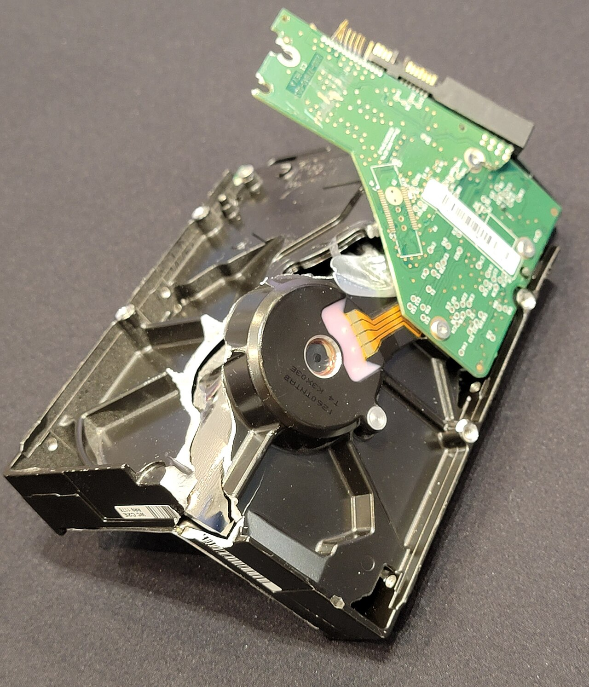
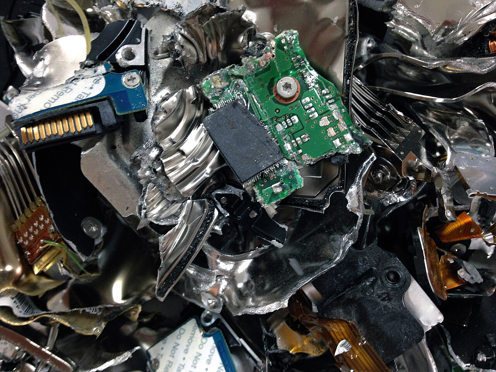
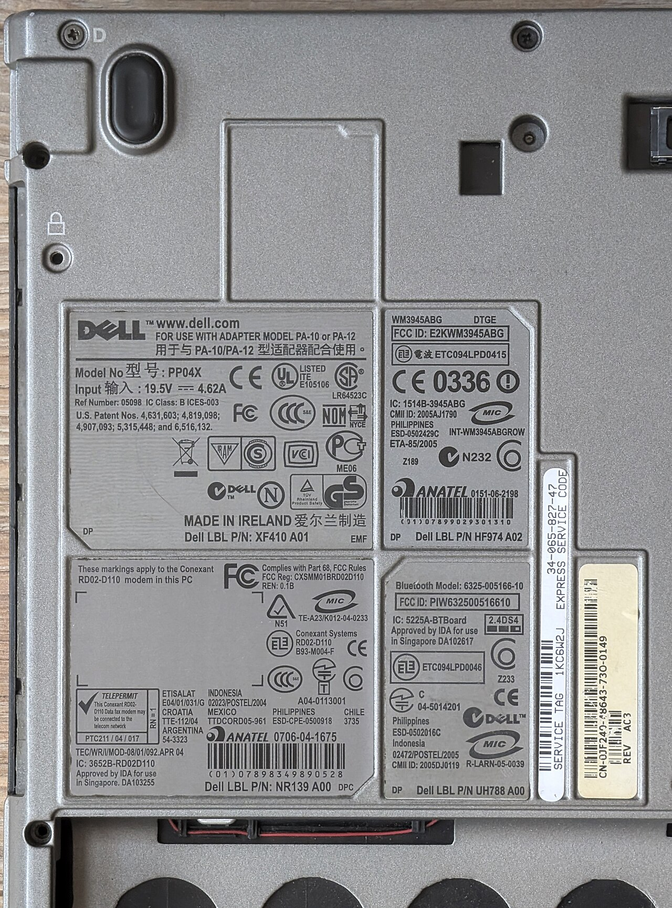

> **Before you read.** A contractor finished in March and handed back their
> laptop. It went into a cupboard, came out last week, and was issued to a new
> starter after somebody deleted the old user profile.
>
> **What is on that machine now, and who could tell you?**

Both halves of that question are the topic. The first is a fact about storage that
most people have wrong. The second is a fact about record-keeping, and it is the
one everything else on this page depends on.

### Some words you will need

<dl class="terms">
<dt>inventory</dt>
<dd>The list of what you have. A record per asset, with an owner, a location and a state.</dd>
<dt>enumeration</dt>
<dd>Finding out what you have, as opposed to reading what somebody wrote down. The two disagree.</dd>
<dt>asset owner</dt>
<dd>A named person accountable for one asset. Not the person using it, necessarily.</dd>
<dt>classification</dt>
<dd>What kind of data the asset holds, which decides how it is handled and how it is destroyed.</dd>
<dt>sanitization</dt>
<dd>Making the data on a medium unrecoverable while the medium survives.</dd>
<dt>destruction</dt>
<dd>Making the medium unusable. The data goes with it.</dd>
<dt>certificate of destruction</dt>
<dd>A signed record from whoever destroyed the medium, naming what was destroyed and when.</dd>
<dt>retention schedule</dt>
<dd>How long each kind of record is kept, and when it must be deleted.</dd>
</dl>

## What breaks without this

**Machines get reissued with the previous person's data on them.** The profile was
deleted, which is not the same as the data being gone, and the next user has a
disk that still contains it.

**Nobody can answer how many machines exist.** Every other control is scoped to a
population, and if the population is unknown then coverage figures are estimates
of an estimate.

**Disposal happens without a record.** Equipment leaves the building, and there is
nothing on paper saying what was on it or what happened to it.

**A deletion request cannot be honoured.** Somebody exercises a right to have their
data erased and there is no way to say where copies of it are, because there is no
list of what holds data.

## The control everything else depends on

Take any control on this exam and ask what it is applied to. Patching applies to
machines. Encryption applies to disks. Access review applies to accounts on
systems. Every one of them is scoped to a set of things, and the set has to exist
somewhere before the control can be said to cover it.

**That is why the inventory is not administrative filler.** A vulnerability report
saying 98 percent of machines are patched is a statement about the machines the
scanner found. If the inventory says 400 and the scanner found 340, the real figure
is unknown and lower, and nobody in the room can tell which of those two numbers is
wrong.

Enumeration and inventory are different words for a reason. The inventory is what
somebody wrote down. Enumeration is what is actually there, discovered by asking
the network, the directory, the cloud accounts and the purchasing records. The gap
between them is the finding, and it exists in every organisation that has not
recently looked.

<figure class="learn-figure">
<svg viewBox="0 0 720 320" role="img" aria-labelledby="life-title" style="width:100%;height:auto;">
<title id="life-title">An asset lifecycle in six stages with the data present at each one, and the two stages at either end where the organisation does not control the hardware</title>
<g fill="currentColor">
<text x="14" y="20" font-size="11">the data does not follow the ownership, which is the whole of this page</text>
<rect x="8" y="40" width="116" height="150" rx="5" fill="var(--red)" fill-opacity="0.07" stroke="var(--red)" stroke-opacity="0.45" stroke-width="1.2" stroke-dasharray="5 3"/>
<rect x="598" y="40" width="116" height="150" rx="5" fill="var(--red)" fill-opacity="0.07" stroke="var(--red)" stroke-opacity="0.45" stroke-width="1.2" stroke-dasharray="5 3"/>
<text x="66" y="56" text-anchor="middle" font-size="8" fill="var(--red)" fill-opacity="0.95">somebody else</text>
<text x="66" y="68" text-anchor="middle" font-size="8" fill="var(--red)" fill-opacity="0.95">has it</text>
<text x="656" y="56" text-anchor="middle" font-size="8" fill="var(--red)" fill-opacity="0.95">somebody else</text>
<text x="656" y="68" text-anchor="middle" font-size="8" fill="var(--red)" fill-opacity="0.95">has it</text>
<path d="M 120 96 H 130" stroke="currentColor" stroke-opacity="0.5" stroke-width="1.2"/>
<path d="M 127 93 L 131 96 L 127 99" fill="none" stroke="currentColor" stroke-opacity="0.5" stroke-width="1.2"/>
<path d="M 238 96 H 248" stroke="currentColor" stroke-opacity="0.5" stroke-width="1.2"/>
<path d="M 245 93 L 249 96 L 245 99" fill="none" stroke="currentColor" stroke-opacity="0.5" stroke-width="1.2"/>
<path d="M 356 96 H 366" stroke="currentColor" stroke-opacity="0.5" stroke-width="1.2"/>
<path d="M 363 93 L 367 96 L 363 99" fill="none" stroke="currentColor" stroke-opacity="0.5" stroke-width="1.2"/>
<path d="M 474 96 H 484" stroke="currentColor" stroke-opacity="0.5" stroke-width="1.2"/>
<path d="M 481 93 L 485 96 L 481 99" fill="none" stroke="currentColor" stroke-opacity="0.5" stroke-width="1.2"/>
<path d="M 592 96 H 602" stroke="currentColor" stroke-opacity="0.5" stroke-width="1.2"/>
<path d="M 599 93 L 603 96 L 599 99" fill="none" stroke="currentColor" stroke-opacity="0.5" stroke-width="1.2"/>
<rect x="14" y="82" width="104" height="28" rx="4" fill="var(--accent)" fill-opacity="0.12" stroke="var(--accent)" stroke-width="1.4"/>
<text x="66" y="100" text-anchor="middle" font-size="8.5">bought</text>
<rect x="132" y="82" width="104" height="28" rx="4" fill="var(--accent)" fill-opacity="0.12" stroke="var(--accent)" stroke-width="1.4"/>
<text x="184" y="100" text-anchor="middle" font-size="8.5">assigned</text>
<rect x="250" y="82" width="104" height="28" rx="4" fill="var(--accent)" fill-opacity="0.12" stroke="var(--accent)" stroke-width="1.4"/>
<text x="302" y="100" text-anchor="middle" font-size="8.5">in use</text>
<rect x="368" y="82" width="104" height="28" rx="4" fill="var(--accent)" fill-opacity="0.12" stroke="var(--accent)" stroke-width="1.4"/>
<text x="420" y="100" text-anchor="middle" font-size="8.5">reassigned</text>
<rect x="486" y="82" width="104" height="28" rx="4" fill="var(--accent)" fill-opacity="0.12" stroke="var(--accent)" stroke-width="1.4"/>
<text x="538" y="100" text-anchor="middle" font-size="8.5">decommissioned</text>
<rect x="604" y="82" width="104" height="28" rx="4" fill="var(--accent)" fill-opacity="0.12" stroke="var(--accent)" stroke-width="1.4"/>
<text x="656" y="100" text-anchor="middle" font-size="8.5">disposed of</text>
<text x="14" y="134" font-size="9.5" fill-opacity="0.9">data on it</text>
<path d="M 66 112 V 140" stroke="currentColor" stroke-opacity="0.3" stroke-width="1" stroke-dasharray="3 3"/>
<rect x="14" y="146" width="104" height="28" rx="4" fill="currentColor" fill-opacity="0.05" stroke="currentColor" stroke-opacity="0.5" stroke-width="1.1"/>
<text x="66" y="164" text-anchor="middle" font-size="8" fill-opacity="0.9">none</text>
<path d="M 184 112 V 140" stroke="currentColor" stroke-opacity="0.3" stroke-width="1" stroke-dasharray="3 3"/>
<rect x="132" y="146" width="104" height="28" rx="4" fill="currentColor" fill-opacity="0.05" stroke="currentColor" stroke-opacity="0.5" stroke-width="1.1"/>
<text x="184" y="164" text-anchor="middle" font-size="8" fill-opacity="0.9">a little</text>
<path d="M 302 112 V 140" stroke="currentColor" stroke-opacity="0.3" stroke-width="1" stroke-dasharray="3 3"/>
<rect x="250" y="146" width="104" height="28" rx="4" fill="currentColor" fill-opacity="0.05" stroke="currentColor" stroke-opacity="0.5" stroke-width="1.1"/>
<text x="302" y="164" text-anchor="middle" font-size="8" fill-opacity="0.9">all of it</text>
<path d="M 420 112 V 140" stroke="currentColor" stroke-opacity="0.3" stroke-width="1" stroke-dasharray="3 3"/>
<rect x="368" y="146" width="104" height="28" rx="4" fill="currentColor" fill-opacity="0.05" stroke="currentColor" stroke-opacity="0.5" stroke-width="1.1"/>
<text x="420" y="164" text-anchor="middle" font-size="8" fill-opacity="0.9">still all of it</text>
<path d="M 538 112 V 140" stroke="currentColor" stroke-opacity="0.3" stroke-width="1" stroke-dasharray="3 3"/>
<rect x="486" y="146" width="104" height="28" rx="4" fill="currentColor" fill-opacity="0.05" stroke="currentColor" stroke-opacity="0.5" stroke-width="1.1"/>
<text x="538" y="164" text-anchor="middle" font-size="8" fill-opacity="0.9">still all of it</text>
<path d="M 656 112 V 140" stroke="currentColor" stroke-opacity="0.3" stroke-width="1" stroke-dasharray="3 3"/>
<rect x="604" y="146" width="104" height="28" rx="4" fill="currentColor" fill-opacity="0.05" stroke="currentColor" stroke-opacity="0.5" stroke-width="1.1"/>
<text x="656" y="164" text-anchor="middle" font-size="8" fill-opacity="0.9">whatever survived</text>
<text x="14" y="216" font-size="10" fill-opacity="0.85">the inventory is what connects a serial number to a person and a date</text>
<text x="14" y="238" font-size="10" fill-opacity="0.85">without one, the two dashed boxes are the only stages you can describe</text>
<text x="14" y="272" font-size="10" fill="var(--red)" fill-opacity="0.95">the fourth box is where most estates actually lose data</text>
<text x="14" y="294" font-size="10" fill-opacity="0.85">a machine handed to the next person, still carrying everything the last one had</text>
</g></svg>
<figcaption>Six stages, and the row underneath is the one people do not think about. Data accumulates from the moment the machine is assigned and it does not decrease on its own: a machine coming back from a leaver holds everything that person put on it, and it holds all of it while it sits in a cupboard. The two dashed regions are the stages where the hardware is in somebody else's hands, at the beginning before you take delivery and at the end after it leaves for disposal. Most attention goes to the second one, because that is where the horror stories are. The stage that actually loses more data in ordinary organisations is the fourth, where a machine is handed to the next person without anything having been done to what is on it.</figcaption>
</figure>

<details class="deeper">
<summary>If you have tried to build an inventory: why it goes stale, and the one field that decides whether it survives</summary>

Everybody who has built an asset inventory has watched one decay. The pattern is
consistent enough to be worth naming: it is accurate on the day it is finished and
wrong within a quarter, because it was built as a project and maintained by
goodwill.

The field that decides whether it survives is not the serial number or the
location. It is the owner, and specifically whether the owner is a named person
rather than a team. A record owned by "IT Operations" is owned by nobody, so
nothing prompts an update when the machine moves. A record owned by a person
generates an email when the reconciliation runs and that person is asked to
confirm.

The second thing that decides it is whether the inventory is fed by something that
already happens. An inventory maintained by people remembering to update it is an
inventory that decays. One that is reconciled against the directory, the endpoint
management server, the purchasing system and the cloud account is one that decays
and then gets corrected, which is the achievable version.

NISTIR 8011 Volume 2 is the document that takes this seriously, and its framing is
useful even if you never use its measurement model: the questions it asks are how
many assets exist, how many are managed, and how quickly a new one becomes
managed. That third question is the one that catches the machine somebody bought
on a departmental card.

The uncomfortable version of this, worth saying because it comes up in every real
programme: an organisation that cannot produce an asset list also cannot produce a
meaningful coverage figure for anything else, and the numbers it has been
reporting were denominators somebody guessed.

</details>

## Deleting a file does not remove it

This is the part people know abstractly and have usually not seen. Here is a real
block device, a file with a distinctive string in it, and an ordinary deletion.

<details class="predict">
<summary>A file is written, then deleted with rm, and the filesystem is unmounted cleanly. Predict whether the string is still findable on the raw device.</summary>

```bash
# AlmaLinux 10.2, aarch64
$ mkfs.ext4 -q $DEV0; mkdir -p /mnt/d; mount $DEV0 /mnt/d; printf "CUSTOMER-LIST-7f3a2b91-DO-NOT-LEAK\n" > /mnt/d/customers.csv; umount /mnt/d; echo "the string is on the device, as expected:"; grep -ac "CUSTOMER-LIST-7f3a2b91" $DEV0; echo "delete the file the way anybody would, then unmount cleanly:"; mount $DEV0 /mnt/d; rm -f /mnt/d/customers.csv; sync; umount /mnt/d; echo "and the device still says:"; grep -ac "CUSTOMER-LIST-7f3a2b91" $DEV0
the string is on the device, as expected:
1
delete the file the way anybody would, then unmount cleanly:
and the device still says:
1
```

**Still there.** The same answer before and after, from a `grep` reading the raw
device rather than the filesystem.

What `rm` did was remove the directory entry and mark the blocks free. It did not
touch the blocks, because there is no reason for it to: writing over half a
megabyte to make a deletion feel thorough would make every deletion slow, and the
filesystem's job is to manage names rather than to erase contents.

So the data sits there until something else needs those blocks and happens to
write over them. On a disk with plenty of free space, that may be never.

This is the whole mechanism behind a reissued laptop leaking, and it is why
"we deleted the profile" is not an answer to "what is on that machine". It is also
why file recovery tools work at all, which is the same fact stated by somebody
selling you something.

</details>

Now the thing that does remove it.

```bash
# AlmaLinux 10.2, aarch64
$ dnf -q -y install e2fsprogs >/dev/null 2>&1; mkfs.ext4 -q $DEV0; mkdir -p /mnt/d; mount $DEV0 /mnt/d; printf "CUSTOMER-LIST-7f3a2b91-DO-NOT-LEAK\n" > /mnt/d/customers.csv; sync; umount /mnt/d; mount $DEV0 /mnt/d; rm -f /mnt/d/customers.csv; sync; umount /mnt/d; echo "same situation as the block above:"; grep -ac "CUSTOMER-LIST-7f3a2b91" $DEV0; echo "one pass of zeroes over the whole 512 MB device:"; dd if=/dev/zero of=$DEV0 bs=1M count=512 status=none; sync; grep -ac "CUSTOMER-LIST-7f3a2b91" $DEV0
same situation as the block above:
1
one pass of zeroes over the whole 512 MB device:
0
```

One pass, and it is gone. **That is sanitization: the medium survives and the data
does not.** The distinction between that and destruction is not a matter of
thoroughness. It is whether you still have a disk afterwards.

<details class="deeper">
<summary>If you specify sanitization for a living: the three levels, and why the medium chooses the method rather than the risk</summary>

SP 800-88 gives three levels and the names are worth learning because they turn up
in contracts.

**Clear** applies logical techniques through the device's normal read and write
interface. The overwrite above is a clear. It defeats anybody using ordinary
software to recover the data.

**Purge** applies a technique that defeats laboratory recovery. On magnetic media
that includes degaussing. On modern drives it usually means the device's own
sanitize command, which is a firmware operation rather than a stream of writes.

**Destroy** renders the medium unusable, and the data with it. Shredding,
disintegration, incineration.

The counterintuitive part, and the one that catches people who learned this on
spinning disks, is that the medium decides the method more than the sensitivity
does. Overwriting a hard disk works because a logical block address maps to the
same physical place every time. On a solid state drive it does not: the controller
writes wherever it likes, keeps spare capacity you cannot address, and moves data
around underneath you for wear levelling. A whole-device overwrite may therefore
leave copies in blocks the interface cannot reach.

That is why the correct answer for a solid state drive is the device's own
sanitize command or the destruction of the encryption key, and why degaussing,
which is genuinely effective on magnetic media, does nothing useful to flash at
all. Applying the magnetic answer to the wrong medium is one of the more common
mistakes in this area, and it produces a confident record of a sanitization that
did not happen.

The practical rule: read the medium first, then pick the method, then record which
one you used and against which device serial. All three of those end up in the
certificate.

</details>

## Sanitization, destruction, and the paperwork that separates them

<figure class="learn-figure photo">



<figcaption>This drive was erased by a strong magnetic field and then mechanically destroyed with a purpose-built data destroyer. Both steps are in SP 800-88's vocabulary and they are different levels: the degaussing is a purge, the deformation is a destroy. Doing both is common where the data was sensitive enough that somebody wanted the second step to be visible, because a purge leaves a working-looking drive and a photograph of a working-looking drive proves nothing to an auditor. Photograph by Dimawik, CC BY-SA 4.0.</figcaption>
</figure>

The paperwork is what makes the difference legible afterwards, and it is the part
the objective is really testing.

**A sanitized asset stays in your inventory**, with a record saying which method
was applied, by whom, on what date, against which serial number. It can then be
reissued, sold, donated or leased back, and the record is what lets you say the
data went before the hardware did.

**A destroyed asset leaves the inventory**, and the record that closes it is the
certificate of destruction. That certificate names the serial numbers, the method,
the date and the party who performed it, and it is the only evidence you will have
once the hardware is metal fragments.

**A certificate is required when somebody else did the destroying**, which is most
of the time, because the alternative is your word for it. It is also required by a
long list of regimes for particular data types, and the requirement is usually
written as a retention obligation on the certificate rather than on the data.

<figure class="learn-figure photo">



<figcaption>The same idea taken further. What is in this photograph used to be several drives, and the fragments include recognisable pieces of circuit board and a torn label still reading "Do Not Remove". This is what a shredding service produces and it is the only sanitization outcome that is obvious from a photograph, which is a large part of why organisations choose it: nobody has to trust a log file. It costs the residual value of the hardware, so the choice between this and a purge is usually financial rather than technical. Photograph by IT Liquidators, CC BY-SA 3.0.</figcaption>
</figure>

<details class="predict">
<summary>Four hundred laptops go to a disposal contractor who returns a certificate of destruction listing 400 serial numbers. What have you actually established?</summary>

**That the contractor says they destroyed 400 machines with those serials.** Which
is worth having, and is not the same as knowing your data is gone.

Three gaps are worth naming, in the order they bite.

The certificate covers the machines that reached the contractor. If 412 left the
building and 400 arrived, the certificate is silent about twelve, and the only
thing that would catch it is your own record of what was collected. That record is
the inventory again.

It also covers the machines rather than the media. A certificate for a laptop says
nothing about the second drive somebody added in 2023, and it says nothing about
whether the drive was in the machine when it arrived.

And it is a claim rather than an observation, unless you witnessed the destruction
or the contractor's process is audited. That is a normal commercial arrangement
and it is worth being clear-eyed that the control is contractual.

The practical answer to all three is the same and it is unglamorous: sanitize
before the hardware leaves your control, so the certificate is a second line of
defence rather than the only one. A drive that was purged in your building is a
drive whose contents do not depend on somebody else's process.

</details>

<details class="deeper">
<summary>If you have received a deletion request: the retention schedule it collides with, and which one wins</summary>

Somebody asks you to erase everything you hold about them. Somewhere else in the
organisation a retention schedule says invoices are kept for seven years. Both are
obligations, they point in opposite directions, and the person who has to resolve
it is usually whoever opened the ticket.

The resolution is not a technical one and the shape of it is worth knowing.
Retention obligations that come from law generally survive a deletion request,
because the organisation is required to keep the record rather than merely
choosing to. Retention that exists because somebody decided seven years sounded
prudent does not, and the difference is whether anybody can name the instrument
requiring it.

That distinction only helps if the schedule records why each line exists. Most
schedules record a duration and not a reason, so when the request arrives nobody
can say which lines are obligations and which are habits, and the safe-looking
answer is to keep everything, which is the wrong answer and the common one.

The second thing that makes this hard is copies. A deletion request applies to the
data wherever it is, and the data is in the production database, the analytics
warehouse, three years of backups, an export somebody made for a report, and a
supplier's system. The inventory that this topic opened with is what makes that
list producible, which is why data mapping sits next to asset management in every
framework that covers both.

The practical version, for anybody who might be handed one of these: answer the
easy part first by deleting what has no retention basis, then produce a written
list of what is retained and under which instrument, and be specific about
backups, which almost always cannot be selectively edited and are handled by
letting the retention period expire instead.

</details>

## Across platforms

The overwrite above is one answer to sanitization. The other two platforms have
their own, and the interesting part is what each one refuses to do.

| Task | Linux | Windows | macOS |
| --- | --- | --- | --- |
| Overwrite free space | `dd`, or `shred` on a file | `cipher /W:directory` | `diskutil secureErase freespace` |
| Is the medium magnetic or flash | `lsblk -d -o NAME,ROTA` | `Get-PhysicalDisk`, MediaType | `diskutil info`, Solid State |
| Are deleted blocks already discarded | `lsblk -D` | `fsutil behavior query DisableDeleteNotify` | TRIM on by default for Apple flash |
| Destroy the key instead | LUKS header wipe | BitLocker, if it was ever on | FileVault, if it was ever on |

```powershell
# Microsoft Windows Server 2025 Datacenter, version 10.0.26100.0
> Get-PhysicalDisk | Select-Object FriendlyName, MediaType, @{n='SizeGB';e={[int]($_.Size/1GB)}} | Format-Table -AutoSize
FriendlyName      MediaType   SizeGB
------------      ---------   ------
Msft Virtual Disk Unspecified    150
Msft Virtual Disk Unspecified    150

# Whether the volume is encrypted, because that changes sanitization into a key problem
> manage-bde -status C: 2>&1 | Select-String -Pattern 'Conversion Status|Percentage Encrypted|Protection Status' | ForEach-Object { $_.Line.Trim() }
Conversion Status:    Fully Decrypted
Percentage Encrypted: 0.0%
Protection Status:    Protection Off

# The built-in tool for overwriting the free space a deleted file left behind
> cipher /? | Select-String -Pattern 'unused disk space' -Context 1,2 | Select-Object -First 1 | ForEach-Object { $_.Context.PreContext + $_.Line + $_.Context.PostContext } | ForEach-Object { $_.Trim() }
options except /N.
/W        Removes data from available unused disk space on the entire
volume. If this option is chosen, all other options are ignored.
The directory specified can be anywhere in a local volume. If it

# Whether the filesystem already tells the device to discard deleted blocks
> fsutil behavior query DisableDeleteNotify
NTFS DisableDeleteNotify = 0  (Allows TRIM operations to be sent to the storage device)
ReFS DisableDeleteNotify = 0  (Allows TRIM operations to be sent to the storage device)
```

**Two of those four answers are about the medium rather than the tool.** The
`MediaType` field reports `Unspecified` here because this is a virtual disk, which
is itself the practical problem: a machine that cannot tell you whether its
storage is magnetic or flash cannot tell you which sanitization method is correct
for it, and virtualised and cloud storage is exactly where that question is
hardest.

`DisableDeleteNotify = 0` says TRIM is enabled, so on real flash the device is
already being told which blocks are free and may already have discarded them. That
is helpful and it is not a sanitization method, because you cannot verify it and
the controller is under no obligation to have acted.

The BitLocker line matters most. Protection is off on this machine, so the
key-destruction route is unavailable. On a machine where it had been on from the
beginning, sanitization becomes a much smaller job: the disk holds ciphertext, and
removing the key makes all of it unreadable in seconds rather than hours.

```bash
# macOS 26.5.2, arm64
$ diskutil secureErase 2>&1 | head -12
Usage:  diskutil secureErase [freespace] level
        MountPoint|DiskIdentifier|DeviceNode
"Securely" (BUT SEE "man diskutil" FOR MODERN LIMITATIONS) erases either a
whole disk or a volume's freespace. Level should be one of the following:
        0 - Single-pass erase resulting in a zero fill.
        1 - Single-pass erase resulting in a random-number fill.
        2 - Seven-pass "secure" erase.
        3 - Gutmann algorithm 35-pass "secure" erase.
        4 - Three-pass "secure" erase.
Ownership of the affected disk is required.
Note: Level 2, 3, or 4 secure erases can take an extremely long time.

# A small disk image to try it on, so nothing real is touched
$ hdiutil create -size 12m -fs "HFS+" -volname sanitest /tmp/sanitest.dmg >/dev/null 2>&1; hdiutil attach /tmp/sanitest.dmg 2>&1 | tail -1
/dev/disk8s1        	Apple_HFS                      	/Volumes/sanitest

# The same overwrite, on a filesystem that accepts it and on the boot volume that does not
$ diskutil secureErase freespace 0 /Volumes/sanitest 2>&1 | tail -3; echo "--- and on the boot volume:"; diskutil secureErase freespace 0 / 2>&1 | tail -2
Creating a secondary temporary file
Mounting disk
Finished erase on disk8s1 (sanitest)
--- and on the boot volume:
Erasing freespace only works on mounted and writable volumes

# Whether the key-destruction route is available instead
$ fdesetup status; diskutil apfs list 2>/dev/null | grep -E "FileVault|Encrypted" | head -3
FileVault is Off.
|   |   FileVault:                 No
|   |   FileVault:                 No
|   |   FileVault:                 No
```

**Read the third line of the usage text before anything else on this page.** Apple
has put the word Securely in quotation marks in their own tool and pointed the
reader at a warning about modern limitations. That is a vendor saying, in the help
output of a command they still ship, that the technique this command implements
does not do what its name suggests on current hardware.

The reason is the one from the panel above. Overwriting works when a logical
address maps to a fixed physical place. On the flash in every current Mac it does
not, so a free-space overwrite is a best effort against a controller that is free
to have written your data somewhere the interface cannot reach.

The list of levels is worth a second look too. Level 3 is the Gutmann 35-pass
algorithm, designed in 1996 for encoding schemes that no drive has used in
decades, and it is still in the menu. Its presence in a modern tool is a good
illustration of how long obsolete advice survives once it is in a procedure
document.

The last two commands complete the picture. The overwrite ran happily on an HFS+
disk image and refused on the boot volume, which on a current Mac is a sealed
read-only system volume. FileVault is off, so the key-destruction route is not
available here either. On a Mac where FileVault has been on since setup, erasing
the volume destroys the key and the data is unreadable immediately, which is why
Apple's own guidance treats encryption as the sanitization strategy rather than as
a separate control.

## Prove it

**Run it.** On any spare disk, loop device or virtual machine, write a file with a
distinctive string in it, delete the file, unmount, and run
`grep -ac YOUR-STRING /dev/whatever`. Two minutes, and it settles the question
permanently.

**Work it out.** Take your own laptop. Say which of the three SP 800-88 levels you
could actually apply to it today, and what would have to be true for the fastest
one to be available. If the answer involves encryption having been enabled from
the beginning, note the date it was enabled and whether anything was on the disk
before that.

**Look it up.** Open SP 800-88 and find the decision flow for choosing between
clear, purge and destroy. The input that drives it is not the sensitivity of the
data on its own, and the second input is the one this page has been arguing about.

## What trips people up

### 1. Believing deletion removes data

It removes a directory entry and marks blocks free. The capture above finds the
string on the raw device after a clean delete and unmount, which is the mechanism
behind every reissued machine that leaks.

### 2. Applying the magnetic answer to flash

Degaussing works on magnetic media and does nothing useful to a solid state drive.
Overwriting is similarly unreliable on flash, because the controller decides where
writes land and keeps capacity the interface cannot address.

### 3. Treating a certificate of destruction as proof your data is gone

It is a claim by a contractor about the machines that reached them. It says
nothing about hardware that never arrived, about media added after purchase, or
about whether the drive was still in the machine.

### 4. Confusing sanitization with destruction

Sanitization leaves you with a working device and no data. Destruction leaves you
with neither. The choice is usually financial, because the residual value of the
hardware is what you give up.

### 5. Reporting coverage against an inventory nobody enumerated

Ninety-eight percent of what? If the list says 400 and the network shows 340, the
percentage has an unknown denominator and the number is decoration.

### 6. Forgetting that the cupboard is a stage

A machine waiting to be reissued holds everything the last user put on it, for as
long as it sits there, in a room whose access control is usually weaker than the
one the machine came from.

## Work it through

Two hundred laptops are being replaced. The old ones have value, the finance team
has already booked the trade-in credit, and you have been asked to sign off the
disposal.

**The tempting move is to send them to the recycler and file the certificate.**
It is one step, the contractor is reputable, and the certificate satisfies the
auditor. What it does is move your data into somebody else's building for a period
you do not control, protected by a contract rather than by anything you can
verify.

**The move that works sanitizes before the hardware leaves.** Every one of these
machines has encryption available, and the fastest correct method is to confirm
the volume was encrypted from first boot and then destroy the key, which takes
seconds per machine and is verifiable on your own premises. Where a machine was
never encrypted, the device's own sanitize command is the next answer, and where
neither is available the drive comes out and goes for destruction while the
chassis goes for trade-in.

**Then the certificate becomes a second line rather than the only one.** It still
gets filed, it still matters, and it is no longer the thing standing between the
customer list and the open market.

**What this rejects is the single-step version, and the cost is real.** Confirming
encryption state on 200 machines is a person for several days, and pulling drives
from the ones that were never encrypted reduces the trade-in value of those
units. That is a genuine cost and somebody should sign it off knowingly rather
than discover it.

The residual is the machines the inventory does not know about. This plan covers
200 laptops because 200 is what the list says, and any machine issued outside the
purchasing process is not in this scope, will not be collected, and will turn up in
somebody's drawer in two years. Naming that now is better than finding it later.

## Try it

**Find your own deleted data.** On a spare device or a loop file, write a
distinctive string into a file, delete it, and `grep -a` the device. Do not do
this on a machine holding anybody else's data.

**Ask what your storage is.** `lsblk -d -o NAME,ROTA` on Linux, `Get-PhysicalDisk`
on Windows, or `diskutil info /` on a Mac. A `1` in the rotational column or a
`HDD` media type means the magnetic answers apply. Anything else and they do not.

**Check whether the fast route exists.** `fdesetup status`, `manage-bde -status`,
or `cryptsetup status` will tell you whether the disk holds ciphertext. If it
does, and it has since the machine was built, sanitization is a key problem rather
than a disk problem.

**Read your own asset record.** Find the record for the machine you are using. If
there is no record, that is the finding. If there is one, check whether the owner
field names a person and whether the last-verified date is inside the last year.

<figure class="learn-figure photo">



<figcaption>The narrow label on the right reads SERVICE TAG 1KC6W2J. That is the manufacturer's identifier, not an asset number: it was on the machine before your organisation owned it and it will be on it afterwards, which makes it a good key to reconcile against and a poor substitute for a record of your own. An asset tag is something the organisation adds, and the reason to add one is that it survives a motherboard replacement and ties the machine to a person and a date. Reconciling both is what turns a purchase order into an inventory row. Photograph by Siarhei Besarab, CC BY-SA 4.0.</figcaption>
</figure>

## Check yourself

<details class="qa">
<summary>A file is deleted and the filesystem unmounted cleanly. Is the data gone?</summary>

No. `rm` removes the directory entry and marks the blocks free, and the blocks
still contain what they contained. The capture on this page finds the string on
the raw device after a clean delete and unmount.

The data survives until something else needs those blocks and writes over them,
which on a disk with plenty of free space may never happen.

</details>

<details class="qa">
<summary>Name the three sanitization levels and say what chooses between them.</summary>

Clear, purge and destroy. Clear uses the device's normal read and write interface,
which is what an overwrite is. Purge defeats laboratory recovery, which on
magnetic media includes degaussing and on modern drives usually means the device's
own sanitize command. Destroy makes the medium unusable.

Sensitivity is one input and the medium is the other, and the medium is the one
people forget. Overwriting depends on a logical address mapping to a fixed
physical place, which is true of a hard disk and not of flash.

</details>

<details class="qa">
<summary>Why does an inventory come before every other control rather than alongside them?</summary>

Because every control is applied to a set of things, and coverage is a fraction
whose denominator is that set. Patch coverage, encryption coverage and access
review coverage are all statements about a population.

If nobody knows the population, the numerator is real and the denominator is a
guess, so the percentage is not a measurement. Enumeration is finding out what is
actually there, and the gap between it and the written inventory is the finding.

</details>

<details class="qa">
<summary>A disposal contractor returns a certificate listing 400 serial numbers. What does it establish?</summary>

That the contractor asserts they destroyed those 400 machines. It is worth having
and it is a contractual control rather than an observation.

It says nothing about hardware that left your building and never arrived, nothing
about media added to a machine after purchase, and nothing about whether a drive
was still inside when it got there. Sanitizing before the hardware leaves turns
the certificate into a second line of defence instead of the only one.

</details>

<details class="qa">
<summary>Apple's own secureErase help puts "Securely" in quotation marks. Why?</summary>

Because overwriting depends on a logical block address mapping to the same
physical location every time, which is true of magnetic media and not of the flash
in current Macs. The controller writes where it likes, keeps spare capacity the
interface cannot address, and moves data for wear levelling.

A free-space overwrite is therefore a best effort rather than a guarantee, and the
supported answer on that hardware is encryption from first boot followed by
destruction of the key.

</details>

## References

- [SP 800-88 Rev. 1](https://csrc.nist.gov/pubs/sp/800/88/r1/final) - NIST, Guidelines for Media Sanitization, and the source of clear, purge and destroy and of the decision flow between them. Free. Accessed 2026-08-25.
- [NISTIR 8011 Vol. 2](https://csrc.nist.gov/pubs/ir/8011/v2/final) - NIST, hardware asset management, for what an inventory has to answer and how quickly. Free. Accessed 2026-08-25.
- [SP 800-128](https://csrc.nist.gov/pubs/sp/800/128/upd1/final) - NIST, for the relationship between an asset record and a configuration baseline. Free. Accessed 2026-08-25.
- [cipher](https://learn.microsoft.com/en-us/windows-server/administration/windows-commands/cipher) - Microsoft, for what the `/W` option does and does not cover. Free. Accessed 2026-08-25.
- [fsutil behavior](https://learn.microsoft.com/en-us/windows-server/administration/windows-commands/fsutil-behavior) - Microsoft, for the TRIM setting the capture reads. Free. Accessed 2026-08-25.

**Photograph credits.** All three are downloaded and committed to this repository
rather than hotlinked.

- Degaussed and mechanically destroyed drive by Dimawik, [CC BY-SA 4.0](https://creativecommons.org/licenses/by-sa/4.0), from [Wikimedia Commons](https://commons.wikimedia.org/wiki/File:Hard_drive_destroyed_using_a_data_destroying_device.jpg).
- Shredded storage media by IT Liquidators, [CC BY-SA 3.0](https://creativecommons.org/licenses/by-sa/3.0), from [Wikimedia Commons](https://commons.wikimedia.org/wiki/File:Destroyed_Hard_Drive.jpg).
- Laptop service tag by Siarhei Besarab, [CC BY-SA 4.0](https://creativecommons.org/licenses/by-sa/4.0), from [Wikimedia Commons](https://commons.wikimedia.org/wiki/File:Bottom_view_of_a_Dell_Latitude_D830_showing_regulatory_labels_and_service_tags.jpg).

**Where the content came from.** The two Linux blocks are captured against a real
512 MB loop device on AlmaLinux 10.2, and the before and after counts are the
output of `grep` reading the raw device rather than the filesystem. The Windows
and macOS blocks are captured from disposable runners. Nothing on this page
recovers anybody's data: the string that survives deletion is one this topic wrote
seconds earlier, on a device provisioned for the purpose and destroyed afterwards.

**If you also work on Linux.** The Linux+ track's
[disks, partitions and filesystems](/learn/linux-plus/disks-partitions-and-filesystems)
covers what a filesystem is doing when it deletes, and
[backup and restore](/learn/linux-plus/backup-and-restore) covers the copies that
a sanitization plan has to account for and usually does not.
