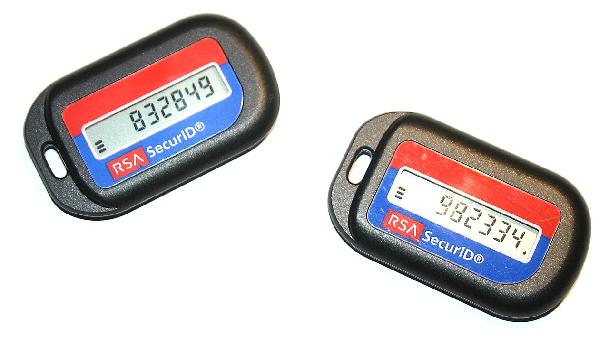
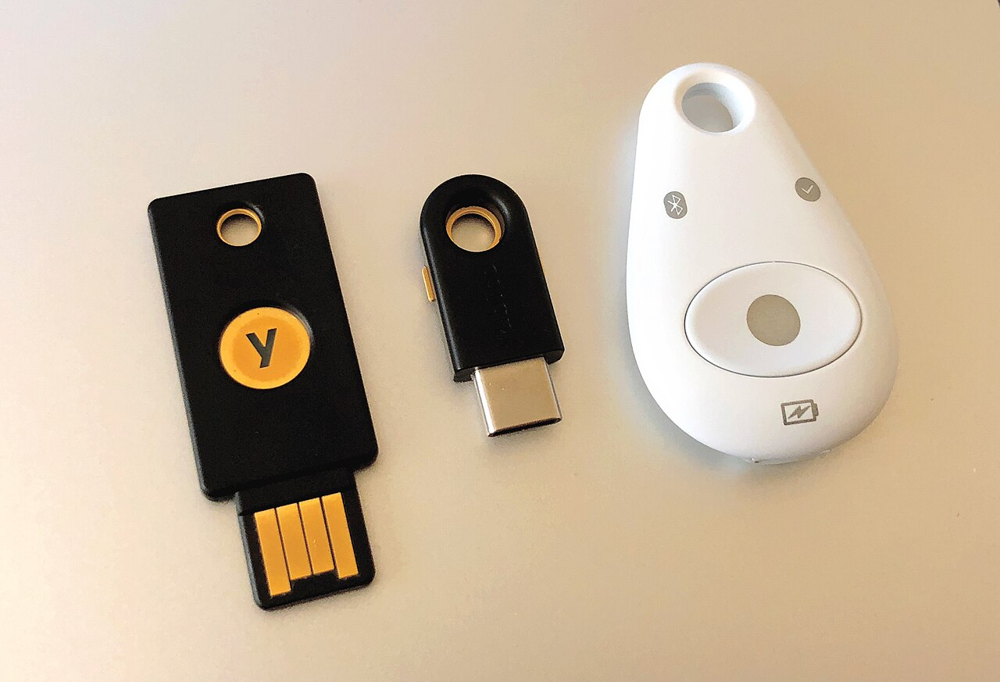

> **Before you read.** A system requires a password and then a second password,
> stored separately, chosen at a different time, and never used together
> anywhere else.
>
> The security team calls it multifactor authentication.
>
> **Are they right, and what would change your answer?**

They are not, and nothing about the second password's quality would change it.
Factors are categories rather than counts, and two things from the same category
fail together in the same way, which is the entire reason for using more than one.

### Some words you will need

<dl class="terms">
<dt>factor</dt>
<dd>A category of evidence: something you know, have, are, or somewhere you are.</dd>
<dt>TOTP</dt>
<dd>A time-based one-time password. Six digits derived from a shared secret and the clock.</dd>
<dt>HOTP</dt>
<dd>The counter-based ancestor of TOTP. The code changes when it is used rather than when time passes.</dd>
<dt>drift window</dt>
<dd>How many time steps either side of now a server will accept, because clocks disagree.</dd>
<dt>phishing resistance</dt>
<dd>The property that a credential cannot be used by a site that is not the one it belongs to.</dd>
<dt>security key</dt>
<dd>A hardware device holding a private key per site, which never leaves it.</dd>
<dt>false acceptance</dt>
<dd>A biometric system admitting the wrong person.</dd>
<dt>false rejection</dt>
<dd>A biometric system refusing the right person.</dd>
<dt>crossover error rate</dt>
<dd>The threshold at which those two rates are equal. A comparison point rather than a target.</dd>
</dl>

## What breaks without this

**Two of the same thing is called two factors.** Both are stolen by the same
breach, and the arrangement provides one factor's worth of protection at two
factors' worth of inconvenience.

**A second factor is deployed and phishing continues to work.** The attacker's
page asks for the code, the person supplies it, and the code works because nothing
in it is bound to the real site.

**Codes fail for one user and nobody knows why.** Their device's clock is off, the
server's window is narrow, and the symptom looks like a broken token.

**Recovery undoes the scheme.** Everything is protected by a security key, and the
key can be replaced by answering three questions about a first school.

## Four categories, and why the category is the point

**Something you know.** A password, a passphrase, an answer to a question.
Reproducible, shareable, and stolen in bulk when a database leaks.

**Something you have.** A hardware token, a phone, a security key, a certificate on
a device. Not stolen in bulk, and stolen individually by taking the object.

**Something you are.** A fingerprint, a face, an iris. Not changeable if it is
compromised, which is its central weakness rather than a detail.

**Somewhere you are.** Location, usually inferred from a network address or from
a device the organisation controls. The weakest as an authenticator and useful as
a signal alongside the others.

**The point of using two is that they fail independently.** A password database
leak does not put a hardware token in anybody's hand. Stealing somebody's phone
does not reveal what they know. Two passwords fail together, and so, in practice,
do a password and a security question, because a security question is a password
somebody else can research.

<figure class="learn-figure photo">



<figcaption>Two hardware tokens, each showing a different six-digit code at the same moment, because each holds a different secret. There is no connection to anything: the device has a clock, a stored secret and a display, and everything it produces comes from those three. The bars at the left of each display count down the seconds until the code changes. Photograph by Mateusz Adamowski, CC BY-SA 1.0.</figcaption>
</figure>

## What a time-based code actually is

There is nothing mysterious inside those tokens, and writing the algorithm out
takes about ten lines.

<details class="predict">
<summary>A token and a server both produce the same six digits without ever communicating. Predict what they must share.</summary>

```bash
# AlmaLinux 10.2, x86_64
$ totp 1786996800
secret: the 20-byte RFC 6238 test value, shared by the token and the server
step:   30 seconds

   unix time     counter  code
  1786996740    59566558  365141
  1786996770    59566559  689250
  1786996800    59566560  201983  <- now
  1786996830    59566561  300928
  1786996860    59566562  521001
```

**A secret and a clock, and nothing else.** The counter is the Unix time divided
by the step, so both ends compute the same counter independently, and the code is
a truncation of an HMAC over that counter using the shared secret.

Two consequences fall straight out of that.

The code depends on the time, so a device whose clock has drifted produces a code
for a different counter. That is the entire explanation for a token that
mysteriously stops working, and the fix is to correct the clock rather than to
re-enrol.

And the secret is shared, which means the server holds something that can generate
your codes. That is the structural difference from public key methods, and it
means a breach of the authentication server yields the ability to produce valid
codes for every enrolled user rather than merely password hashes.

The window in the output is the practical accommodation. A server accepts the code
for the current counter and usually one step either side, because expecting two
clocks to agree exactly is unreasonable. Widen it and codes remain valid longer,
which is more forgiving and gives an intercepted code a longer life.

</details>

The implementation above is not to be taken on trust. The specification publishes
test vectors, so it can be checked.

```bash
# AlmaLinux 10.2, x86_64
$ totp-check
        time   published    computed  match
          59    94287082    94287082  True
  1111111109    07081804    07081804  True
  1111111111    14050471    14050471  True
  1234567890    89005924    89005924  True
  2000000000    69279037    69279037  True
```

**Five published values, five matches.** That is what a specification with test
vectors is for, and it is worth knowing that any implementation you rely on can be
checked the same way in a few minutes.

<figure class="learn-figure">
<svg viewBox="0 0 720 268" role="img" aria-labelledby="totp-title" style="width:100%;height:auto;">
<title id="totp-title">A time-based code changing every thirty seconds, with the window of counters a server will accept around the current one</title>
<g fill="currentColor">
<text x="14" y="20" font-size="11">one shared secret, one clock, and a different six digits every thirty seconds</text>
<path d="M 40 118 H 690" stroke="currentColor" stroke-opacity="0.4" stroke-width="1.2"/>
<rect x="24" y="88" width="92" height="30" rx="4" fill="var(--red)" fill-opacity="0.06" stroke="var(--red)" stroke-opacity="0.7" stroke-width="1.1"/>
<text x="70" y="108" text-anchor="middle" font-size="10">365141</text>
<path d="M 70 118 V 126" stroke="currentColor" stroke-opacity="0.5" stroke-width="1.1"/>
<text x="70" y="140" text-anchor="middle" font-size="7.5" fill-opacity="0.7">1786996740</text>
<text x="70" y="80" text-anchor="middle" font-size="8" fill-opacity="0.8">-60s</text>
<rect x="164" y="88" width="92" height="30" rx="4" fill="currentColor" fill-opacity="0.08" stroke="currentColor" stroke-opacity="0.7" stroke-width="1.1"/>
<text x="210" y="108" text-anchor="middle" font-size="10">689250</text>
<path d="M 210 118 V 126" stroke="currentColor" stroke-opacity="0.5" stroke-width="1.1"/>
<text x="210" y="140" text-anchor="middle" font-size="7.5" fill-opacity="0.7">1786996770</text>
<text x="210" y="80" text-anchor="middle" font-size="8" fill-opacity="0.8">-30s</text>
<rect x="304" y="88" width="92" height="30" rx="4" fill="var(--accent)" fill-opacity="0.20" stroke="var(--accent)" stroke-opacity="0.7" stroke-width="1.7"/>
<text x="350" y="108" text-anchor="middle" font-size="10">201983</text>
<path d="M 350 118 V 126" stroke="currentColor" stroke-opacity="0.5" stroke-width="1.1"/>
<text x="350" y="140" text-anchor="middle" font-size="7.5" fill-opacity="0.7">1786996800</text>
<text x="350" y="80" text-anchor="middle" font-size="8" fill-opacity="0.8">now</text>
<rect x="444" y="88" width="92" height="30" rx="4" fill="currentColor" fill-opacity="0.08" stroke="currentColor" stroke-opacity="0.7" stroke-width="1.1"/>
<text x="490" y="108" text-anchor="middle" font-size="10">300928</text>
<path d="M 490 118 V 126" stroke="currentColor" stroke-opacity="0.5" stroke-width="1.1"/>
<text x="490" y="140" text-anchor="middle" font-size="7.5" fill-opacity="0.7">1786996830</text>
<text x="490" y="80" text-anchor="middle" font-size="8" fill-opacity="0.8">+30s</text>
<rect x="584" y="88" width="92" height="30" rx="4" fill="var(--red)" fill-opacity="0.06" stroke="var(--red)" stroke-opacity="0.7" stroke-width="1.1"/>
<text x="630" y="108" text-anchor="middle" font-size="10">521001</text>
<path d="M 630 118 V 126" stroke="currentColor" stroke-opacity="0.5" stroke-width="1.1"/>
<text x="630" y="140" text-anchor="middle" font-size="7.5" fill-opacity="0.7">1786996860</text>
<text x="630" y="80" text-anchor="middle" font-size="8" fill-opacity="0.8">+60s</text>
<rect x="164" y="60" width="372" height="72" rx="6" fill="none" stroke="var(--accent)" stroke-opacity="0.55" stroke-width="1.4" stroke-dasharray="6 4"/>
<text x="350" y="52" text-anchor="middle" font-size="9" fill="var(--accent)" fill-opacity="0.95">the window a server accepts: one step either side of now</text>
<text x="14" y="182" font-size="10" fill-opacity="0.85">the window exists because the two clocks are never exactly the same</text>
<text x="14" y="202" font-size="10" fill-opacity="0.85">widen it and an intercepted code stays usable for longer</text>
<text x="14" y="228" font-size="10" fill="var(--red)" fill-opacity="0.9">and none of it helps if the person typed the code into the wrong site</text>
<text x="14" y="248" font-size="9" fill-opacity="0.7">which is the property a security key has and a code does not</text>
</g></svg>
<figcaption>The same secret producing a different code at each thirty-second step. The dashed region is what a server typically accepts: the current counter and one either side, because the token's clock and the server's are never exactly the same. Every widening of that region is a trade, since a code observed by somebody else stays usable for as long as the window lasts. What the drawing cannot show is the failure that matters most, which is that a person can be persuaded to read any of these codes to somebody who asked for it, and every one of them will work.</figcaption>
</figure>

<details class="deeper">
<summary>If you run the authentication server: what the shared secret means for a breach, and what HOTP still gets used for</summary>

The secret in a time-based scheme is symmetric, which has a consequence people
skip past: the server can generate your codes. It has to be able to, in order to
check them.

So a compromise of the authentication database is qualitatively different from a
password database breach. Password hashes are expensive to reverse and the good
ones are not reversible in practice. Time-based secrets are stored so they can be
used, which means an attacker with the database can produce valid second factors
for every enrolled user, indefinitely, without touching anybody's phone.

That is the argument for storing them in a hardware security module, and it is the
argument for public key methods, where the server holds only a public key and a
breach yields nothing usable.

The counter-based ancestor is still around and it is worth knowing why. HOTP
advances when a code is used rather than when time passes, which suits a device
with no clock and no battery to run one. The trade is resynchronisation: if
somebody presses the button on the token a few times without using the codes, the
token's counter is ahead of the server's, and the server has to look ahead a
certain number of steps to find a match. That look-ahead window is the same kind
of accommodation as the time window and it has the same property, which is that
widening it for usability weakens it.

Where you still meet HOTP is in printed code sheets, in some banking devices, and
in tokens designed to last a decade on no power at all. It is not obsolete so much
as suited to a narrower case.

</details>

## Phishing resistance is the property that matters

Every method above shares one weakness, and it is the one that actually costs
organisations money.

**A code can be read out.** The person is on a page that looks right, it asks for
the six digits, they supply them, and the attacker relays them to the real site
within the window. The code was valid, the person authenticated correctly, and the
attacker is now signed in.

Push notifications have the same shape with an extra failure of their own.
Somebody receives a prompt they did not initiate, taps approve because prompts are
routine, and the attacker is in. Sending the same prompt repeatedly until somebody
approves it to make it stop is a documented and effective technique.

**Security keys break that pattern**, and the mechanism is worth being precise
about because it is the reason to prefer them.

<figure class="learn-figure photo">



<figcaption>Three devices doing the job the tokens above do, differently. Each holds a private key generated on the device for one specific site, and that key never leaves it. Signing in means the site sends a challenge, the device signs it, and the signature includes the origin the browser is actually talking to. There is nothing to read out and nothing to relay: a signature produced for one origin does not verify at another, so a convincing copy of a login page gets a signature it cannot use. Photograph by Tony Webster, CC BY 2.0.</figcaption>
</figure>

The property has a name worth using in a meeting. **The credential is bound to the
origin**, so the attacker's site cannot obtain a usable one no matter what the
person does. That is a different kind of protection from making the secret harder
to guess: it removes the class of attack rather than raising its cost.

**And a text message is the weakest of the common second factors.** The message
can be redirected by moving a number to another device, the network delivering it
provides no confidentiality, and the code can be read out like any other. It is
still substantially better than nothing, because it defeats the attack that
matters most by volume, which is somebody trying a password leaked from another
service. Dismissing it entirely has left more accounts on one factor than it has
moved to a good one.
<details class="deeper">
<summary>If you are choosing where a factor lives: the phone as a token, and what is being assumed</summary>

Most second factors now live on a phone, and it is worth being explicit about what
that arrangement assumes, because the assumptions are usually invisible.

It assumes the phone is a separate thing from the thing being protected. That
holds when somebody signs in on a laptop and approves on a phone, and it stops
holding the moment they sign in on the phone itself, which for most consumer
services is the normal case. A password manager and an authenticator application
on the same unlocked device is one factor with extra steps, and the compromise of
that device yields both.

It assumes the phone's own security is adequate, so the second factor is protected
by whatever unlocks the phone. That is frequently a biometric backed by a four or
six digit code, and the code is the real floor.

It assumes the number stays with the person, which is where text-message delivery
specifically fails, since moving a number to another device is an attack against a
telephone company rather than against you.

And it assumes the person has the phone. That is the availability problem, and it
is why recovery flows exist and why recovery flows undo schemes.

None of that argues against phones, which are the reason multifactor
authentication reached ordinary users at all. It argues for knowing which
assumption your deployment rests on. A workforce signing in to laptops with a
factor on a phone genuinely has two devices. A workforce doing everything on the
phone has one, and the arrangement should be described that way rather than
counted as two.

</details>

<details class="predict">
<summary>An attacker sends the same push approval prompt fifty times in an hour. Predict what happens, and why the design permits it.</summary>

**Somebody approves one to make it stop, and the design permits it because
approval is the only control the prompt offers.**

Consider what the person actually sees. A notification saying somebody is signing
in as them, with two buttons. They did not initiate it. They have received
legitimate prompts before that arrived at odd moments, because sessions expire and
background applications re-authenticate. At two in the morning, on the fifteenth
one, tapping approve ends the interruption.

That is not carelessness. The prompt asks a question the person cannot answer:
whether this particular sign-in is theirs. Nothing in it distinguishes the
attacker's attempt from a legitimate one, so the decision is being made on a
feeling about how routine prompts are, and prompts are routine.

Two mitigations exist and they work by giving the person something to compare.
Number matching displays a value on the sign-in screen that has to be typed into
the prompt, so approving requires seeing the screen the attacker is looking at.
And context in the prompt, naming the application and the location, at least gives
somebody a reason to hesitate.

The deeper answer is the one this topic keeps returning to. A push approval is a
human decision under interruption, and any method that depends on a person
correctly judging whether a request is legitimate will eventually be defeated by
volume or by timing. A security key does not ask the person to judge anything: it
either has a credential for that origin or it does not.

</details>


## Biometrics, and the dial between two errors

A biometric system compares a sample against a stored template and decides whether
they match closely enough. That threshold is adjustable and it is the whole of the
design.

**False acceptance** is admitting the wrong person. **False rejection** is refusing
the right one. Loosening the threshold reduces the second and raises the first,
tightening it does the reverse, and no setting reduces both. The crossover error
rate is where they are equal, and it is useful for comparing two systems rather
than as a target: a door to a data centre and a phone unlock should not sit at the
same point on that dial.

Two other things belong here.

**A biometric cannot be reissued.** A password that leaks is changed. A fingerprint
that is copied is a fingerprint for life, which is why treating one as a secret is
a mistake and why the correct framing is that a biometric is a convenient way of
unlocking something local, not a credential to send anywhere.

**Presentation attacks are the practical concern**, meaning a photograph, a mask
or a lifted print. Liveness detection exists to counter them and it is another
threshold with the same trade in it.
<details class="deeper">
<summary>If you are enrolling biometrics: what is actually stored, and the sentence that ends the privacy argument</summary>

The most common objection to a biometric deployment is that the organisation is
collecting fingerprints, and the answer is more reassuring than most people
expect, provided the deployment is built the way modern platforms build it.

What is stored is a template rather than an image. A template is a mathematical
derivation of features, it is not reversible into the original in any practical
sense, and comparing two templates is what matching means. That distinction is
real and it is not the sentence that ends the argument, because a template is
still biometric data and still subject to the legal regimes that cover it.

The sentence that ends the argument is about location. On current phones and
laptops, the template does not leave the device and is held in a separate secure
element the operating system itself cannot read. What the application receives is
a yes or a no from that element, plus, in the good designs, a signature from a key
the element releases only after a successful match. The organisation never holds
anything.

That changes what a biometric is in the architecture. It is not a credential sent
to a server for checking. It is a local unlock for a credential that already lives
on the device, which is why the whole arrangement is properly described as
something you have, unlocked by something you are.

The deployments where the objection is well founded are the ones that do it
differently: a central biometric database compared against at a door or a
terminal. Those exist, they carry the risk people are worried about, and the
irreversibility of a compromised biometric is the reason to hold that data as
briefly and as locally as the design allows.

</details>


## The recovery flow undoes all of it

An organisation deploys security keys to everybody, enforces them, and is pleased.
Then somebody loses one on a Friday, and there is a process for that.

**Whatever that process is, it is now the authentication scheme**, because an
attacker will use it rather than attacking the keys. If it is a phone call to a
help desk that verifies identity with a date of birth and an employee number, the
account is protected by a date of birth and an employee number.

This is the most common way a strong scheme is undermined and it is almost never
in the diagram. Three things make it better and none is exotic: enrol a second
key at the same time as the first, so the ordinary case is not a recovery; require
recovery to be verified by a person who knows the individual, or in person; and
alert on recovery events, because a legitimate one is rare and an illegitimate one
looks identical until somebody checks.

## Prove it

**Run it.** Implement the algorithm in ten lines in any language and check it
against the vectors published in RFC 6238. If your codes match, you understand
what a token does.

**Work it out.** Take the drift window in the figure. If a server accepts the
current step and one either side, for how long is a single observed code usable,
and what does widening the window to two steps either side change about that?

**Look it up.** Open SP 800-63B and find what it says about out-of-band
authenticators delivered over the public telephone network. The wording is
careful, it is not a prohibition, and the reasoning is the argument this topic
makes about text messages.

## What trips people up

### 1. Counting credentials instead of categories

Two passwords are two credentials in one category. They leak in the same breach
and are guessed by the same technique, so the arrangement has one factor's
strength and two factors' friction.

### 2. Treating a security question as a second factor

It is something you know, like the password, and it is frequently something a
stranger can research. Same category, correlated failure.

### 3. Assuming any second factor stops phishing

A code can be read out and relayed inside the window, and a push can be approved
by somebody who has stopped reading prompts. Only origin-bound credentials remove
the class.

### 4. Blaming the token when codes fail

The code is a function of the clock. A device whose time has drifted computes a
different counter, and correcting the clock fixes it where re-enrolling merely
appears to.

### 5. Chasing a low crossover error rate

It is a comparison point, not a target. The correct threshold depends on what the
door protects, and moving it always trades one error against the other.

### 6. Leaving the recovery flow out of the design

Whatever recovers an account is what protects it. A key-based scheme with a help
desk reset verified by an employee number is protected by an employee number.

## Work it through

An organisation wants multifactor authentication for four hundred staff. The
options on the table are an authenticator application, text messages, and security
keys. Budget exists for one, and a mixture is politically harder than a single
choice.

**The tempting move is security keys for everybody.** They are the strongest
option, they remove phishing rather than making it harder, and the recommendation
is defensible on every technical axis. It also means four hundred devices to
purchase and distribute, a replacement process, and a support burden for the
people who lose them, which is a real programme rather than a rollout.

**The move that works splits the population by what an attacker gains.**
Administrators, finance, and anybody who can move money or change access get
security keys, because those are the accounts a targeted attack goes after and
targeted attacks are where phishing resistance earns its cost. That is perhaps
forty people, which is a purchase rather than a programme.

**Everybody else gets the authenticator application**, which defeats the
credential-stuffing attack that accounts for most incidents by volume, costs
nothing, and is deployable in a fortnight.

**What this rejects is uniformity.** A single choice for four hundred people is
either too expensive to happen or too weak where it matters, and the political
difficulty of explaining two tiers is smaller than the difficulty of explaining
why the programme stalled.

The residual is worth naming: everybody on the authenticator application remains
phishable, and that is accepted deliberately with a date to revisit. The trigger
for revisiting is not a calendar entry, it is the first successful phishing
incident against a non-key account, and writing that down now makes the follow-on
decision quick.

## Try it

**Compute a code by hand.** Ten lines of any language and the test vectors in RFC
6238. It removes all the mystery from the object in your pocket.

**Check your own drift window.** Change your phone's clock by a minute and see
whether the code is still accepted. Change it by five and see whether it is not.

**Find your recovery flow.** For your own most important account, work out exactly
what somebody would have to do to replace your second factor. That is the real
strength of the scheme.

**Look for the second key.** If you use a security key anywhere, check whether a
backup is enrolled. If it is not, the recovery flow is the authentication scheme.

## Check yourself

<details class="qa">
<summary>Why is a password plus a security question not multifactor authentication?</summary>

Both are something you know, so they fail together. A breach that exposes stored
credentials tends to expose both, and a security question is frequently something
an attacker can research about the person rather than something only they know.

Factors are categories chosen so that failures are independent. Two items from one
category provide one factor's protection at two factors' inconvenience.

</details>

<details class="qa">
<summary>What do a token and a server share, and what follows from that?</summary>

A secret and a clock. The counter is the current time divided by the step, both
ends compute it independently, and the code is a truncated HMAC over that counter
using the secret.

Two things follow. A drifted clock produces a code for a different counter, which
is why a token appears to stop working. And the secret is symmetric, so the server
can generate valid codes for every enrolled user, which makes a breach of the
authentication database far worse than a breach of password hashes.

</details>

<details class="qa">
<summary>What does phishing resistance mean, and which methods have it?</summary>

That the credential cannot be used by a site other than the one it belongs to. A
security key signs a challenge together with the origin the browser is actually
talking to, so a signature produced for a copy of a login page does not verify at
the real one.

Codes and push approvals do not have this property. Both can be supplied to an
attacker by a person who believes they are on the right site, and both work when
relayed within the window.

</details>

<details class="qa">
<summary>A biometric system is tuned to a very low false acceptance rate. What has that cost?</summary>

False rejections. The two rates sit at opposite ends of one threshold, so
tightening against the wrong person being admitted means more occasions on which
the right person is refused.

The crossover error rate is where they are equal, and it is a way of comparing
systems rather than a setting to aim for. A data centre door and a phone unlock
should sit at different points, because the cost of each error differs.

</details>

<details class="qa">
<summary>Why is the recovery flow part of the authentication design?</summary>

Because an attacker will use the cheapest route, and if replacing a lost factor is
easier than defeating it, that is the route. An estate protected by security keys
where a help desk will issue a replacement after verifying a date of birth is
protected by a date of birth.

Three things help: enrol a backup key at the same time as the first, so the
ordinary case is not a recovery at all; verify recovery by a person who knows the
individual or in person; and alert on recovery events, because they are rare and
an illegitimate one looks identical to a legitimate one.

</details>

## References

- [RFC 6238](https://www.rfc-editor.org/rfc/rfc6238.html) - IETF, TOTP, and the source of the test vectors the second capture checks against. Free. Accessed 2026-08-25.
- [RFC 4226](https://www.rfc-editor.org/rfc/rfc4226.html) - IETF, HOTP, for the counter-based scheme and its resynchronisation window. Free. Accessed 2026-08-25.
- [SP 800-63B](https://csrc.nist.gov/pubs/sp/800/63/b/upd2/final) - NIST, authentication and lifecycle management, for authenticator types and what it says about delivery over the telephone network. Free. Accessed 2026-08-25.
- [Web Authentication](https://www.w3.org/TR/webauthn-2/) - W3C, for how a security key binds a credential to an origin. Free. Accessed 2026-08-25.
- [SP 800-76-2](https://csrc.nist.gov/pubs/sp/800/76/2/final) - NIST, biometric specifications, for matching thresholds and error rates. Free. Accessed 2026-08-25.

**Photograph credits.** Both are downloaded and committed to this repository
rather than hotlinked.

- Hardware one-time password tokens by Mateusz Adamowski, [CC BY-SA 1.0](https://creativecommons.org/licenses/by-sa/1.0), from [Wikimedia Commons](https://commons.wikimedia.org/wiki/File:RSA-SecurID-Tokens.jpg).
- Security keys by Tony Webster, [CC BY 2.0](https://creativecommons.org/licenses/by/2.0), from [Wikimedia Commons](https://commons.wikimedia.org/wiki/File:U2F_Hardware_Authentication_Security_Keys_(Yubico_Yubikey_4_and_Feitian_MultiPass_FIDO)_(42286852310).jpg).

**Where the content came from.** Both code blocks run on an AlmaLinux 10.2
container. The secret is the twenty-byte test value published in RFC 6238 for
exactly this purpose and belongs to nobody, and the second block checks the
implementation against the five vectors printed in that document so the codes in
the first are verifiable rather than asserted. There is no platform comparison on
this page, because the methods here are properties of an authenticator and a
protocol rather than of an operating system, and the biometric hardware the topic
discusses is not present on any machine this project can capture from.

**If you also work on networks.** The Network+ track's
[identity and access management](/learn/network-plus/identity-and-access-management)
covers where the authentication exchange travels and what carries it.
