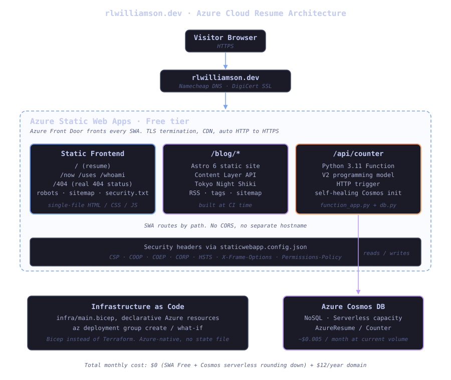
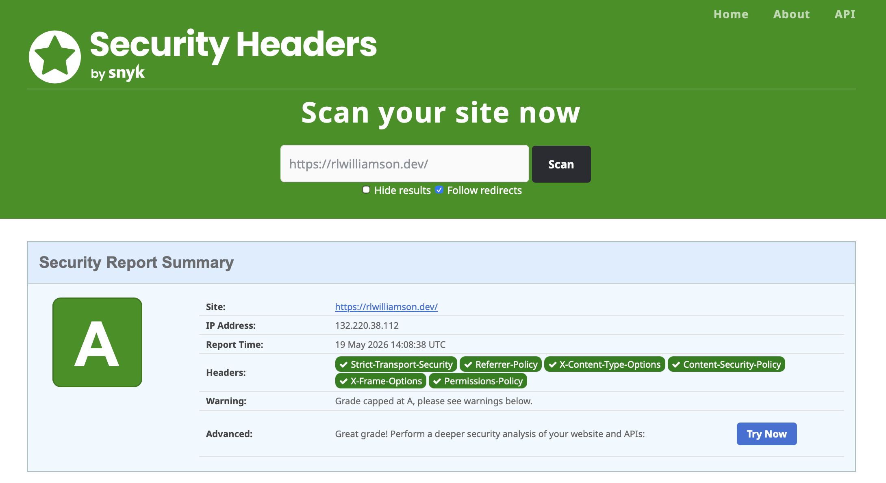

Eight years into a DevOps career and I'd never built a personal site.

I'd architected and helped build out dozens of IaaS environments at work. I'd reviewed enough PRs touching CI/CD pipelines to have opinions about every action in the GitHub Marketplace. But Azure Static Web Apps, Cosmos DB, the whole serverless front-of-house stack? Those I knew from architecture diagrams and not from deploying one myself, which is a different relationship to a piece of software than people sometimes assume. For the half hour someone might spend googling my name, all I had was a LinkedIn page and a generic Outlook email pointing nowhere. The shoemaker's children, etc.

The [Cloud Resume Challenge](https://cloudresumechallenge.dev) was the excuse. The 16 official steps got me a working portfolio at `rlwilliamson.dev`. The next several rounds of "well, just one more thing" got me everything else: a blog, custom subpages, an A-grade security posture, a handful of easter eggs, and a README that is, charitably, ambitious in scope. This post is the build log.

## What the Cloud Resume Challenge is

[Forrest Brazeal](https://forrestbrazeal.com)'s Cloud Resume Challenge is a 16-step gauntlet that walks you from "I want to learn the cloud" to a real, running, hand-built portfolio site backed by a serverless visitor counter and deployed via CI/CD. The official path covers a cloud cert, an HTML/CSS resume, a static website with HTTPS and a custom DNS, some JavaScript for interactivity, a database, an API, a server-side language (typically Python), tests, infrastructure as code, source control, frontend and backend CI/CD, and a blog post to wrap it up.

Thousands of people have done it. The format is opinionated by design. Forrest wants you to fight through the same problems professional cloud engineers fight, not to copy-paste your way to a working site. What makes mine worth reading isn't the 16 steps. It's the part where I refused to stop, and a project that should have ended in two weekends went on for a couple of months.

## Why I did it

A certification tells you I've passed an exam. Live infrastructure tells you I can actually run things. The challenge sits at the spot where those two converge. There's a real running counter and a real deploy pipeline somebody can poke at, plus the version-controlled source for all of it on GitHub. Either side standing alone is easy to fake. Both at once, hard.

I also wanted to spend some personal time in the parts of the Azure stack one layer below my day job. I'm a DevOps engineer where I help build and execute Azure CI/CD and DevSecOps practices for a tax portfolio. I help build out the platform developers work on, which means I spend most of my time in pipelines and IaaS, not in the application-layer Azure services. Cosmos DB doesn't show up at work. Neither does the Functions runtime, in any way I'd consider hands-on. The challenge gave me a chance to run them both in anger, on someone else's credit card. (My credit card. The "someone else" was the past version of me who said "yeah, sure, $12 for the domain.")

Last reason: it sounded fun, in the slightly-unhinged way that "let me wire all this together with my own hands instead of clicking through a portal" is fun for people who like this kind of work. If that doesn't immediately make sense to you, you are not the target audience for this post and I hope you have a nice day.

## The architecture



The whole thing is one Azure Static Web App. A browser hits `rlwilliamson.dev`. Azure Front Door (which fronts every SWA whether you ask for it or not) terminates TLS and routes the request. SWA serves the static HTML directly for the resume and the custom subpages. For `/blog/*`, it serves a pre-built Astro static site that gets compiled into the same `frontend/` directory at CI time. Astro's static output is just HTML, so there's no separate hosting and no runtime cost. For `/api/*`, SWA's built-in proxy hands the request to a managed Python Function on the same SWA deployment, which reads or writes a single document in Cosmos DB serverless.

There's no separate API hostname, no CORS configuration, no cookie-domain weirdness. The `/api` proxy is one of the cleanest "API + frontend on the same domain" patterns I've used in Azure, in the strict sense that I never had to write a single redirect rule to make it work.

Everything stateful lives in Cosmos DB serverless mode. That choice was the difference between "fractions of a cent per month" and ~$24 minimum monthly, and I'll come back to it.

## How it works

### The frontend

Single-file HTML. Inline CSS. Inline JavaScript. No bundler, no framework, no build step for the resume page itself. One network request to the document, then a few for the photo, the font, and the favicon.

I'd push back hard on this for a team project. Inline CSS doesn't scale, build steps exist for good reasons. For a single-page personal site it's a feature: no FOUC, no chunked-asset cache invalidation problems, no source-map drift. The whole page can be cracked open in DevTools and understood in five minutes, which is exactly what you want when the audience is engineers.

The visual personality comes from a Linux-style boot animation that prints kernel log lines, then a typing terminal hero that cycles through `whoami`, `cat current-role.txt`, `ls -la skills/`, `history | grep migration`, and `contact --short`. The avatar opens a lightbox on click. Each role expands from a one-line summary to full bullets when you click it. There's a built-in print-to-PDF mode that produces a clean traditional resume via the browser's print dialog. Dark mode is the default. Light mode is one toggle away and persists in `localStorage`.

I'll save the easter eggs for later in this post. There are a few. I'm not going to say what or where.

### The API

The visitor counter is a Python 3.11 Azure Function on the V2 programming model, exposed at `/api/counter`. It does exactly one thing: increments a single document in Cosmos DB and returns the new count. The interesting part is the self-healing init:

```python
# api/db.py (abbreviated)
from azure.cosmos.exceptions import CosmosResourceNotFoundError

def get_or_create_counter(container):
    try:
        return container.read_item(item="counter", partition_key="counter")
    except CosmosResourceNotFoundError:
        return container.create_item({"id": "counter", "count": 0})
```

Cold start, fresh container, missing document, and `db.py` creates it on the fly. You never have to seed the database manually. This is also the pattern I use for tests: spin up a mock container, the function creates its own initial state, no fixtures.

Tests live in `api/tests/` and run as a pytest job in CI:

```bash
cd api
pip install -r requirements-dev.txt
pytest -v
```

The Cosmos client is mocked, so the tests don't need a live connection and don't accidentally rack up RUs. The CI workflow gates the deploy job on `needs: test`, so a red pytest run blocks production. This is a 5-line change from the default SWA workflow and it's worth its weight.

### The infrastructure (Bicep, not Terraform)

The official challenge mentions Terraform as the default IaC choice. I went with Bicep, on purpose, for three reasons:

1. **Azure-native**. Bicep is a first-party Microsoft DSL. It speaks Azure resource types fluently without a provider layer in between, and new Azure resource types light up in Bicep faster than they do in the Terraform provider.
2. **No state file**. Bicep deployments use Azure Resource Manager's own deployment history as the source of truth. There's no `terraform.tfstate` to keep in a storage account with a lock, no state corruption to recover from. ARM tracks every deployment for you.
3. **`what-if`**. `az deployment group what-if` is the cleanest "show me what's going to change" preview I've used. It's not perfect (drift detection on some resource types is fuzzy), but for a small project it's plenty.

Here's the Cosmos resource definition:

```bicep
resource cosmosAccount 'Microsoft.DocumentDB/databaseAccounts@2024-05-15' = {
  name: cosmosAccountName
  location: location
  kind: 'GlobalDocumentDB'
  properties: {
    databaseAccountOfferType: 'Standard'
    capabilities: [
      { name: 'EnableServerless' }
    ]
    locations: [
      { locationName: location }
    ]
    consistencyPolicy: {
      defaultConsistencyLevel: 'Session'
    }
  }
}
```

That `EnableServerless` capability is the entire billing-mode story in one line. Get it right and you pay rounding-error dollars per month. Get it wrong and you pay the provisioned-throughput minimum. More on that in the war stories.

Deploying changes:

```bash
az deployment group what-if \
  --resource-group rg-azure-resume \
  --template-file infra/main.bicep \
  --parameters infra/main.bicepparam

az deployment group create \
  --resource-group rg-azure-resume \
  --template-file infra/main.bicep \
  --parameters infra/main.bicepparam
```

The Static Web App itself is *not* in Bicep. SWA's GitHub integration is built around a workflow file that gets created when you connect a repo through the Azure portal, and trying to manage SWA as a Bicep resource while ALSO managing the workflow file from GitHub is a recipe for split-brain. The community pattern is "Bicep for the backend (Cosmos), portal-managed for the SWA + workflow." I followed it.

### CI/CD


The GitHub Actions workflow has three jobs:

1. **`test`**. Checks out, installs `requirements-dev.txt`, runs `pytest -v`. About 30 seconds.
2. **`build_and_deploy_job`** runs only if `test` passed. Checks out, gets an OIDC token, sets up Node 22, runs `npm ci` and `npm run build` in `blog/`, copies `blog/dist/*` into `frontend/blog/`, then runs the standard `Azure/static-web-apps-deploy@v1` action which ships `frontend/` plus the Python Function. About 2 minutes.
3. **`close_pull_request_job`** runs when a PR closes. Uses OIDC auth (same pattern as the build job) to call the SWA deploy action with `action: close`, which deletes the preview environment.

The Astro build steps and the OIDC-on-close-PR setup are both non-default. Without the build steps you can't have a static blog co-located with the resume. Without OIDC on the close job, preview environments accumulate until you hit the 10-environment Free tier cap and your next PR build fails.

The full daily loop, from terminal:

```bash
git checkout -b feat/something-new
# ... edit, test locally ...
git commit -m "feat: ..."
git push -u origin feat/something-new

gh pr create --base main --title "..." --body "..."
gh pr checks --watch && gh pr merge --squash --delete-branch

git checkout main && git pull origin main && git fetch --prune
```

Everything from "push" to "merged and live in production" runs in the terminal. The browser exists for one purpose: looking at the running site after the deploy.

## What I changed from the standard challenge

The 16 steps are the floor. Here's what I added on top:

| Standard challenge step | What I did |
|---|---|
| Pick any IaC tool | **Bicep** instead of Terraform. Azure-native, no state file, first-party tooling |
| Write a blog post about the build | Built an actual ongoing blog at **`/blog`** using Astro 6 with the Content Layer API, tags, RSS, reading times, and Tokyo Night syntax highlighting |
| HTTPS via the platform-managed cert | HTTPS plus **[A grade on securityheaders.com](https://securityheaders.com/?q=https%3A%2F%2Frlwilliamson.dev%2F&followRedirects=on)** with COOP, COEP, CORP, CSP, HSTS, X-Frame-Options, Permissions-Policy |
| Custom domain | Custom domain plus **`security.txt`** (RFC 9116), `robots.txt`, and an auto-generated sitemap |
| Single resume page | Resume plus **`/now`**, **`/uses`**, **`/whoami`**, custom **`/404.html`** with the right status code (SWA's default returns 200) |
| Workflow tests then deploys | Workflow tests, gates deploy on test failure, AND **cleans up SWA preview environments via OIDC** on PR close |
| Static HTML | **Boot animation**, typing terminal hero, photo lightbox, expandable role entries, animated architecture diagram, theme toggle with `localStorage` persistence |
| (n/a) | **A few easter eggs** scattered around for engineers who poke at things. I won't say what or where. |
| (n/a) | **SSH commit signing** via a dedicated signing key |
| (n/a) | **Schema.org Person** structured data plus Open Graph tags for nice link previews on LinkedIn, Slack, iMessage, etc. |
| (n/a) | **`prefers-reduced-motion`** respected for both CSS animations and the JS-driven boot sequence |

The easter eggs need a quick caveat. They're not on the page to show off. They're there because anyone reading a DevOps engineer's portfolio site is the kind of person who opens DevTools out of curiosity, and rewarding that curiosity feels right. The README mentions they exist; that's all. Go find them.

The blog deserves its own note. The official challenge ends with "write a blog post about the build," usually meaning a one-shot Medium or Dev.to article. I wanted a real ongoing blog, version-controlled in the same repo as the rest of the site, with proper tooling. Astro 6 with the Content Layer API was the right call: plain markdown for the posts, type-safe Zod schemas for the frontmatter, Shiki for code blocks, auto-generated RSS and sitemap. The blog builds in CI alongside the rest of the site. There's no second deploy target. You're reading the result.

The security headers piece was a rabbit hole. SWA's default deployment ships with no `staticwebapp.config.json` and therefore no security headers, which scores a B-minus on `securityheaders.com`. Adding CSP, X-Frame-Options, X-Content-Type-Options, Referrer-Policy, Permissions-Policy gets you to A. Adding the cross-origin trinity (COOP, COEP, CORP) keeps the A grade and unlocks cross-origin isolation in the browser, which is required for `SharedArrayBuffer` and high-resolution timers if you ever need them. The COEP gotcha: it blocks external resources that don't send `Cross-Origin-Resource-Policy: cross-origin`. Every `` and `<script>` from a CDN has to either send that header or be loaded with `crossorigin="anonymous"`. Took me an afternoon to track down the broken image that didn't.



## War stories

The challenge spec is honest about the fact that things will break. It just doesn't tell you which things, when, or in what order. Here are five of mine, in rough order of how stupid I felt while debugging each one.

### The DigiCert CAA record cliff

The first time I bound my custom domain to SWA, validation hung. Eighteen hours, no error, no progress bar, no telemetry. The portal showed "Validating" the way a person says "I'm working on it" once they have stopped working on it.

Azure Static Web Apps issues custom-domain TLS certs through DigiCert. DigiCert respects CAA records, which are DNS records that authorize which Certificate Authorities are allowed to issue certs for a domain. My DNS had no CAA records at all, which most people read as "anyone can issue," but DigiCert's stricter read is "you have not explicitly authorized me, and I will wait." Forever, apparently.

The fix is one record:

```
Type: CAA
Host: @
Tag: issue
Value: digicert.com
TTL: 5 min
```

Within ten minutes of adding that record, validation completed and SSL provisioned. Total fix time, zero. Total debug time, one Saturday afternoon.

The lesson isn't "remember CAA records." It's "Azure's certificate provisioning has zero observability into what's actually happening upstream at the CA, and you need to learn the CA's quirks even though you never directly interact with it." DigiCert is the most common CA Azure uses for managed certs. Their docs on CAA are buried.

### The `close_pull_request_job` OIDC saga

This one ate a full debugging session and is worth its own write-up.

The default GitHub Actions workflow that Azure generates when you connect a SWA to a repo has two jobs: `build_and_deploy_job` and `close_pull_request_job`. Both call the same `Azure/static-web-apps-deploy@v1` action. Both need to authenticate to Azure. They authenticate *differently*.

The build job uses both a static deployment token (from the repo secret `AZURE_STATIC_WEB_APPS_API_TOKEN_*`) AND an OIDC `github_id_token`. The close job, in the default workflow, uses only the static token. When the static token gets rotated or invalidated, the build job keeps working via OIDC. The close job silently fails.

A broken close job means preview environments never get cleaned up. They accumulate on every PR. SWA Free tier has a 10-environment cap. Once you hit it, new PR builds start failing with "max environments reached." Your CI red-X count goes up. You go looking for what's wrong with the build job. The build job is fine. The cleanup is broken.

Common online advice: add `skip_deploy_on_missing_secrets: true` to the close job. This silences the red X without fixing anything. Preview environments still accumulate, you just don't get notified anymore. It is the CI/CD equivalent of putting electrical tape over the check-engine light.

The actual fix is to add OIDC auth to the close job, mirroring the build job. Three coordinated changes:

```yaml
close_pull_request_job:
  permissions:
    id-token: write           # <-- 1. permission to mint a token
    contents: read
  runs-on: ubuntu-latest
  steps:
    - name: Install OIDC Client from Core Package    # <-- 2. mandatory install
      run: npm install @actions/core@1.6.0 @actions/http-client

    - name: Get Id Token                             # <-- 3. mint the token
      uses: actions/github-script@v6
      id: idtoken
      with:
        script: |
          const coredemo = require('@actions/core')
          return await coredemo.getIDToken()
        result-encoding: string

    - name: Close Pull Request
      id: closepullrequest
      uses: Azure/static-web-apps-deploy@v1
      with:
        azure_static_web_apps_api_token: ${{ secrets.AZURE_STATIC_WEB_APPS_API_TOKEN_* }}
        action: "close"
        github_id_token: ${{ steps.idtoken.outputs.result }}
```

The "Install OIDC Client" step is non-obvious but mandatory. Without it, `actions/github-script`'s `require('@actions/core')` throws `MODULE_NOT_FOUND` because the package isn't bundled with the action. The build job has this step too, which is easy to overlook when you're copy-pasting from one job to the other.

Once OIDC is wired through, preview cleanup is automatic. Every closed PR auto-deletes its environment. The 10-env cap becomes a non-issue.

### Cosmos serverless vs. provisioned

Cosmos DB has two billing modes: **provisioned throughput** (you pay for RU/s capacity you've reserved, whether or not you use it) and **serverless** (you pay per request, no reservation, no minimum). They look identical in the portal. They are not.

Provisioned mode has a 400 RU/s minimum, which works out to roughly $24/month at the cheapest. For a visitor counter that handles maybe a few requests per day from the people I've sent the link to, this is a comically wrong fit, like leasing a forklift to move one box of cereal. Serverless mode on the same workload rounds down to zero. The site is too new to have any Cosmos billing line items yet, but the projected number is "you will not notice it."

The portal default for new databases is provisioned. You have to actively pick serverless during creation. There is no "switch from provisioned to serverless later." You would have to migrate the data to a brand new account. If you create a Cosmos account in provisioned mode for a low-traffic personal project, you will pay $24/month minimum until you delete and recreate, and you will learn this on billing day.

Bicep makes this a one-line choice and a one-line documentation footnote:

```bicep
capabilities: [
  { name: 'EnableServerless' }
]
```

The lesson is: read the billing-mode docs *first*, then pick the resource type. Cosmos is the most obvious offender, but Application Insights, Log Analytics, and Azure Front Door all have similar billing-mode forks where the wrong default at provisioning time costs you orders of magnitude more than you needed to spend.

### `EnableCanary` and the region picker that wasn't

When I first tried to provision Cosmos through the portal, every region dropdown showed exactly two regions, both with names ending in `EUAP`. Neither supported Cosmos. The portal claimed Cosmos was unavailable.

It turned out my subscription had the `Microsoft.Resources/EnableCanary` feature flag registered. This feature opts a subscription into "early-access (EUAP) regions" for testing pre-release Azure features. It also, very helpfully, filters every region dropdown across the portal to show *only* those EUAP regions, on the apparent theory that if you opted into preview features once you can never have wanted East US again.

Fix:

```bash
az feature unregister --namespace Microsoft.Resources --name EnableCanary
az provider register --namespace Microsoft.Resources
```

The provider re-registration is the part the docs don't mention, and without it the feature-flag change doesn't take effect on the next portal session.

I have no idea how that flag got registered on my subscription. The most likely answer is "I clicked something during an unrelated preview enrollment a year ago and forgot." Welcome to the EnableCanary club.

### The squash-merge that didn't deploy

Once, after a clean PR merge to `main`, the production deploy didn't run. The site stayed on the previous version. `gh run list --branch=main --event=push` showed no recent run. The Actions tab showed nothing happening. There was no error to look at, because there was nothing to error.

GitHub's webhook delivery for push events occasionally drops. It is rare but real. The merge fires a push event, the webhook is supposed to fire to Actions, and sometimes the delivery silently fails. There is no retry. The push effectively didn't happen as far as Actions is concerned.

The fix is to make another push event:

```bash
git pull origin main
git commit --allow-empty -m "chore: retrigger deploy"
git push origin main
```

The empty commit costs nothing and forces a fresh webhook. The deploy ran on the next push without complaint.

The deeper lesson: production deploys need a "did we actually ship?" sanity check that doesn't rely on the deploy log being green. For this site, that's:

```bash
curl "https://rlwilliamson.dev/?nocache=$(date +%s)" | grep "your latest change"
```

The cache-busting query string forces a fresh fetch through Azure Front Door's edge cache. If your latest change isn't in the response, the deploy didn't ship, regardless of what Actions says.

## What I learned

A few things stuck.

The combo of `gh pr checks --watch && gh pr merge --squash --delete-branch` is the solo-dev gold path. The browser is for reading code and viewing the live site. Everything else (PR creation, status, merge, branch cleanup) runs from the terminal. Once you've internalized that, going back to clicking buttons in GitHub's UI feels like walking when you could be biking.

Inline CSS is a sin for any team project and a feature for a single-page personal site. One file, one request, no FOUC, no source maps to leak, no build step. The "every page should have an external stylesheet" rule exists for reasons that don't apply when there is one page.

The challenge is structurally a feedback loop. You build the smallest possible thing that exercises every layer of the stack (frontend, backend, database, IaC, CI/CD, DNS, certs, observability), and then every problem you hit teaches you something specific and load-bearing about one of those layers. A textbook tells you "Cosmos has serverless and provisioned modes." Building this site teaches you that the difference between those modes is $24 in real money on your real credit card on real billing day, and you will not forget it.

Personal projects with running infrastructure teach you what your gaps are in a way that work projects often can't. At work, you have a team. There is always someone who already knows the answer to the Cosmos billing question or the OIDC quirk. On your personal project, you are the team. You are the on-call. You are the entire stack-trace reader and the entire postmortem author and the only attendee at the postmortem. The gaps stand out, because they are the only thing in the room. You fill them in.

## Tech stack

- **Hosting**: Azure Static Web Apps (Free tier)
- **Compute**: Azure Functions (Python 3.11, V2 programming model)
- **Database**: Azure Cosmos DB for NoSQL (Serverless capacity)
- **IaC**: Bicep
- **CI/CD**: GitHub Actions with OIDC auth on both build and close-PR jobs
- **Frontend**: HTML / CSS / JavaScript (single-file resume), JetBrains Mono via Google Fonts
- **Blog**: Astro 6 with Content Layer API, Shiki (Tokyo Night), `@astrojs/rss`, `@astrojs/sitemap`, `reading-time`
- **DNS**: Namecheap
- **SSL**: DigiCert via SWA managed cert
- **Tests**: pytest with mocked Cosmos client, gated via `needs: test`
- **Commit signing**: SSH with a dedicated `id_ed25519_signing` key
- **Total cost**: $0/month plus $12/year for the domain

## Where to next

The repo is at [github.com/rlwilliamson-dev/azure-resume](https://github.com/rlwilliamson-dev/azure-resume). Fork it, adapt it, rip out the parts you don't want, ignore the parts you find self-indulgent. The README has a section called *How this differs from the standard Cloud Resume Challenge* that maps every addition I made back to the base spec, which should make cherry-picking easier.

If you're hiring senior DevOps or platform engineers and you've read this far, my contact is in the site footer. Otherwise, thanks for reading. If you take the Cloud Resume Challenge yourself, I'd genuinely like to see what you build. Send me a link, even if it's just the 16 steps. Especially then.

The 16 steps are the floor.
